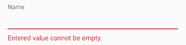
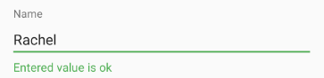

# Visually Customizing RadDataForm's Validation

Every editor in RadDataForm has a default **validation behavior**. This behavior is represented by the **DataFormValidationViewBehavior** class. It shows only negative feedback which
looks like this:



The negative feedback consists of displaying a message somewhere around the editor, showing an error icon if available and setting the background of the core editor parent to some red
color.

Another indication for negative validation that you can use is, to show red color as a background of the core editor. You can use this behavior with validation behavior's **setChangeBackground** method and set it to `true`, if you want the color modification to be applied not to the line below the editor, but to its background.

The error message and indications can also be animated. RadDataForm provides another class called **ValidationAnimationBehavior** which animates an invalid editor by shaking it. It can
easily be extended to blink, fade or any other appropriate animation.

To customize the validation behavior the DataFormValidationViewBehavior class can be tweaked with the following properties:
* InvalidBackgroundDrawable: The error background.
* InvalidDrawable: The error icon.

There is also a third behavior out of the box that inherits from DataFormValidationViewBehavior and it is called **DataFormPositiveValidationViewBehavior**. 
The positive behavior can display negative as well as positive feedback. For example:



The positive behavior adds two more properties:
* ValidBackgroundDrawable
* ValidDrawable

To use any of the described behaviors developers have to do this:
```Java
EntityPropertyEditor editor = 
	(EntityPropertyEditor)dataForm.getExistingEditorForProperty("Name");
editor.setValidationViewBehavior(new DataFormValidationViewBehavior(context));
```
```C#
EntityPropertyEditor editor = 
	Android.Runtime.Extensions.JavaCast<EntityPropertyEditor>(
		dataForm.GetExistingEditorForProperty("Name"));
editor.ValidationViewBehavior = new DataFormValidationViewBehavior(context);
```