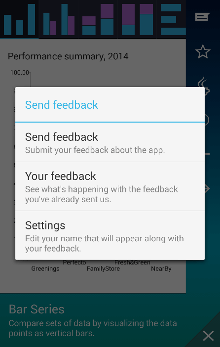
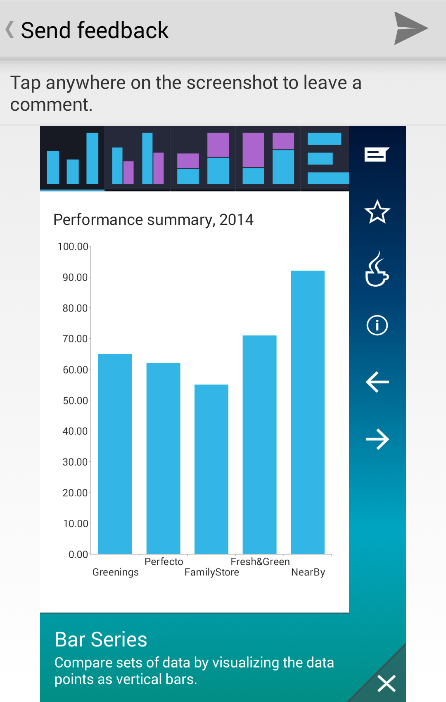
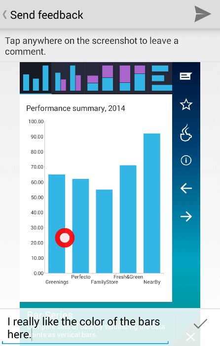
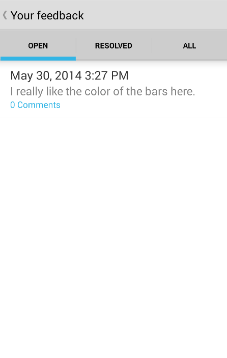
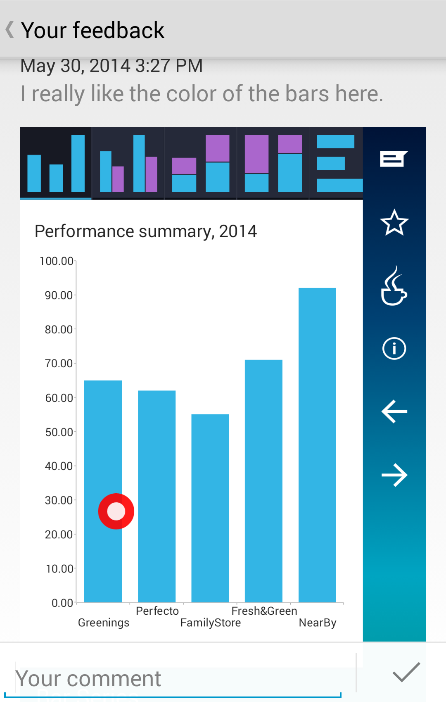
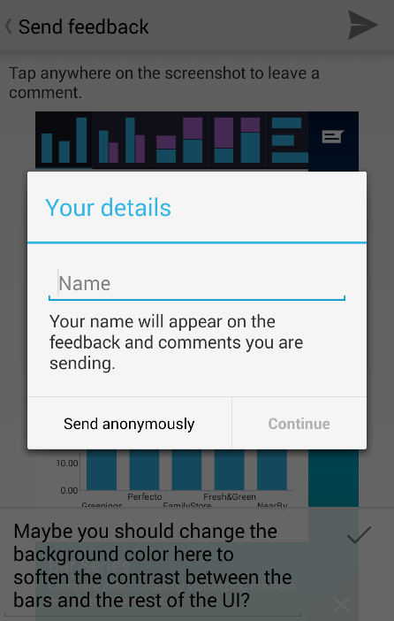

---
title: Getting Started
page_title: RadFeedback Getting Started | Telerik UI for Xamarin.Android Documentation
description: An getting started page of RadFeedback for Android. This article provides the basics you need to know to be able to integrate the RadFeedback component into your Android app.
slug: feedback-gettingstarted
position: 1
tags: radfeedback, feedback, getting started
publish: false
---  

## RadFeedback: Getting started
### Finding the needed packages
**RadFeedback** is distributed in a separate library as a part of the Telerik UI for Xamarin.Android suite. If you are using Eclipse as your development environment you can find the component in the **\Controls\Eclipse\Feedback** folder part of the main folder of your Telerik UI for Xamarin.Android installation. If you are using **Android Studio** as your development environment you can find an _.aar_ package in the **\Controls\Android Studio** folder.
### Getting started with Xamarin Studio
**RadFeedback** is distributed as part Telerik UI for Xamarin as well. To be able to use the component in your Android Xamarin application, you will need to reference the following wrapper DLLs:

* **Telerik.Xamarin.Android.Common.dll**
* **Telerik.Xamarin.Android.Feedback.dll**
* **Xamarin.Android.Support.v4.dll**
* **Xamarin.Android.Support.v7.AppCompat.dll**

>When building your Android application, Xamarin Studio does not automatically merge the manifest files coming from third-party libraries into the main application's AndroidManifest.xml. For that purpose, you will have to manually paste the following activity declarations in your AndroidManifest.xml to be able to use RadFeedback:
```
    <activity
        android:name="com.telerik.widget.feedback.SendFeedbackActivity"
        android:label="@string/title_activity_send_feedback"
        android:theme="@style/AppCompatTheme" >
    </activity>
    <activity
        android:name="com.telerik.widget.feedback.ViewFeedbackActivity"
        android:label="@string/title_activity_view_feedback"
        android:theme="@style/AppCompatTheme" >
    </activity>
    <activity
        android:name="com.telerik.widget.feedback.ViewFeedbackItemActivity"
        android:label="@string/title_activity_view_feedback"
        android:theme="@style/AppCompatTheme" >
    </activity>
    <activity
        android:name="com.telerik.widget.feedback.EditDetailsActivity"
        android:label="@string/title_activity_edit_details"
        android:theme="@style/AppCompatTheme">
    </activity>
```

### Using RadFeedback
Before you can use **RadFeedback** in your app you will need to prepare the communication with the backend. Go to <a href="http://platform.telerik.com/" tagret="_blank">Telerik Platform<a/> and create a new app. 
Then from the side menu choose **Feedback** and click **Enable Feedback**. This will enable the feedback feature and you will be able to use this page to review the feedback sent by your users and reply to them if necessary. 
Now go to **Settings** to get the **App ID**, which you will need later. You can proceed with the set up of **RadFeedback**. Once you ensure that 
the required references are added you can initialize the component using the following settings:

* **Application key** - used to identify the Telerik Platform account which will be used to store the Feedback data (this is the App ID taken from the previous step)
* **Service URI** - the address of the backend service providing the database infrastructure for the RadFeedback component
* **UID** - a unique identifier used to mark the feedback items sent from a given device. This identifier may be unique information about the currently logged user or the ID of the device. This identifier is extremely important as it is used to make feedback data sent by a particular user accessible only by them.

>You will have to extend your AndroidManifest.xml by adding the INTERNET permission if you haven't already done so. This is achieved by inserting the `<uses-permission android:name="android.permission.INTERNET" />` line directly below your `<manifest>` tag in the AndroidManifest.xml

To initialize the component with the required settings you need to call the `init(String apiKey, String serviceUri, String uid)` method on the **RadFeedback** instance as shown below:

```C#
	RadFeedback.Instance ().Init (
			"1234-5678-9101-1121",
			"https://platform.telerik.com/feedback/api/v1",
			"<current_user_email>");
```

>**RadFeedback** implements the singleton pattern, i.e. there is only one **RadFeedback** instance in memory during the lifetime of your Android application.

After initializing the component following the instructions above, you can call the `show(Context context)` method providing an instance of the `Context` class which in most of the cases is the calling `Activity`:

```C#
    Button button = FindViewById<Button> (Resource.Id.myButton);
    
	button.Click += delegate {
	    RadFeedback.Instance().Show(this);
	};
```

After calling the `show(Context context)` a standard feedback procedure is started and your user is presented with a list of predefine options allowing for:

* Sending feedback
* Browsing existing feedback items
* Adjusting settings

# Sending feedback
Once the `show(Context context)` method is called the user is presented with a predefined list of options as shown below:



>The target of the feedback procedure will always be the activity that is passed to the `show(Context context)` method.

To send feedback about the activity the **RadFeedback** component has been started from the user needs to choose the 'Send feedback' option. Chossing this option makes a screenshot of the current state of the activity and opens a new one where annotations and comments can be made and associated with the picture:



To add a comment one simply taps on the picture where they would like to put an annotation. This will put a marker at that location and will open the keyboard for them to enter their comment:



>If the user leaves a marker without a comment it will be automatically removed from the picture.
>You can edit the comment associated with an existing marker by tapping on it.

After the user is done adding comments, tapping on the 'Send' button at the top right corner of the screen will finish the procedure.

#Reading feedback
The users of your application can read the feedback they have already submitted by choosing the 'Your feedback' option on the main menu:


Choosing this option opens a new activity in which the feedback items are grouped in the following categories:

* **Open**
* **Resolved**
* **All**

The item that we have submitted earlier will be visible as shown below:



Initially items are always submitted with their state set to 'open'. Using the backend interface on the <a href="http://platform.telerik.com/" tagret="_blank">Telerik Platform<a/> website you can see these items and mark them as resolved after closing the case. When your users click on an item from either of the lists a new activity will be opened which will present the details of the selected item. The details include:

* The screenshot with the associated marker and comment
* The state of the item
* The conversation with the application developer.

Here's a screenshot of an opened feedback item:



Your users can submit additional comments and read the response from the developer (you) on this activity. Comments are submitted by using the `EditText` instance at the bottom part of the activity.

#Editing settings
The initial menu provides the end users with an option to edit their preferences. Currently there is only one editable preference: the name which will appear when the end user submits comments. Although not obligatory, the name is a good way of providing a way for the developer to address the comments submitted by a user. To make sure the end user is informed about this option, an initial attempt for sending feedback without setting a name will be accompanied by a popup asking the end user to provide their name. The following screenshot demonstrates this experience:



The end user is provided with three options here:

* **Cancelling the popup** - this option closes the popup and interrupts the sending procedure. A second attempt to send feedback will launch this popup again.
* **Sending the feedback anonymously** - this option sends the feedback data anonymously. The popup will never be shown again.
* **Providing a name and sending the feedback** - this option sends the feedback data with the provided author name. The popup will never be shown again.

Editing the already provided name is done by choosing the 'Edit settings' option from the main menu.

#Appending additional JSON content to the new feedback items
RadFeedback allows for appending custom JSON content to each item created on the server. This feature is exposed by the `setAdditionalContent(JSONObject o)` implemented on the **RadFeedback** instance. This method accepts a `JSONObject` instance containing a key-value pairs representing the custom data to be uploaded. These key-value pairs will be merged along the standard Feedback item values in a final `JSONObject` that will be sent as a payload of the HTTP Post request that creates the item on the server. To stop sending custom data with each item, simply call the `setAdditionalContent(JSONObject o)` by passing `null` as an argument.


