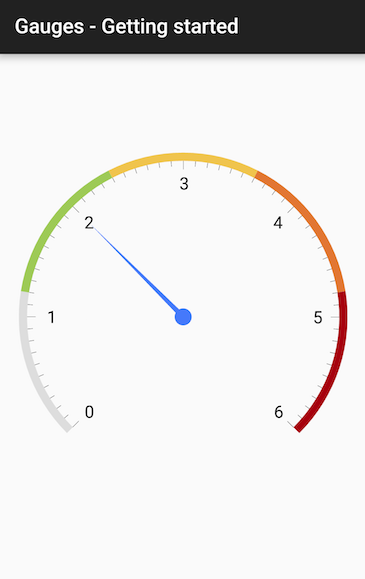

## Gauges for Xamarin.Android: Getting Started

This article demonstrates how to setup an instance of **RadGaugeView** from scratch.

# Initialization

In order to use **RadGuageView** you need to add reference to the **Gauges** library which is part of Telerik UI for Xamarin.Android.

After your project is set up referencing the library you are ready to add a gauge to your activity. **RadGaugeView** is a base class for TelerikUI gauges so you need to instantiate a subclass. The most common way is to describe the gauge in the XML layout of your activity.

```XML
<com.telerik.widget.gauge.RadRadialGaugeView
    android:id="@+id/radial_gauge"
    android:layout_width="match_parent"
    android:layout_height="match_parent"
    android:layout_margin="20dp"/>
```

Then you can access the gauge in your activity and add scales and indicators to it.


```C#
RadRadialGaugeView gauge = (RadRadialGaugeView)rootView.FindViewById(Resource.Id.radial_gauge);
```

## Adding scales

After the gauge is loaded in the activity/fragment you are ready to add scales and indicators to it. The base class that represents a scale in **RadGaugeView** is **GaugeScale**. It has maximum and minimum values and a set of indicators that show values on the scale. You can also set the count of labels and ticks drawn on the scale. The code below demonstrates how to instantiate and configure a scale:


```C#
GaugeRadialScale scale = new GaugeRadialScale(this.Context);
scale.Minimum = 0;
scale.Maximum = 6;
scale.MajorTicksCount = 7;
scale.MinorTicksCount = 9;
scale.LabelsCount = 7;
scale.LineVisible = false;
scale.Radius = 0.95f;
scale.TicksOffset = 0;
```

After the scale is configured you are ready to add indicators to it. In this example you will add a radial needle and radial bar indicators to the scale. The needle points to a specific value and the bar shows a range on the scale.

```C#
int[] colors = new int[] {
    Color.Rgb(221,221,221),
    Color.Rgb(157,202,86),
    Color.Rgb(240,196,77),
    Color.Rgb(226,118,51),
    Color.Rgb(167,1,14)
};

float rangeWidth = scale.Maximum / colors.Length;
float start = 0;
foreach (var color in colors)
{
    GaugeRadialBarIndicator indicator = new GaugeRadialBarIndicator(this.Context);
    indicator.Minimum = start;
    indicator.Maximum = start + rangeWidth;
    indicator.FillColor = color;
    scale.AddIndicator(indicator);
    start += rangeWidth;
}

GaugeRadialNeedle needle = new GaugeRadialNeedle(this.Context);
needle.Value = 2;
scale.AddIndicator(needle);
```

The last thing that you need to do is to add the scale to the gauge:

```C#
gauge.AddScale(scale);
```

