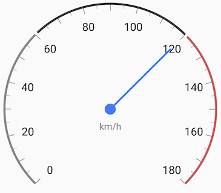
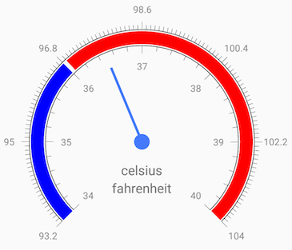

## Gauges for Xamarin.Android: Indicators

Indicators in **RadGaugeView** are visual elements that point to value or visualize a range of values on a scale. They should be added to a scale and their values are aligned to the scale the indicators belong to.





### Bar indicators

Bar indicators are used to visualize a range of values on a scale. Customization of the bars is trivial. Changing their range, color, position and width is achieved by just setting a property. Bar indicators in **RadGaugeView** have a default animation that animates their maximum value. Below is an example how to create a bar indicator and add it to **GaugeScale**.


```C#
    int[] transparentColors = new int[] {
        Color.Argb(100,224,151,36),
        Color.Argb(100,196,241,57),
        Color.Argb(100,132,235,247)
};

    int[] colors = new int[] {
        Color.Argb(255,224,151,36),
        Color.Argb(255,196,241,57),
        Color.Argb(255,132,235,247)
};

    for (int i = 0; i < 3; i++)
    {
        GaugeRadialBarIndicator trnspIndicator = new GaugeRadialBarIndicator(Activity);
        trnspIndicator.Minimum = 0;
        trnspIndicator.Maximum = 100;
        trnspIndicator.FillColor = transparentColors[i];
        trnspIndicator.BarWidth = 0.2f;
        trnspIndicator.Location = 0.5f + i * 0.25f;
        scale.AddIndicator(trnspIndicator);

        GaugeRadialBarIndicator indicator = new GaugeRadialBarIndicator(Activity);
        indicator.Minimum = 0;
        Random r = new Random();
        indicator.Maximum = r.Next(100);
        indicator.Animated = true;
        indicator.AnimationDuration = 500;
        indicator.BarWidth = 0.2f;
        indicator.Location = 0.5f + i * 0.25f;
        indicator.FillColor = colors[i];
        indicator.Cap = GaugeBarIndicatorCapMode.Round;
        scale.AddIndicator(indicator);
    }
```

Note that the indicator's width and location are normalized values. They are calculated based on the size of the gauge that displays them. 


### Needle indicator

The needle indicator is used to point to a specific value. You can easily customize its length, top and bottom width. It is also possible to change the radius of the needle's circle or to offset the needle by just setting the corresponding properties. The length of the needle is again value between 0 and 1. The supports animations when its value is changed.

```C#
needle = new GaugeRadialNeedle(Activity);
needle.Length = 0.8f;
needle.BottomWidth = 8;
needle.TopWidth = 8;
```