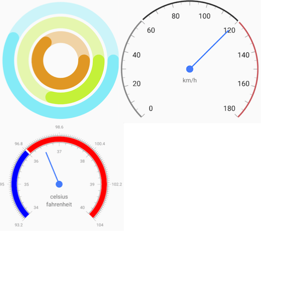

# Gauges: Overview

**RadGaugeView** is a highly customizable component that allows you to show the current status of a value within a range of upper and lower bounds, illustrate progress towards a goal or a summary of a fluctuating metric.

