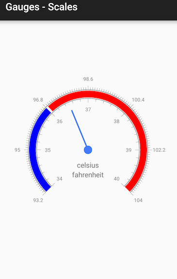

## Gauges for Xamarin.Android: Scales

**GaugeScale** is a base class for the scales in **RadGaugeView**. The scale is a **ViewGroup** that has range and a set of indicators that are rendered according to the range of the scale they belog to. The scale manages the count and appearance of its ticks and labels. **GaugeRadialScale** also allows setting its start and sweep angles. It is possible to add more than one scale to a gauge as this example demonstrates.

## Setup scales

**GaugeScale** allows you to customize every aspect of its visual appearance. You can set the count of ticks and labels or choose to draw then inside or outside the scale. We are going to create an configure 2 scales that will be added to a radial gauge. First thing to do is to instantiate a scale and set its minimum and maximum values:

```C#
GaugeRadialScale scale1 = new GaugeRadialScale(Activity);
scale1.LineVisible = true;
scale1.Minimum = 34;
scale1.Maximum = 40;
```

This scale is going to be the inner scale of the gauge so we are going to change its radius. The radius should be a value between 0 and 1 since the scale works with normalized values. It will then be calculated base on the size of the gauge. We are also going to change the stroke's width.


```C#
scale1.Radius = 0.6f;
scale1.StrokeWidth = 2;
```

Now we can customize the appearance of the ticks and labels.

```C#
scale1.LabelsColor = Color.Gray;
scale1.LabelsCount = 7;
scale1.MajorTicksCount = 7;
scale1.LabelsPaint.TextSize = 30;
scale1.TicksOffset = 0;
scale1.LabelsOffset = 0.1f;
```

The same way we are going to create the second scale. The difference is that this time we are going to draw the labels and the ticks outside the scale.

<snippet id='radial-scale-config2' />

The scale are ready to be added to the gauge.

<snippet id='add-scales-to-gauge' />

### Add indicators to GaugeScale

We now have a gauge with 2 scales, however to be able to show values on the gauge we need to add some indicators. We are going to add 2 radial bar indicators and a needle to the inner scale of the gauge. Below is a helper method that returns bar indicator.

```C#
private GaugeIndicator GetIndicator(float min, float max, int color)
{
    GaugeRadialBarIndicator indicator = new GaugeRadialBarIndicator(Activity);
    indicator.Minimum = min;
    indicator.Maximum = max;
    indicator.FillColor = color;
    indicator.Location = 0.69f;
    indicator.BarWidth = 0.08f;
    return indicator;
}
```

And here is how to add the indicators:

```C#
GaugeRadialNeedle needle = new GaugeRadialNeedle(Activity);
needle.Value = 36.5f;
needle.Length = 0.5f;
needle.TopWidth = 8;
needle.BottomWidth = 8;
scale1.AddIndicator(needle);
scale1.AddIndicator(GetIndicator(34, 36, Color.Blue));
scale1.AddIndicator(GetIndicator(36.05f, 40, Color.Red));
```

The last thing to do is to set titles to the gauge.

```C#
gauge.Title.Text = "celsius";
gauge.Subtitle.Text = "fahrenheit";
gauge.TitleVerticalOffset = 90;
```

Here is how the gauge should look like.



