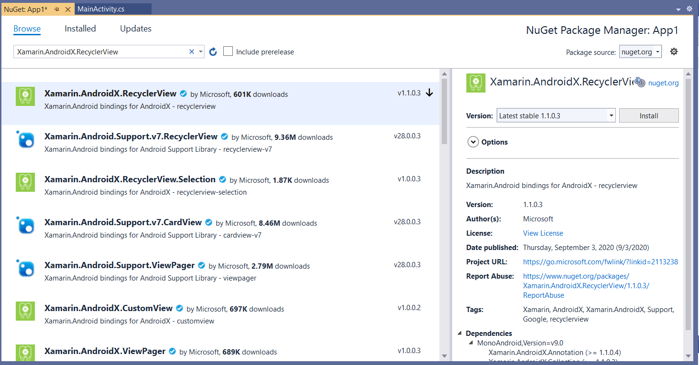
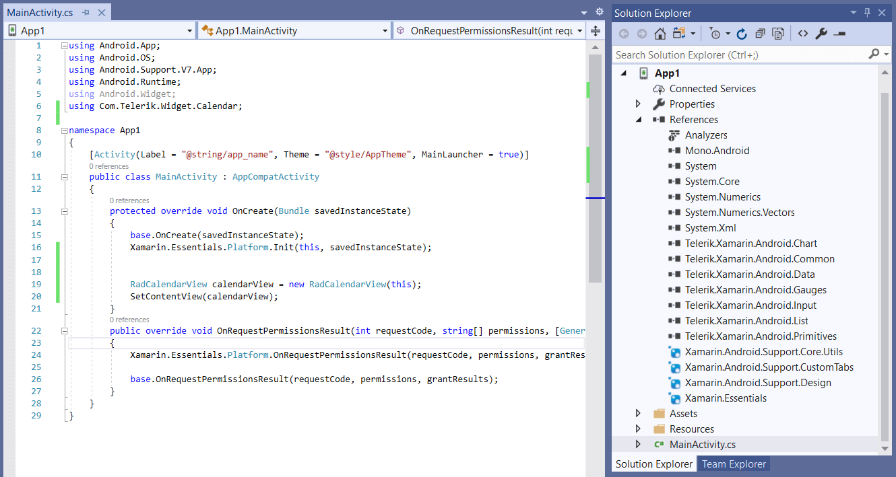

## Telerik UI for Xamarin.Android: Getting Started

This article explains how to start using **Telerik UI for Xamarin.Android** controls.
 
The **Telerik UI for Xamarin.Android** Xamarin distribution comes as a set of **Dynamic Link Libraries**. To be able to use Telerik UI for Xamarin.Android controls, you will need to complete the following steps:

1. Add references to the libraries inside your project.
2. Add the required AndroidX packages using the NuGet.

>With R3 2020 release we have migrated our Xamarin.Android components to use AndroidX. This allows to use all the latest development in Android extensions (AndroidX) along with our controls. 
>
> You can read more on AndroidX and Xamarin here: https://docs.microsoft.com/en-us/xamarin/android/platform/androidx

### System Requirements

Check below the requirements for using our Xamarin.Android components:
 
- **Visual Studio 2019** - On Windows update to Visual Studio 2019 version 16.4 or later. On macOS, update to Visual Studio 2019 for Mac version 8.4 or later.
- **Xamarin.Android** - Xamarin.Android 10.0 or later must be installed with Visual Studio (Xamarin.Android is automatically installed as part of the Mobile Development With .NET workload on Windows and installed as part of the Visual Studio for Mac Installer)
- **Java Developer Kit** - Xamarin.Android 10.0 development requires JDK 8. Microsoft's distribution of the OpenJDK is automatically installed as part of Visual Studio.
- **Android SDK** - Android SDK API 28 or higher must be installed via the Android SDK Manager.

### Referencing the libraries from your project

>tip Check [Download Product Files]() topic for detailed instructions on how to navigate to Telerik UI for Xamarin download page. Download "Telerik_UI_for_Xamarin_[version]_[license].zip" file which contains the needed assemblies for Xamarin.Android development inside Binaries/Android folder.

1. Click on **Android App (Xamarin)** project template in Visual Studio to create a new Xamarin.Android solution:

2. Go through the next steps to configure the solution location, minimum Android version, etc.

3. Add references to the Telerik.Xamarin.Android.* libraries by right-clicking the **References** of your project and selecting **Edit References...**.

4. Add the following AndroidX packages using the NuGet:
	- Xamarin.AndroidX.RecyclerView
	- Xamarin.AndroidX.AppCompat.Resources
	- Xamarin.AndroidX.Lifecycle.LiveData
	- Xamarin.AndroidX.Browser
	- Xamarin.AndroidX.Legacy.Support.V4
	- Xamarin.Google.Android.Material
	- Xamarin.AndroidX.Migration
	

5. Your solution is now ready to use Telerik UI for Xamarin.Android.

## Opening the Samples solution

Samples solution that shows how to use the controls when developing through **Xamarin.Android** is included in the Telerik UI for Xamarin zip file provided for manual installation. 

Telerik_UI_for_Xamarin_[version]_[license].zip, where [version] marks the release and [license] is replaced with Dev license, is available for download from the [Downloads section of your Telerik account](https://www.telerik.com/account/product-download?product=UIXAM). Unzip the archive and go to Examples folder - Xamarin.Android solution is available in the Android folder.

In addition, the Samples solution is included as part of the [Telerik UI for Xamarin MSI installation](). You can find it in the  "[installation-path]/Telerik UI for Xamarin [version]/Examples" folder. 