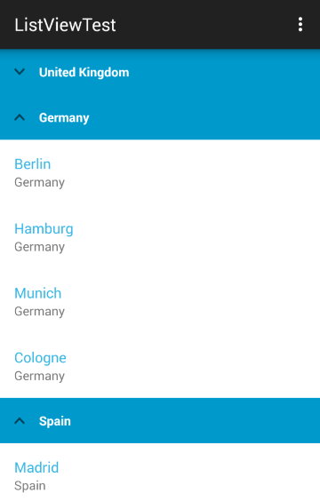

# RadListView: CollapsibleGroupsBehavior

If your list contains group headers as demonstrated in [this article]( "Read more about Grouping"), you can use the **CollapsibleGroupsBehavior** which will allow users to collapse and expand
groups by tapping on their headers.



## Getting Started

The **ListViewDataSourceAdapter**'s default header template contains an image that shows whether a group is expanded or collapsed. Since our example uses its own adapter - **CityDataSourceAdapter**, we will need to
add an image element that will hold an indication arrow. Change the `city_group_item.xml` added in the article for [grouping]( "Read more about Grouping") to include an image:

	<LinearLayout xmlns:android="http://schemas.android.com/apk/res/android"
		android:orientation="horizontal"
		android:background="#FF0099CC"
		android:padding="8dp"
		android:layout_width="match_parent" android:layout_height="match_parent">
		<ImageView
			android:id="@+id/groupHeaderCollapseImage"
			android:layout_gravity="center_vertical"
			android:src="@drawable/ic_collapse"
			android:visibility="gone"
			android:paddingLeft="8dp"
			android:paddingRight="8dp"
			android:layout_width="wrap_content"
			android:layout_height="match_parent" />
		<TextView
			android:id="@+id/headerTextView"
			android:layout_width="match_parent"
			android:layout_height="match_parent"
			android:textStyle="bold"
			android:textColor="#FFFFFF"
			android:textSize="14sp"
			android:padding="8dp" />
	</LinearLayout>

Now we can create a new instance of the collapsible groups behavior and add it to the list view:

```Java
CollapsibleGroupsBehavior collapsibleGroupsBehavior = new CollapsibleGroupsBehavior();
listView.addBehavior(collapsibleGroupsBehavior);
```
```C#
CollapsibleGroupsBehavior collapsibleGroupsBehavior = new CollapsibleGroupsBehavior ();
listView.AddBehavior (collapsibleGroupsBehavior);
```

## Customization

If you need to change the image that is used for indication of whether the group is collapsed you can use the **setCollapseImageResource(int)** method. The image will be automatically rotated when the group is collapsed. You can also
provide a different image of the collapsed state by using **setExpandImageResource(int)**. The default value is `-1` indicating that instead of another resource the upside down version of the collapse image will be used.

## Collapse Group Listener

The CollapseGroupListener can be used to get notification that a group is collapsed or expanded. Here's one simple implementation:

```Java
CollapsibleGroupsBehavior.CollapseGroupListener listener =
	new CollapsibleGroupsBehavior.CollapseGroupListener() {

	@Override
	public void onGroupCollapsed(Object o) {
		Toast.makeText(getBaseContext(), String.format(
			"Group %s was collapsed", o.toString()), Toast.LENGTH_SHORT).show();
	}

	@Override
	public void onGroupExpanded(Object o) {
		Toast.makeText(getBaseContext(), String.format(
			"Group %s was expanded", o.toString()), Toast.LENGTH_SHORT).show();
	}
};
```
```C#
public class CollapseListener : Java.Lang.Object,
	CollapsibleGroupsBehavior.ICollapseGroupListener {

	Context context;
	public CollapseListener(Context context) {
		this.context = context;
	}

	public void OnGroupCollapsed (Java.Lang.Object p0)
	{
		Toast.MakeText (context, String.Format (
			"Group {0} was collapsed", p0.ToString ()), ToastLength.Short).Show ();
	}

	public void OnGroupExpanded (Java.Lang.Object p0)
	{
		Toast.MakeText (context, String.Format (
			"Group {0} was expanded", p0.ToString ()), ToastLength.Short).Show ();
	}
}
```

Now we can add the listener to our behavior:

```Java
collapsibleGroupsBehavior.addListener(listener);
```
```C#
CollapseListener listener = new CollapseListener (Context);
collapsibleGroupsBehavior.AddListener (listener);
```

## Manual collapse/expand

With **CollapsibleGroupsBehavior** you can also manually change whether a group is expanded or collapsed with **changeIsGroupCollapsed(Object group)**.
To determine the current state of a group you can use **isGroupCollapsed(Object group)**.
You can also expand all groups or collapse them by using **expandAll()** or **collapseAll()**.
