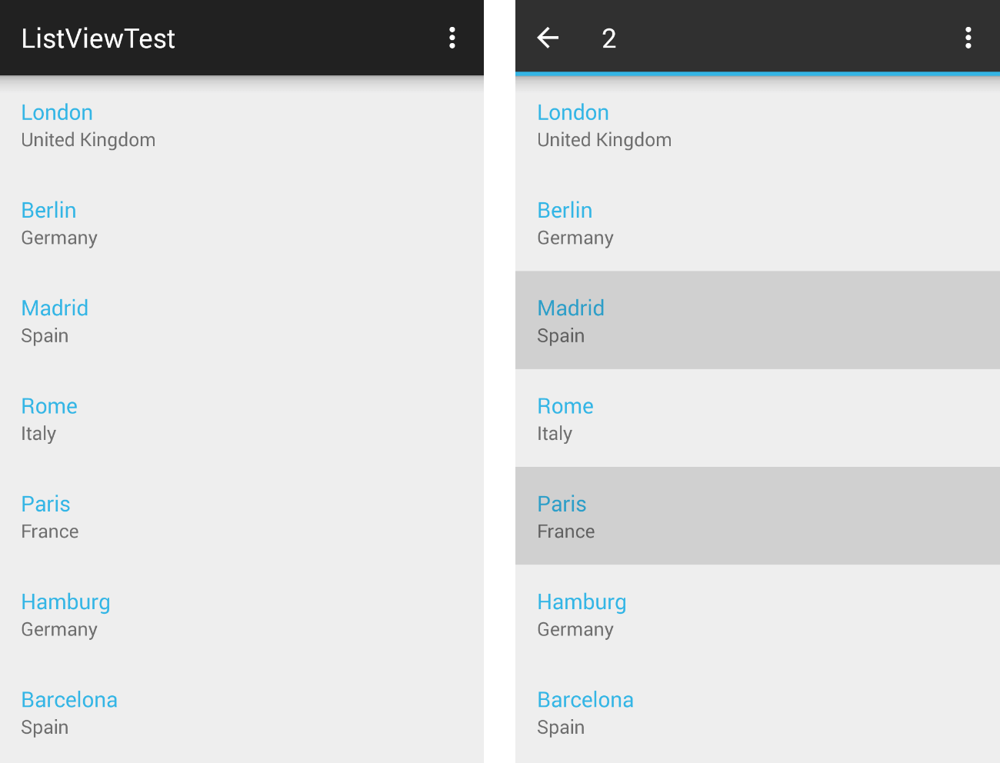

# RadListView: SelectionBehavior

The **SelectionBehavior** is responsible for selecting, deselecting and reporting the selection of items in **RadListView**. It supports single and multiple selection and can provide a notification
when the selection state of an item is changed. Here's how the default settings work: when long press gesture occurs, the list view starts selection mode and the item that was pressed gets selected. Once in selection mode,
a simple tap is enough to change the selection state of each item. The list view exits the selection mode when all items are de-selected or when the back button is pressed.



## Getting Started

If you have read the [Getting Started page]( "Read the RadListView getting started"), you already have a project with **RadListView** which is populated with items of type **City**. In
the [Behaviors Overview]( "Read the behaviors overview page for RadListView") we introduced the behaviors and now we will go into more details about the **SelectionBehavior**.
If we were using an instance of the default ListViewAdapter, adding the **SelectionBehavior** to the list view instance would have been enough to enable the selection:


```C#
SelectionBehavior selectionBehavior = new SelectionBehavior ();
listView.AddBehavior (selectionBehavior);
```

However, we have already extended the default list view adapter to **CityAdapter** and now in order to be able to highlight an item when selected we will need to add a StateListDrawable to our layout that will handle the selected state. 
If you are not familiar with state list drawables you can read more <a href="http://developer.android.com/reference/android/graphics/drawable/StateListDrawable.html" target="_blank">here</a>. You can also use the one 
that is part of the list view resources and is called `selectable_item_background`. You simply need to set it as background of the list item layout (in our example that is `city_list_item`). In order to target all supported platforms, you need to
set this resource as a background of the root element of the layout. Since API Level 11 the state list drawable doesn't need to be set on the root element. You can add a new layout that will be used when running on a device with API 11 or higher
(or change the default layout if you don't plan to support versions prior API 11). This can be used to add an overlay view that will contain the selection state layer. The difference will be more visible if your 
layout contains an image. Then you may notice that if the selection layer was set as background, the image would look the same way no matter if the item is selected or not.
Even though our layout does not include images, we are going to add a new View for the selection layer for demonstration purposes. Here's the new content of the `city_list_item`:

	<FrameLayout xmlns:android="http://schemas.android.com/apk/res/android"
		android:background="#FFFFFFFF"
		android:layout_width="match_parent"
		android:layout_height="match_parent">
		<LinearLayout
			android:layout_width="match_parent"
			android:layout_height="match_parent"
			android:orientation="vertical"
			android:background="@drawable/pressable_item_background"
			android:padding="16dp">
			<TextView
				android:id="@+id/nameView"
				android:layout_width="match_parent"
				android:layout_height="wrap_content"
				android:textSize="16sp"
				android:textColor="#FF33B5E5" />
			<TextView
				android:id="@+id/countryView"
				android:layout_width="match_parent"
				android:layout_height="wrap_content"
				android:textSize="14sp"
				android:textColor="#8A000000" />
		</LinearLayout>
		<View
			android:layout_width="match_parent"
			android:layout_height="match_parent"
			android:background="@drawable/selectable_item_background"/>
	</FrameLayout>

Now if you long press an item, it will change its state to show the selection layer.

## Single selection

The **SelectionBehavior** can be also used for selection of a single item at a time. This can be done by the **setSelectionMode(SelectionBehavior.SelectionMode)** method. To see the current mode you can use 
**getSelectionMode()**. The default value is `MULTIPLE`. Let's change the mode to `SINGLE`:


```C#
selectionBehavior.SetSelectionMode (SelectionBehavior.SelectionMode.Single);
```

Still, long press is required to start the selection mode. The difference is that now when you select another item, the previous selection is cleared. 
In some scenarios, you may need to select an item instantly on tap, without the explicit
need to start a selection by a long press gesture first. Here's when the **setSelectionOnTouch(SelectionBehavior.SelectionOnTouch)** comes in handy. It allows you to change the way the tap gesture is treated. 
The options are: `NEVER`, `ALWAYS`, `AFTER_START`. In order to achieve the above mentioned instant selection on tap, you need to set the mode to `ALWAYS`. The default value is `AFTER_START` which means that you need 
to start the selection first (by long press) before the behaviors starts listening for tap gestures. 
If the value is `NEVER`, the only way to select an item will be by long press no matter if there are selected items or not. The method **getSelectionOnTouch()** returns the current value.

## Selection with code

Sometimes it may be useful to have a certain item(s) preselected. Then you will need to select them manually through code. This can be achieved through the **changeIsSelected(int position, boolean value)** and 
**changeIsSelected(int position)** methods. The first will allow you to define whether the item at the specified position is selected or not and the second allows you to simply change the selection state of the
item at the specified position. In other words, if it was not selected, it will become selected, and if it was selected already, it will be deselected. Here's an example of how to manually select the first item
from your list:


```C#
selectionBehavior.ChangeIsSelected (0);
```

Using the other overload with `true` as a second parameter will have the same result in this case.

## SelectionChangedListener

Usually you will need to monitor the items that the user selects. You can do this by adding a **SelectionChangedListener** to your **SelectionBehavior**. Let's remove the previously added line that set the mode to single selection,
so we can get back to the default selection mode. Now we are going to add a new **android.support.v7.view.ActionMode.Callback** instance that we will use in a **SelectionChangedListener** in order to properly reflect the current selection.
Here's the callback that we will use:


```C#
public class SelectionCallback : Java.Lang.Object, ActionMode.ICallback {
	private SelectionBehavior selectionBehavior;
	public SelectionCallback(SelectionBehavior behavior) {
		selectionBehavior = behavior;
	}

	public bool OnCreateActionMode (ActionMode mode, IMenu menu)
	{
		MenuInflater inflater = mode.MenuInflater;
		inflater.Inflate (Resource.Menu.menu_main, menu);
		return true;
	}

	public bool OnPrepareActionMode (ActionMode mode, IMenu menu)
	{
		return false;
	}

	public bool OnActionItemClicked (ActionMode mode, IMenuItem item)
	{
		return false;
	}

	public void OnDestroyActionMode (ActionMode mode)
	{
		selectionBehavior.EndSelection ();
	}
}
```

>Note that depending on the action bar that your current activity has (if it has), you may need to use different types of callback, but the methods are similar as well as the general idea.

If you are using Android Studio, it should have generated the menu resource automatically, but if it hasn't or if you are using another IDE, you will need to add a menu folder to your resources and add a layout file 
named `menu_main` with the following (or similar) content:

	<menu xmlns:android="http://schemas.android.com/apk/res/android"
		xmlns:app="http://schemas.android.com/apk/res-auto"
		xmlns:tools="http://schemas.android.com/tools" tools:context=".MainActivity">
		<item android:id="@+id/action_settings" android:title="Settings"
			android:orderInCategory="100" app:showAsAction="never" />
	</menu>

Here's the **SelectionChangedListener** that we will use:


```C#
public class SelectionListener : Java.Lang.Object, 
	SelectionBehavior.ISelectionChangedListener {

	private ActionMode actionMode;
	private ActionMode.ICallback callback;
	private Activity activity;
	private SelectionBehavior selectionBehavior;

	public SelectionListener(Activity activity, SelectionBehavior selectionBehavior) {
		this.callback = new SelectionCallback(selectionBehavior);
		this.activity = activity;
		this.selectionBehavior = selectionBehavior;
	}

	public void OnSelectionStarted ()
	{
		actionMode = activity.StartActionMode (callback);
	}
	public void OnItemIsSelectedChanged (int position, bool newValue)
	{
		int selectionCount = selectionBehavior.SelectedItems ().Count;
		actionMode.Title = selectionCount.ToString ();
	}
	public void OnSelectionEnded ()
	{
		actionMode.Finish ();
	}
}
```

Now that we have the callback and the listener, all that's left is to add the listener to our **SelectionBehavior**:


```C#
SelectionListener selectionListener = new SelectionListener (this, selectionBehavior);
selectionBehavior.AddListener (selectionListener);
```

You can see the result in the image from the beginning of the article. That is when we start the selection mode, the default action bar will be replaced with a contextual action bar 
that will display the number of currently selected items.