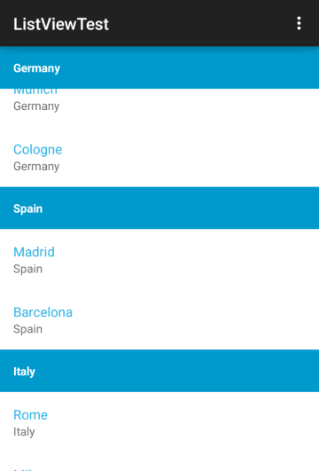

# RadListView: StickyHeaderBehavior

If your list contains group headers as demonstrated in [this article]( "Read more about Grouping"), you can use the **StickyHeaderBehavior** which will 'freeze' the group header of the top item:



As you can see from the image, even though the list is scrolled to the middle of an item, its header remains visible on the top of the list. Here's the code for this to work:

```Java
StickyHeaderBehavior stickyHeaderBehavior = new StickyHeaderBehavior();
listView.addBehavior(stickyHeaderBehavior);
```
```C#
StickyHeaderBehavior stickyHeaderBehavior = new StickyHeaderBehavior ();
listView.AddBehavior (stickyHeaderBehavior);
```
