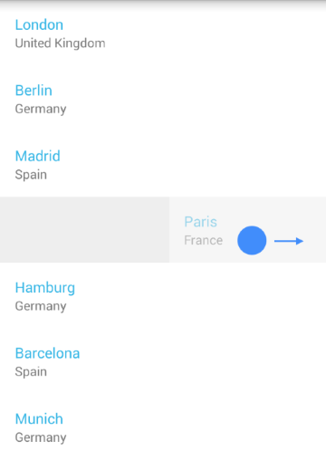

# RadListView: SwipeExecuteBehavior

A popular pattern when you have a list of items is to allow the user to remove an item by swiping it to the right (or to the left). The **SwipeExecuteBehavior** allows you to achieve this fairly easy. 
You can also use it to reveal additional swipe content behind the item. For example a button with some dedicated action.



## Getting Started

If you have read the [Getting Started page]( "Read the RadListView getting started"), you already have a project with **RadListView** which is populated with items of type **City**. In 
the [Behaviors Overview]( "Read the behaviors overview page for RadListView") we introduced the behaviors and now we will go into more details about the **SwipeExecuteBehavior**.
Here's how to add the **SwipeExecuteBehavior** to your list view instance:

```Java
SwipeExecuteBehavior swipeExecuteBehavior = new SwipeExecuteBehavior();
listView.addBehavior(swipeExecuteBehavior);
```
```C#
SwipeExecuteBehavior swipeExecuteBehavior = new SwipeExecuteBehavior ();
listView.AddBehavior (swipeExecuteBehavior);
```

This will allow you to swipe items to the direction that is opposite of the layout of your items. If we presume that you are using the default layout, which is vertical, you can swipe items to the left and to the right.

## SwipeExecuteListener

The **SwipeExecuteListener** should be used to get notification that an item is swiped, so you can perform the desired action on that item, for example to delete it. Here's one simple implementation:

```Java
SwipeExecuteBehavior.SwipeExecuteListener swipeExecuteListener = 
	new SwipeExecuteBehavior.SwipeExecuteListener() {
	
	@Override
	public void onSwipeStarted(int position) {
	}

	@Override
	public void onSwipeProgressChanged(int position, int offset, View swipeContent) {
	}

	@Override
	public void onSwipeEnded(int position, int offset) {
		int absOffset = Math.abs(offset);
		if (absOffset > 300) {
			cityAdapter.remove(position);
		}
		cityAdapter.notifySwipeExecuteFinished();
	}

	@Override
	public void onExecuteFinished(int position) {
	}
};
```
```C#
public class SwipeExecuteListener: Java.Lang.Object, 
	SwipeExecuteBehavior.ISwipeExecuteListener {
	
	private ListViewAdapter listViewAdapter;
	public SwipeExecuteListener(ListViewAdapter adapter) {
		listViewAdapter = adapter;
	}
	public void OnSwipeStarted (int position) {
	}
	public void OnSwipeProgressChanged (int position, int offset, View swipeContent) {
	}
	public void OnSwipeEnded (int position, int offset) {
		int absOffset = Math.Abs(offset);
		if (absOffset > 300) {
			listViewAdapter.Remove(position);
		}
		listViewAdapter.NotifySwipeExecuteFinished ();
	}
	public void OnExecuteFinished (int position) {
	}
}
```

This listener will be notified when a swipe gesture starts (with onSwipeStarted(int)), when it's in progress (with onSwipeProgressChanged(int, int, View))) and when it ends (with onSwipeEnded(int, int)). 
Additionally if there is a special content that is revealed you will be notified when it is dismissed (with onExecuteFinished(int)). We will see later how to add such content. 
The sample implementation that we have just made simply checks if the item that is swiped
has travelled at least `300` pixels in any supported direction (left or right) and if it has, it is removed. Let's add this listener to our behavior and see it in action:

```Java
swipeExecuteBehavior.addListener(swipeExecuteListener);
```
```C#
SwipeExecuteListener swipeExecuteListener = new SwipeExecuteListener ();
swipeExecuteBehavior.AddListener(swipeExecuteListener)
```

You can see the result in the image from the beginning of the article.

## Revealing Additional Swipe Content

Now let's see the other scenario, where we need to add buttons that will be revealed, when an item is swiped to the left or to the right. In order to achieve this we will need to override the **ListViewAdapter**'s 
**onBindSwipeContentHolder(ListViewHolder holder, int position)**. This method is very similar to the **onBindViewHolder** method that we used to populate our items. What you get as a parameter is a view holder 
that will contain the swipe content and the position of the swiped item. Here's one simple implementation of this method:

```Java
@Override
public void onBindSwipeContentHolder(ListViewHolder holder, int position) {
	RelativeLayout mainLayout = (RelativeLayout)holder.itemView;
	LinearLayout leftLayout = (LinearLayout)mainLayout.getChildAt(0);
	LinearLayout rightLayout = (LinearLayout)mainLayout.getChildAt(1);

	Button leftButton = new Button(mainLayout.getContext());
	leftButton.setText("edit");

	Button rightButton = new Button(mainLayout.getContext());
	rightButton.setText("delete");

	leftLayout.removeAllViews();
	leftLayout.addView(leftButton);

	rightLayout.removeAllViews();
	rightLayout.addView(rightButton);
}
```
```C#
public override void OnBindSwipeContentHolder (ListViewHolder holder, int position)
{
	RelativeLayout mainLayout = (RelativeLayout)holder.ItemView;
	LinearLayout leftLayout = (LinearLayout)mainLayout.GetChildAt(0);
	LinearLayout rightLayout = (LinearLayout)mainLayout.GetChildAt(1);

	Button leftButton = new Button(mainLayout.Context);
	leftButton.Text = "edit";

	Button rightButton = new Button(mainLayout.Context);
	rightButton.Text = "delete";

	leftLayout.RemoveAllViews();
	leftLayout.AddView(leftButton);

	rightLayout.RemoveAllViews();
	rightLayout.AddView(rightButton);
}
```

This implementation heavily relies on the knowledge about the nature of the default view holder for the swipe content, namely &mdash; that it is a RelativeLayout, which contains two child views &mdash; each of them
of type LinearLayout. In most cases that implementation is enough to display different content on each side of the swiped item, however if you need something else you can override **onCreateSwipeContentHolder()**
and create a view holder that will suit your needs. If you keep the default implementation, you will get one more benefit. When the swipe gesture ends, the item will automatically snap to the size of the content that you 
have added (in our example that is the default width of a button). If you need to snap the swiped item to another offset (or if you don't use the 
default implementation), you can use the **setSwipeOffset(int)** method and set your preferred final offset. Another thing that is worth mentioning is that the item will fade as you drag it towards the edge.
This is useful to hint the user that a swiped item will be removed but since this is not the case, you can disable the fading through the behavior's **setAutoDissolve(boolean)** method. 
The default value is `true`, which means that the item will fade as you swipe it.

## Swipe Limits

By default, an item can be swiped away from the screen. If you need to set a limit so that it can be swiped only 50 pixels in each direction, here's how to do it:

```Java
swipeExecuteBehavior.setSwipeLimitStart(-50);
swipeExecuteBehavior.setSwipeLimitEnd(50);
```
```C#
swipeExecuteBehavior.SwipeLimitStart = -50;
swipeExecuteBehavior.SwipeLimitEnd = 50;
```