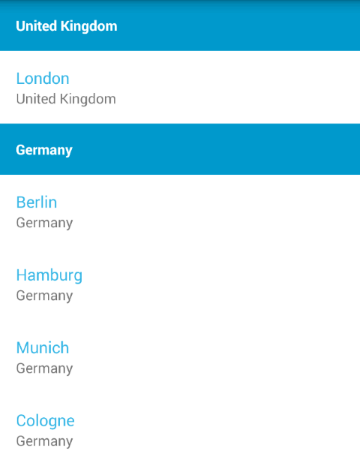

# RadListView: Group, Sort, Filter

**RadListView** has an integration with **RadDataSource** to provide its group, sort and filter features. In this article, you will learn to add descriptors to your adapter in order to reshape the way your original 
list of items is presented.

## Getting Started

For this example, we are going to use again the **City** type that we created in the [Getting Started page]( "Read the RadListView getting started"). The methods that can be used
to add the rules for grouping, sorting and filtering are part of the **ListViewDataSourceAdapter**. This adapter extends the **ListViewAdapter** so you can use it in the same way with all other list view features.

```Java
ListViewDataSourceAdapter listViewDataSourceAdapter = 
	new ListViewDataSourceAdapter(getListOfCities());
listView.setAdapter(listViewDataSourceAdapter);
```
```C#
ListViewDataSourceAdapter listViewDataSourceAdapter = 
	new ListViewDataSourceAdapter (GetListOfCities());
listView.SetAdapter (listViewDataSourceAdapter);
```

At this point you will not notice any difference in the way the items are visualized as opposed to if you were using **ListViewAdapter**. In order to use the layout file that we created in the getting started page,
we will extend the **ListViewDataSourceAdapter** class and create a new adapter. We will name it **CityDataSourceAdapter**:

```Java
public class CityDataSourceAdapter extends ListViewDataSourceAdapter {
    public CityDataSourceAdapter(List items) {
        super(items);
    }

    @Override
    public ListViewHolder onCreateItemViewHolder(ViewGroup parent, int viewType) {
        final LayoutInflater inflater = LayoutInflater.from(parent.getContext());
        View view = inflater.inflate(R.layout.city_list_item, parent, false);
        return new CityViewHolder(view);
    }

    @Override
    public void onBindItemViewHolder(ListViewHolder holder, Object entity) {
        CityViewHolder viewHolder = (CityViewHolder)holder;
        City city = (City)entity;
        viewHolder.nameView.setText(city.getName());
        viewHolder.countryView.setText(city.getCountry());
    }

    public static class CityViewHolder extends ListViewHolder {

        TextView nameView;
        TextView countryView;

        public CityViewHolder(View itemView) {
            super(itemView);

            nameView = (TextView)itemView.findViewById(R.id.nameView);
            countryView = (TextView)itemView.findViewById(R.id.countryView);
        }
    }
}
```
```C#
public class CityDataSourceAdapter : ListViewDataSourceAdapter
{
	public CityDataSourceAdapter(IList items)
		:base(items) {
	}

	public override ListViewHolder OnCreateItemViewHolder (ViewGroup parent, int viewType)
	{
		LayoutInflater inflater = LayoutInflater.From(parent.Context);
		View view = inflater.Inflate(Resource.Layout.city_list_item, parent, false);
		return new CityViewHolder(view);
	}

	public override void OnBindItemViewHolder (ListViewHolder holder, Java.Lang.Object entity)
	{
		CityViewHolder viewHolder = (CityViewHolder)holder;
		City city = (City)entity;
		viewHolder.nameView.Text = city.Name;
		viewHolder.countryView.Text = city.Country;
	}

	public class CityViewHolder : ListViewHolder {
		public TextView nameView;
		public TextView countryView;

		public CityViewHolder(View itemView)
			:base(itemView){

			nameView = (TextView)itemView.FindViewById(Resource.Id.nameView);
			countryView = (TextView)itemView.FindViewById(Resource.Id.countryView);
		}
	}
}
```

You can see that the implementation is very identical to the implementation of our **CityAdapter**. The difference that has to be pointed out is that instead of overriding **onCreateViewHolder** and **onBindViewHolder**, the
methods here are **onCreateItemViewHolder** and **onBindItemViewHolder**. When we add a group descriptor we will see why this is necessary. Now let's just set an instance of our new adapter to the list view:

```Java
CityDataSourceAdapter cityDataSourceAdapter = new CityDataSourceAdapter(getListOfCities());
listView.setAdapter(cityDataSourceAdapter);
```
```C#
CityDataSourceAdapter cityDataSourceAdapter = new CityDataSourceAdapter (GetListOfCities());
listView.SetAdapter (cityDataSourceAdapter);
```

The **ListViewDataSourceAdapter** provides add, remove and clear methods for each type of descriptor that you can use, for example the methods for group descriptors are: **addGroupDescriptor()**, **removeGroupDescriptor()**
and **clearGroupDescriptors()**. Now let's see an example of each descriptor type.

## Group

The **ListViewDataSourceAdapter** allows you to easily define rules for showing your list of items in groups. Let's create a simple group descriptor that will group our items by their country:

```Java
Function<Object, Object> groupDescriptor = new Function<Object, Object>() {
	@Override
	public Object apply(Object object) {
		return ((City)object).getCountry();
	}
};
```
```C#
public class CountryGroupDescriptor : Java.Lang.Object, IFunction {
	public Java.Lang.Object Apply (Java.Lang.Object item)
	{
		return ((City)item).Country;
	}
}
```

And now let's add it to our adapter:

```Java
cityDataSourceAdapter.addGroupDescriptor(groupDescriptor);
```
```C#
CountryGroupDescriptor countryGroupDescriptor = new CountryGroupDescriptor ();
cityDataSourceAdapter.AddGroupDescriptor (countryGroupDescriptor);
```

Now if we run the application we will see that the items are shown in groups. If we want to change the layout of our headers, we can do so by overriding the following methods in our **CityDataSourceAdapter**: 
**onCreateGroupViewHolder()** and **onBindGroupViewHolder()**. Here's one simple implementation:

```Java
@Override
public ListViewHolder onCreateGroupViewHolder(ViewGroup parent, int viewType) {
	final LayoutInflater inflater = LayoutInflater.from(parent.getContext());
	View view = inflater.inflate(R.layout.city_group_item, parent, false);
	return new ListViewTextHolder(view, R.id.headerTextView);
}

@Override
public void onBindGroupViewHolder(ListViewHolder holder, Object groupKey) {
	((ListViewTextHolder)holder).textView.setText(String.valueOf(groupKey));
}
```
```C#
public override ListViewHolder OnCreateGroupViewHolder (ViewGroup parent, int viewType)
{
	LayoutInflater inflater = LayoutInflater.From(parent.Context);
	View view = inflater.Inflate(Resource.Layout.city_group_item, parent, false);
	return new ListViewTextHolder(view, Resource.Id.headerTextView);
}

public override void OnBindGroupViewHolder (ListViewHolder holder, Java.Lang.Object groupKey)
{
	((ListViewTextHolder)holder).TextView.Text = groupKey.ToString ();
}
```

Here we are using a sample layout file named `city_group_item` for our header items that we have added to the layout directory of our project:

	<RelativeLayout xmlns:android="http://schemas.android.com/apk/res/android"
		android:layout_width="match_parent" android:layout_height="wrap_content">
		<TextView
			android:id="@+id/headerTextView"
			android:layout_width="match_parent"
			android:layout_height="match_parent"
			android:textStyle="bold"
			android:textColor="#FFFFFF"
			android:background="#FF0099CC"
			android:textSize="14sp"
			android:padding="16dp" />
	</RelativeLayout>

Here's how it looks now:



As you have probably noticed the methods for creating and binding of the view holders that we had in **ListViewAdapter** and now divided in two for **ListViewDataSourceAdapter** &mdash; one method for the group headers 
and one method for the actual items. If you need to use more than one layout by defining different view types, you can override adapter's 
<a href="https://developer.android.com/reference/android/support/v7/widget/RecyclerView.Adapter.html#getItemViewType(int)" target="_blank">getItemViewType(int)</a>. Note that negative values for item view type will be treated
as group headers and item view types which have a value of `0` or more will be treated like list items.

## Sort

The descriptors for sorting are used in a way similar to the way the grouping descriptors are used. Here's one simple implementation:

```Java
Function2<Object, Object, Integer> sortDescriptor = new Function2<Object, Object, Integer>() {
	@Override
	public Integer apply(Object item1, Object item2) {
		return ((City)item1).getCountry().compareTo(((City)item2).getCountry());
	}
};
```
```C#
public class CountrySortDescriptor : Java.Lang.Object, IFunction2 {
	public Java.Lang.Object Apply (Java.Lang.Object item1, Java.Lang.Object item2)
	{
		return ((City)item1).Country.CompareTo (((City)item2).Country);
	}
}
```

And now let's add it to our adapter:

```Java
cityDataSourceAdapter.addSortDescriptor(sortDescriptor);
```
```C#
CountrySortDescriptor countrySortDescriptor = new CountrySortDescriptor ();
cityDataSourceAdapter.AddSortDescriptor (countrySortDescriptor);
```

Now the items in the list will be sorted alphabetically by their country name. This means that if we keep the group descriptor that we created earlier, we will have the items sorted by their group headers.

## Filter

The descriptors for filtering are definitions of rules that determine whether an item should be displayed or not. Here's one example:

```Java
Function<Object, Boolean> filterDescriptor = new Function<Object, Boolean>() {
	@Override
	public Boolean apply(Object item) {
		return ((City)item).getName().length() <= 5;
	}
};
```
```C#
public class CityFilterDescriptor : Java.Lang.Object, IFunction {
	public Java.Lang.Object Apply (Java.Lang.Object item)
	{
		return ((City)item).Name.Length <= 5;
	}
}
```

And now let's add it to our adapter:

```Java
cityDataSourceAdapter.addFilterDescriptor(filterDescriptor);
```
```C#
CityFilterDescriptor cityFilterDescriptor = new CityFilterDescriptor ();
cityDataSourceAdapter.AddFilterDescriptor (cityFilterDescriptor);
```

The result will be that the visible items will be only those that have a name written with 5 letters or less.