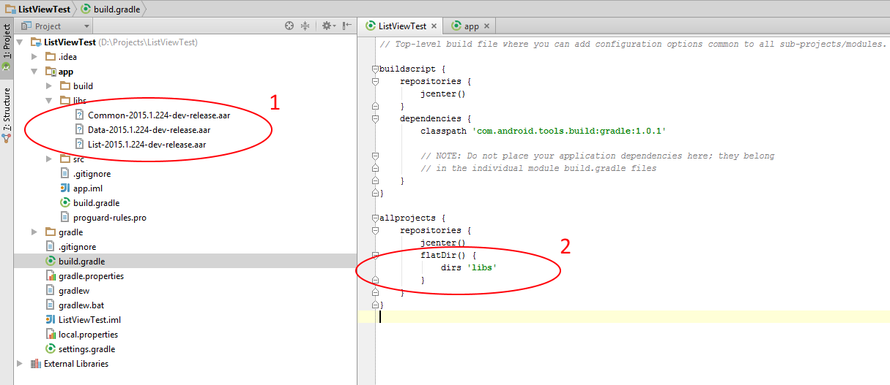
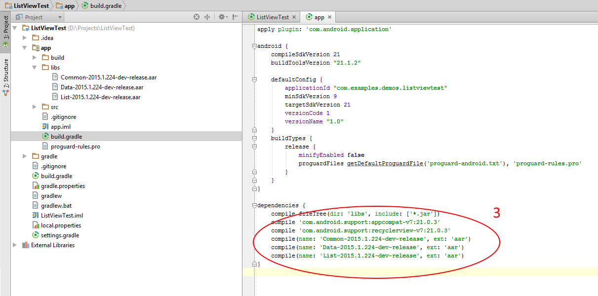
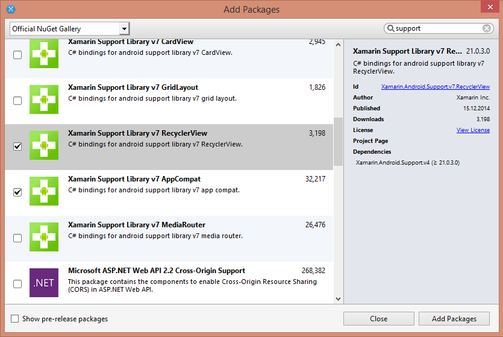

# RadListView: Getting Started

In this article, you will learn how to get started with **RadListView for Android**: how to initialize the list, how to create the adapter that populates it and extend it in accordance with your layout. By the end of 
the article we will have a list that looks like this:


## Project Setup

For **RadListView** you will need the modules **Common**, **Data** and **List**, as well as the **AppCompat v7** and **RecyclerView v7** from the support library:

``` gradle
	compile 'com.android.support:appcompat-v7:<version_of_app_compat>'
    compile 'com.android.support:recyclerview-v7:<version_of_app_compat>'
```



Don't forget to add the modules to the project's dependencies with the same name and version:



If you are using Xamarin Studio, you can add the support libraries from the Add Packages Wizard in the Project menu:



## Adding the list view instance

Now that the project is setup, you can easily add **RadListView** in the layout file for the main activity of your project:

	<RelativeLayout xmlns:android="http://schemas.android.com/apk/res/android"
		xmlns:tools="http://schemas.android.com/tools"
		android:layout_width="match_parent"
		android:layout_height="match_parent"
		tools:context=".MainActivity">

		<com.telerik.widget.list.RadListView
			android:id="@+id/listView"
			android:layout_width="match_parent"
			android:layout_height="match_parent"/>

	</RelativeLayout>

You can access the control from the activity in order to be able to apply further modifications:

```Java
@Override
protected void onCreate(Bundle savedInstanceState) {
	super.onCreate(savedInstanceState);
	setContentView(R.layout.activity_main);

	RadListView listView = (RadListView)findViewById(R.id.listView);
}
```
```C#
protected override void OnCreate (Bundle bundle)
{
	base.OnCreate (bundle);
	SetContentView (Resource.Layout.Main);

	RadListView listView = FindViewById<RadListView> (
		Resource.Id.listView);
}
```

## Adapter

**RadListView** extends <a href="https://developer.android.com/reference/android/support/v7/widget/RecyclerView.html" target="_blank">RecyclerView</a> and requires a similar adapter, which will be responsible for providing 
a proper view for each data item. The items are represented by ViewHolders which are recycled for better performance. For example if we have a list of 20 items, but only 7 are visible on the screen at one point.
Then 7 view holders should be enough to represent all the data. Later when the user scrolls the same view holders will be reused to show the new data. 
The default adapter that is used by **RadListView** is called **ListViewAdapter**. 
In order to create a new instance, you simply need to pass a list of items to the constructor of the adapter. Let's create a simple class that we will use later to populate the list:

```Java
public class City {
	private String name;
	private String country;

	public City(String name, String country) {
		this.name = name;
		this.country = country;
	}

	public String getName() {
		return name;
	}

	public void setName(String name) {
		this.name = name;
	}

	public String getCountry() {
		return country;
	}

	public void setCountry(String country) {
		this.country = country;
	}

	@Override
	public String toString() {
		return String.format("%s (%s)", name, country);
	}
}
```
```C#
public class City : Java.Lang.Object {
	public String Name { get; set; }
	public String Country { get; set; }

	public City(String name, String country) {
		this.Name = name;
		this.Country = country;
	}

	public override string ToString () {
		return string.Format ("{0} ({1})", Name, Country);
	}
}
```

Now, let's create a method that will create a list of items that we can use for our list view adapter:

```Java
private List<City> getListOfCities() {
	List<City> cities = new ArrayList<>();
	cities.add(new City("London", "United Kingdom"));
	cities.add(new City("Berlin", "Germany"));
	cities.add(new City("Madrid", "Spain"));
	cities.add(new City("Rome", "Italy"));
	cities.add(new City("Paris", "France"));
	cities.add(new City("Hamburg", "Germany"));
	cities.add(new City("Barcelona", "Spain"));
	cities.add(new City("Munich", "Germany"));
	cities.add(new City("Milan", "Italy"));
	cities.add(new City("Cologne", "Germany"));
	return cities;
}
```
```C#
private List<City> GetListOfCities() {
	List<City> cities = new List<City> ();
	cities.Add (new City ("London", "United Kingdom"));
	cities.Add (new City ("Berlin", "Germany"));
	cities.Add (new City ("Madrid", "Spain"));
	cities.Add (new City ("Rome", "Italy"));
	cities.Add (new City ("Paris", "France"));
	cities.Add (new City ("Hamburg", "Germany"));
	cities.Add (new City ("Barcelona", "Spain"));
	cities.Add (new City ("Munich", "Germany"));
	cities.Add (new City ("Milan", "Italy"));
	cities.Add (new City ("Cologne", "Germany"));
	return cities;
}
```

We are now ready to create a new adapter from the list and pass it to the list view instance:

```Java
ListViewAdapter listViewAdapter = new ListViewAdapter(getListOfCities());
listView.setAdapter(listViewAdapter);
```
```C#
ListViewAdapter listViewAdapter = new ListViewAdapter (GetListOfCities ());
listView.SetAdapter (listViewAdapter);
```

More often than not, you will want your list view items to include a bit more complex layout. In order to achieve this you will need to extend the **ListViewAdapter** class and override its **onCreateViewHolder** and 
**onBindViewHolder** methods. The first one is responsible for creating a new view holder that will be later reused to visualize different data items. The second is responsible for the binding of a view holder with information
about a specific item from the list. Here's one way to extend the default adapter:

```Java
public class CityAdapter extends ListViewAdapter {
	public CityAdapter(List items) {
		super(items);
	}

	@Override
	public ListViewHolder onCreateViewHolder(ViewGroup parent, int viewType) {
		final LayoutInflater inflater = LayoutInflater.from(parent.getContext());
		View view = inflater.inflate(R.layout.city_list_item, parent, false);
		return new CityViewHolder(view);
	}

	@Override
	public void onBindViewHolder(ListViewHolder holder, int position) {
		CityViewHolder viewHolder = (CityViewHolder)holder;
		City city = (City)getItems().get(position);
		viewHolder.nameView.setText(city.getName());
		viewHolder.countryView.setText(city.getCountry());
	}

	public static class CityViewHolder extends ListViewHolder {

		TextView nameView;
		TextView countryView;

		public CityViewHolder(View itemView) {
			super(itemView);

			nameView = (TextView)itemView.findViewById(R.id.nameView);
			countryView = (TextView)itemView.findViewById(R.id.countryView);
		}
	}
}
```
```C#
public class CityAdapter : ListViewAdapter
{
	public CityAdapter(IList items)
		:base(items) {
	}

	public override RecyclerView.ViewHolder OnCreateViewHolder (ViewGroup parent, int viewType)
	{
		LayoutInflater inflater = LayoutInflater.From(parent.Context);
		View view = inflater.Inflate(Resource.Layout.city_list_item, parent, false);
		return new CityViewHolder(view);
	}

	public override void OnBindListViewHolder (ListViewHolder holder, int position)
	{
		CityViewHolder viewHolder = (CityViewHolder)holder;
		City city = (City)Items[position];
		viewHolder.nameView.Text = city.Name;
		viewHolder.countryView.Text = city.Country;
	}

	public class CityViewHolder : ListViewHolder {
		public TextView nameView;
		public TextView countryView;

		public CityViewHolder(View itemView)
			:base(itemView){

			nameView = (TextView)itemView.FindViewById(Resource.Id.nameView);
			countryView = (TextView)itemView.FindViewById(Resource.Id.countryView);
		}
	}
}
```

The resource city_list_item that is used in the adapter is a new layout resource added in the layout directory of your project and its content is as follows:

	<LinearLayout xmlns:android="http://schemas.android.com/apk/res/android"
		android:layout_width="match_parent"
		android:layout_height="match_parent"
		android:orientation="vertical"
		android:background="@drawable/pressable_item_background"
		android:padding="16dp">

		<TextView
			android:id="@+id/nameView"
			android:layout_width="match_parent"
			android:layout_height="wrap_content"
			android:textSize="16sp"
			android:textColor="#FF33B5E5" />

		<TextView
			android:id="@+id/countryView"
			android:layout_width="match_parent"
			android:layout_height="wrap_content"
			android:textSize="14sp"
			android:textColor="#8A000000" />

	</LinearLayout>

When you set an instance of your new adapter to the list view, it will look as the one in image from the beginning of the article:
```Java
CityAdapter cityAdapter = new CityAdapter(getListOfCities());
listView.setAdapter(cityAdapter);
```
```C#
CityAdapter cityAdapter = new CityAdapter (GetListOfCities ());
listView.SetAdapter (cityAdapter);
```