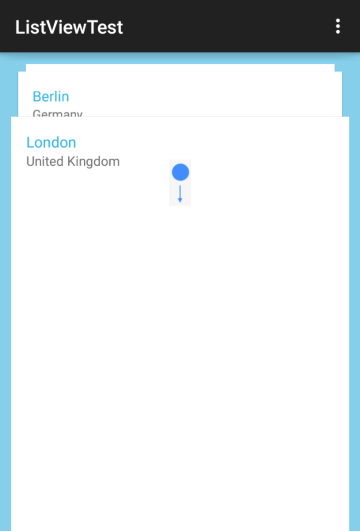
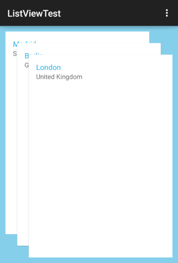
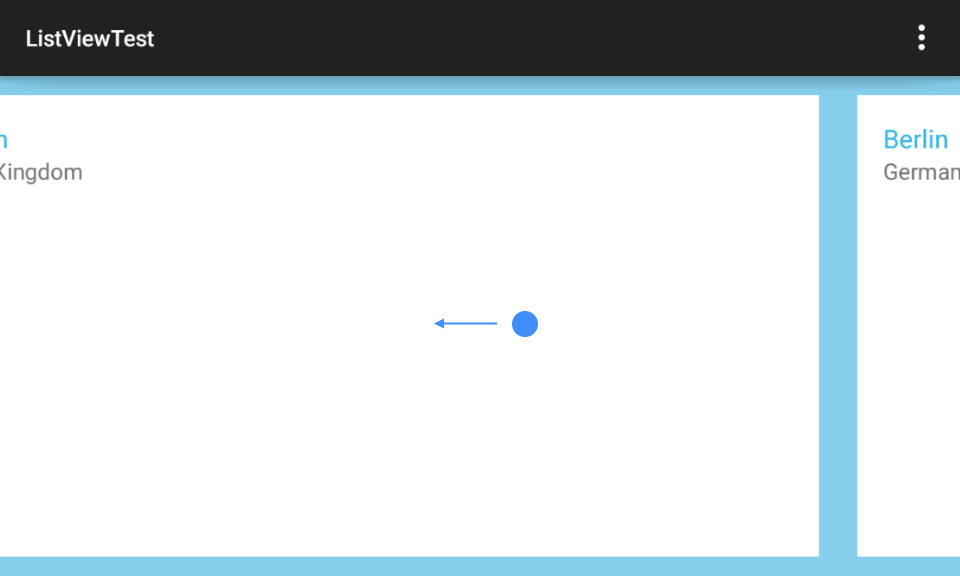

# RadListView: Layouts

As **RadListView** extends **RecyclerView**, it provides the same layout mechanism. Namely &mdash; you can use the **setLayoutManager(LayoutManager)** method to change the layout that is used.
There are three implemented layouts and you can also create your own by extending **LayoutManager**.

## Getting Started

By default **RadListView** will use **LinearLayoutManager** but you can easily change that with the **setLayoutManager(LayoutManager)**. The layouts that are implemented are:

* <a href="https://developer.android.com/reference/android/support/v7/widget/LinearLayoutManager.html" target="_blank">Linear</a>: The default layout which orders the item in a simple list.
* <a href="https://developer.android.com/reference/android/support/v7/widget/GridLayoutManager.html" target="_blank">Grid</a>: A LayoutManager implementation that lays out items in a grid.
* <a href="https://developer.android.com/reference/android/support/v7/widget/StaggeredGridLayoutManager.html" target="_blank">Staggered Grid</a>: A LayoutManager that lays out children in a staggered grid formation.
* **Deck of Cards**: A LayoutManager that lays out children stacked in a way similar to a deck of cards, where one item is fully visible and others are shown in perspective.
* **Slide**: A LayoutManager that lays out children in a gallery-like way where one item is in the center and users can easily swipe to adjacent items.
* **Wrap**: A LayoutManager that lays out children consecutively on one line until it can and when there is not enough space on the current line, it creates a new line and continues the layout process there.

Each of these layouts can layout the items either horizontally or vertically. More information about the first three layouts is available in their own documentation. The others are demonstrated below. 
Here's one example of setting grid layout with two columns and horizontal layout:

```Java
GridLayoutManager gridLayoutManager = new GridLayoutManager(this, 2, 
	LinearLayoutManager.HORIZONTAL, false);
listView.setLayoutManager(gridLayoutManager);
```
```C#
GridLayoutManager gridLayoutManager = new GridLayoutManager(this, 2, 
	LinearLayoutManager.Horizontal, false);
listView.SetLayoutManager(gridLayoutManager);
```

## Deck of Cards

The **DeckOfCardsLayoutManager** is a layout manager which lays out the items in way similar to a deck of cards where one item is fully visible and other are shown behind it in a perspective and when you scroll down, the next item
moves forward:



### Getting Started

Just like the other layout managers, all you need to do, is to create a new instance of the layout and add it through RadListView's **setLayoutManager** method:

```Java
DeckOfCardsLayoutManager deckOfCardsLayoutManager = 
	new DeckOfCardsLayoutManager(this);
listView.setLayoutManager(deckOfCardsLayoutManager);
```
```C#
DeckOfCardsLayoutManager deckOfCardsLayoutManager = 
	new DeckOfCardsLayoutManager (this);
listView.SetLayoutManager (deckOfCardsLayoutManager);
```

Similarly to **LinearLayoutManager**, **DeckOfCardsLayoutManager** provides additional constructor, which allows you to change the orientation to Horizontal and/or reverse the layout, so that the perspective items are shown
on a different side of front item. For example:

```Java
DeckOfCardsLayoutManager deckOfCardsLayoutManager = 
	new DeckOfCardsLayoutManager(this, 
		OrientationHelper.HORIZONTAL, true);
listView.setLayoutManager(deckOfCardsLayoutManager);
```
```C#
DeckOfCardsLayoutManager deckOfCardsLayoutManager = 
	new DeckOfCardsLayoutManager (this, 
		OrientationHelper.Horizontal, true);
listView.SetLayoutManager (deckOfCardsLayoutManager);
```

This way the perspective items will be laid out to the right of the front item and the scrolling forward will be made by swiping to the left. 

### Items Count

Speaking of perspective items, by default you will see 2 items behind the front view,
which can be changed through **setPerspectiveItemsCount(int)**. The current value is accessible with **getPerspectiveItemsCount()**.

```Java
deckOfCardsLayoutManager.setPerspectiveItemsCount(5);
```
```C#
deckOfCardsLayoutManager.PerspectiveItemsCount = 5;
```

### Scrolling

By default you are able to scroll to the next or previous item by swiping bottom or top. However, you can also do that programmatically through the 
**scrollToNext()** and **scrollToPrevious()** methods and also to a certain position through **scrollToPosition(int)**. For example this can be used to move the items with one button for forward scroll and one button for backward scroll.
In that case you can also disable the scrolling through swipe with **setScrollEnabled(false)**.

### Current item

If you need to determine which item is the one that is fully visible, you can get its position through **getCurrentPosition()**. Alternatively you can change it with **setCurrentPosition(int)**. You can also track any changes
by creating a **CurrentPositionChangeListener**:

```Java
CurrentPositionChangeListener listener = 
	new CurrentPositionChangeListener() {
	
    @Override
    public void onCurrentPositionChanged(int oldPosition, int newPosition) {
        Toast.makeText(getApplicationContext(), 
			"Position changed from " + oldPosition + " to " + newPosition, 
			Toast.LENGTH_SHORT).show();
    }
};
```
```C#
public class MyItemChangeListener : Java.Lang.Object, 
	Com.Telerik.Widget.List.ICurrentPositionChangeListener 
{
	private Context context;

	public MyItemChangeListener(Context context) 
	{
		this.context = context;
	}

	public void OnCurrentPositionChanged (int oldPosition, int newPosition)
	{
		Toast.MakeText (context, 
			"Position changed from " + oldPosition + " to " + newPosition,
			ToastLength.Short).Show ();
	}
}
```

Then you need to set it to your deck of cards layout:

```Java
deckOfCardsLayoutManager.addListener(listener);
```
```C#
MyItemChangeListener listener = new MyItemChangeListener (this);
deckOfCardsLayoutManager.AddListener (listener);
```

### Customization

The deck of cards layout provides a transformation object which allows you to tweak the transformation that are applied to the perspective items. That object is available as **perspective()** and you can use it to change
the way the perspective items are visible behind the front view item. For example, if you would like to have a bigger visible part and change the way the perspective is oriented, here's what you can do:

```Java
deckOfCardsLayoutManager.perspective().setTranslateStart(-50);
deckOfCardsLayoutManager.perspective().setTranslateTop(-50);
deckOfCardsLayoutManager.perspective().setTranslateEnd(-50);
```
```C#
deckOfCardsLayoutManager.Perspective ().TranslateStart = -50;
deckOfCardsLayoutManager.Perspective ().TranslateTop = -50;
deckOfCardsLayoutManager.Perspective ().TranslateEnd = -50;
```

The result is:



The idea here is that each item in the perspective will be translated from the one in front of it with the specified pixels, in that case by 50 pixels, and since the values are negative, the translation is to the left and to the top.
Another change in the default behavior can be made with the deck of cards' *setAutoDissolveFrontView(boolean)*. When it is set to `true` the front item will dissolve as you slide it out in order to scroll to next item and
will gently appear while you scroll to the previous item.

### Behaviors

You can add the following behaviors to your list view when the **DeckOfCardsLayoutManager** is used: [SelectionBehavior]( "Read more about the SelectionBehavior"), 
[LoadOnDemandBehavior]( "Read more about the LoadOnDemandBehavior") and [SwipeExecuteBehavior]( "Read more about the LoadOnDemandBehavior"). 
They will provide the same functionality they do for the rest of the layout managers.

## Slide

The **SlideLayoutManager** is a layout manager which lays out the items in a gallery-like way where one item is in the center and users can easily swipe to adjacent items:



### Getting Started

Just like the other layout managers, all you need to do, is to create a new instance of the layout and add it through RadListView's **setLayoutManager** method:

```Java
SlideLayoutManager slideLayoutManager = 
	new SlideLayoutManager(this);
listView.setLayoutManager(slideLayoutManager);
```
```C#
SlideLayoutManager slideLayoutManager = 
	new SlideLayoutManager (this);
listView.SetLayoutManager (slideLayoutManager);
```

**SlideLayoutManager** provides additional constructor, which allows you to change its orientation to Vertical:

```Java
SlideLayoutManager slideLayoutManager = 
	new SlideLayoutManager(this, 
		OrientationHelper.VERTICAL);
listView.setLayoutManager(slideLayoutManager);
```
```C#
SlideLayoutManager slideLayoutManager = 
	new SlideLayoutManager (this, 
		OrientationHelper.Vertical);
listView.SetLayoutManager (slideLayoutManager);
```

This way the adjacent items will be laid out to the top and to the bottom of the front item and the scrolling will be made by swiping to the top or to the bottom. 

### Item Spacing

In the example from the screen shot, we have added margin to the item layout and this is why there is visible space between the items. Another option to have space between items, which will not consume place on the screen is the 
item spacing feature. In other words you can have an item stretched to fill the screen and still have space between the adjacent items. Here's how to add a spacing of 20 pixels:

```Java
slideLayoutManager.setItemSpacing(20);
```
```C#
slideLayoutManager.ItemSpacing = 20;
```

Of course, you can get the current value with **getItemSpacing()**. The default is `0`.

### Item Preview

If you don't want to occupy the whole space with only one item, you can show its adjacent items on the left and/or on the right. Here's an example:

```Java
slideLayoutManager.setPreviousItemPreview(100);
slideLayoutManager.setNextItemPreview(100);
```
```C#
slideLayoutManager.PreviousItemPreview = 100;
slideLayoutManager.NextItemPreview = 100;
```

Now you will be able to see 100 pixels from each of the adjacent items (if there are any). You can use only one of the methods or both of them together depending on your requirements. The default value for both is `0`, 
which you can check with **getPreviousItemPreview()** and **getNextItemPreview()** respectively. By default, when users tap on one of the adjacent items, that item will move to the front. If this behavior is not desired,
you can turn it off through **setScrollOnTap(false)**.

### Transitions

The default transition mode in **SlideLayoutManager** is called `SLIDE_AWAY`. This means that when the user swipes, the current item slides away in the direction of the swipe and another appears from the opposite side. The mode
can be changed to `SLIDE_OVER` which means that the items will appear stacked in a way that one item slides over the one that is current. This mode resembles the behavior in the default Android Photos app. Here's how you can change it:

```Java
slideLayoutManager.setTransitionMode(
	SlideLayoutManager.Transition.SLIDE_OVER);
```
```C#
slideLayoutManager.TransitionMode = 
	SlideLayoutManager.Transition.SlideOver;
```

> Please note that from visual perspective the **Item Preview** and **Item Spacing** make sense only with the default transition mode.

### Scrolling

By default you are able to scroll to the next or previous item by swiping left or right. However, you can also do that programmatically through the 
**scrollToNext()** and **scrollToPrevious()** methods and also to a certain position through **scrollToPosition(int)**. For example this can be used to navigate through items with two buttons - one for each direction.
In that case you can also disable the scrolling through swipe with **setScrollEnabled(false)**.

### Current item

If you need to determine which item is the one that is currently in front, you can get its position through **getCurrentPosition()**. Alternatively you can change it with **setCurrentPosition(int)**. You can also track any changes
by creating a **CurrentPositionChangeListener**:

```Java
CurrentPositionChangeListener listener = 
	new CurrentPositionChangeListener() {
	
    @Override
    public void onCurrentPositionChanged(int oldPosition, int newPosition) {
        Toast.makeText(getApplicationContext(), 
			"Position changed from " + oldPosition + " to " + newPosition, 
			Toast.LENGTH_SHORT).show();
    }
};
```
```C#
public class MyItemChangeListener : Java.Lang.Object, 
	Com.Telerik.Widget.List.ICurrentPositionChangeListener 
{
	private Context context;

	public MyItemChangeListener(Context context) 
	{
		this.context = context;
	}

	public void OnCurrentPositionChanged (int oldPosition, int newPosition)
	{
		Toast.MakeText (context, 
			"Position changed from " + oldPosition + " to " + newPosition,
			ToastLength.Short).Show ();
	}
}
```

Then you need to set it to your slide layout:

```Java
slideLayoutManager.addListener(listener);
```
```C#
MyItemChangeListener listener = new MyItemChangeListener (this);
slideLayoutManager.AddListener (listener);
```

## Wrap

The **WrapLayoutManager** is a layout manager that starts to layout its items consecutively on one line until it can. When there is not enough space on the current line to accommodate the next item, 
it creates a new line and continues the layout process there. This repeats until all items that are currently visible are laid out.

### Getting Started

Just like the other layout managers, all you need to do, is to create a new instance of the layout and add it through RadListView's **setLayoutManager** method:

```Java
WrapLayoutManager wrapLayoutManager = 
	new WrapLayoutManager(this);
listView.setLayoutManager(wrapLayoutManager);
```
```C#
WrapLayoutManager wrapLayoutManager = 
	new WrapLayoutManager (this);
listView.SetLayoutManager (wrapLayoutManager);
```

**WrapLayoutManager** provides additional constructor, which allows you to change its orientation to Horizontal:

```Java
WrapLayoutManager wrapLayoutManager = 
	new WrapLayoutManager(this, 
		OrientationHelper.HORIZONTAL);
listView.setLayoutManager(wrapLayoutManager);
```
```C#
WrapLayoutManager wrapLayoutManager = 
	new WrapLayoutManager (this, 
		OrientationHelper.Horizontal);
listView.SetLayoutManager (wrapLayoutManager);
```

This way the layout process will start by creating one column and will place items there until there is no place for a next item. Then a new column will be created for the next items.

### Minimum Item Spacing

If you want, you can easily add spacing between the items on each line (that is row in vertical orientation and column in horizontal orientation). This happens with the **setMinimumItemSpacing(int)**. You can get the current value
with **getMinimumItemSpacing()**, the default value is `0`.

### Line Spacing

The spacing between the lines (again - between rows in vertical orientation and between columns in horizontal orientation) is controlled by the line spacing. It's default value is also `0`, which you can check
with **getLineSpacing()**. If you want to add spacing, use **setLineSpacing(int)**. 

### Gravity

By default, the layout process starts from the top-left point and layout items one after other. Consider the following layout scenario:


As you can see when items have different sizes, there can be empty spaces. What's common for the items in the layout produced in the image is that the items on each line share common top border. Also all lines share a common left
border. However, different items in a line may have a different bottom position and also, different lines have a different ending right position. Here's when the gravity may come handy. You can combine one value for horizontal gravity
and one for vertical gravity at the same time. 

Let's start with the horizontal values, they can be: LEFT (START), RIGHT (END), CENTER_HORIZONTAL, FILL_HORIZONTAL. As you can see from the image the items in a single line are
aligned to the left. You can align them to the right, which will result in moving the empty space (currently on the right) to the left. Your other option is to center them, which will result in the even distribution of the empty 
space between left and right. The last option is fill, this will result in having the items aligned both to the left and to the right with the remaining empty space equally distributed between the items on that line.
This is why the item spacing is **minimum** - because when the gravity is set to fill, the item spacing may increase.

The vertical meaningful values are: TOP, BOTTOM, CENTER_VERTICAL. Depending on this value the items in each line are aligned to the top edge of the line, to the bottom edge, or to the center.

When the orientation is horizontal, the logic is reverted - the horizontal values are applied for alignment to the edge of the lines and the vertical values reflect the distribution of the empty space on each line.
This also means that you can use FILL_VERTICAL to distribute the empty space between items in a column and that FILL_HORIZONTAL will not make sense for this orientation. Here's an example for changing the gravity:
```Java
wrapLayoutManager.setGravity(Gravity.CENTER_HORIZONTAL | Gravity.BOTTOM);
```
```C#
wrapLayoutManager.Gravity = (int)(GravityFlags.CenterHorizontal | GravityFlags.Bottom); 
```

You can read more about **Gravity** <a href="http://developer.android.com/reference/android/view/Gravity.html" target="_blank">here</a>.
