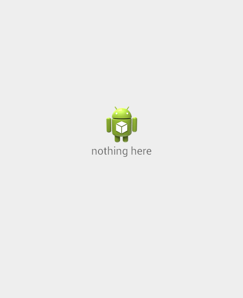

## ListView for Xamarin.Android: Other Features

This article demonstrates some of the other features of **RadListView**: how to show empty content when the list is empty, 
how to add header and footer, how to listen to item clicks and how to scroll to a specific position in the list.

## Empty Content

You can easily provide an indication that your list currently has no items. This can be due to the lack of adapter or if the adapter has no items.

### Custom Layout as Empty Content

This can be done through the **setEmptyContent(View)** method. You can combine multiple items - images, texts, etc. in a layout of your choice and use it 
as a parameter for this method. Here's one example where we have create a dedicated layout resource file to define our empty content:

	<FrameLayout xmlns:android="http://schemas.android.com/apk/res/android"
		android:orientation="vertical" android:layout_width="match_parent"
		android:layout_height="match_parent">
		<LinearLayout
			android:orientation="vertical"
			android:layout_gravity="center"
			android:layout_width="100dp"
			android:layout_height="100dp">
			<ImageView
				android:src="@mipmap/ic_launcher"
				android:layout_gravity="center_horizontal"
				android:layout_width="wrap_content"
				android:layout_height="wrap_content" />
			<TextView
				android:text="nothing here"
				android:layout_gravity="center_horizontal"
				android:layout_width="wrap_content"
				android:layout_height="wrap_content" />
			</LinearLayout>
	</FrameLayout>

> This sample demonstrates how to show the currently default launcher icon. Make sure you are referencing an existing image file from its proper location (mipmap, drawable, etc.) and with its exact name (ic_launcher, Icon, etc.).

Then we need to inflate this layout and set the resulted view as empty content:


```C#
LayoutInflater inflater = LayoutInflater.From (this);
View emptyContentView = inflater.Inflate (Resource.Layout.empty_content, listView, false);
listView.EmptyContent = emptyContentView;
```

Now if our list view doesn't contain an adapter or if it has no items, it would look in a way similar to this:



### Simple Text as Empty Content

If all you need to display is a simple TextView, you can take advantage of our default empty content. Here's how:


```C#
listView.EmptyContentEnabled = true;
```

This will automatically create a TextView with a default text that will be set as your empty content view. You can access if you need to change its appearance, text and or gravity through the **getEmptyContent()** method, of course
after you have enabled it as just shown (setEmptyContentEnabled(true)).

## Header and Footer

**RadListView** allows you to add a custom view as a header or as a footer to your list. The header will be displayed on top of the list and the footer will be at the bottom. Here's how to add a header:


```C#
TextView headerView = new TextView(this);
headerView.Text = "CITIES";

listView.HeaderView = headerView;
```

The footer can be added in a similar way with the **setFooterView(View)** method. You can get the current header any time by the **getHeaderView()** method and **getFooterView()** will give you the footer so that you can
modify it if necessary.

## Item Clicks

Often you will need to listen for item clicks in order to provide more information for the clicked item, for example for a master-detail scenario. Here's one simple example that demonstrates how to add
a toast with the content of the clicked item:


```C#
public class CityClickListener : Java.Lang.Object, RadListView.IItemClickListener {
	private Context context;
	private ListViewAdapter listViewAdapter;
	public CityClickListener(Context context, ListViewAdapter adapter) {
		this.context = context;
		this.listViewAdapter = adapter;
	}
	public void OnItemClick (int postion, MotionEvent motionEvent)
	{
		Toast.MakeText (context, listViewAdapter.GetItem (postion).ToString(), 
			ToastLength.Short).Show ();
	}
	public void OnItemLongClick (int postion, MotionEvent motionEvent)
	{
	}
}
```

And now let's add it to our list view:


```C#
CityClickListener cityClickListener = new CityClickListener (this, cityAdapter);
listView.AddItemClickListener (cityClickListener);
```

You can use the same listener in a similar way to get notified for long clicks by using the listener's **onItemLongClick()**.
You can remove the listener by calling **removeItemClickListener(ItemClickListener)** on the list view.

## Scroll

If you need to scroll the list to a specific position or to the start of the list or to its end, you can use RadListView's **scrollToPosition(int)**, **scrollToStart()** or **scrollToEnd()** methods.