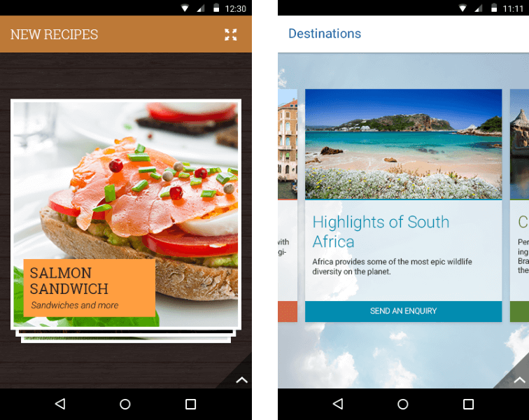
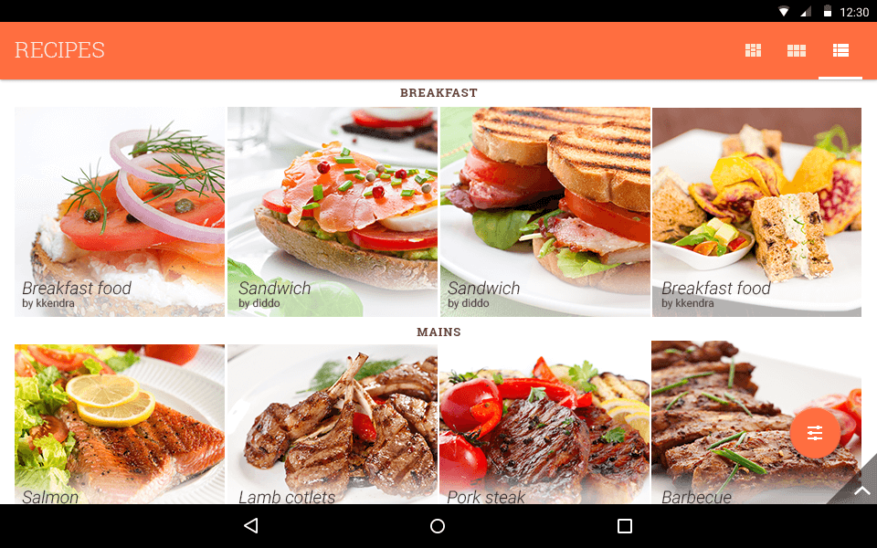

# RadListView: Overview

**RadListView** for Android is a virtualizing list component that provides the most popular features associated with scenarios where a list of items is used.
All these features are embedded in one control with the idea to save developer time and provide better experience. The control's features 
include item animations, different layouts and orientations, smart defaults for many gestures - select on long press, 
execution of special action on swipe, reorder of items on long press and drag, refreshing the list on swipe or loading more items only when need. The control can also be used to easily visualize your items 
in groups, sorted and filtered in accordance with your criteria. 

On [this page]( "Read more about how to get started with RadListView") you can see how to get started using the control.

## Behaviors

The list view control provides various behaviors. Each of them is configurable to perform a specific action when a user gesture occurs.
You are free to add one or more behaviors to your list view instance according to your requirements and preferences. You can also extend an 
existing behavior to tweak it in order to suit your needs or start from scratch and write a completely new behavior. This is the list of the currently available behaviors:

* [Overview]( "Read more about the list view behaviors"): This is the overview page for the list view behaviors which explains their common features.
* [Selection]( "Read more about the selection behavior"): The selection behavior provides single and multiple selection modes for your list and allows you to easily show your custom action bar while the selection is active.
* [Item Reorder]( "Read more about the item reorder behavior"): The item reorder behavior allows the end user to change the initial order of the items by performing a long press on an item and then drag freely to the desired destination position.
* [Load on Demand]( "Read more about the load on demand behavior"): The load on demand behavior allows you to load a few items at the start and when (and only if) the user scrolls down to a certain position or presses a dedicated button at the bottom, you can load more items.
* [Swipe to Refresh]( "Read more about the swipe to refresh behavior"): The Swipe to refresh behavior allows the end user to request a refresh of the list for scenarios where the items in the list can change after the initial load.
* [Swipe to Execute]( "Read more about the swipe to execute behavior"): The Swipe to execute behavior can be used to allow the end users to dismiss an item with swipe gesture or to reveal a custom functionality button hidden behind an item.
* [Sticky Headers]( "Read more about StickyHeaderBehavior"): The Sticky header behavior can be used when grouping is enabled to force the header of the first item to remain visible after it is scrolled away.
* [Collapsible Groups]( "Read more about CollapsibleGroupsBehavior"): The Collapsible Groups behavior can be used when grouping is enabled to allow the users to collapse or expand the groups by tapping on their header.

## Layouts

**RadListView** extends the native **RecyclerView** control so you can use the same layout modes for your list: Linear, Grid and Staggered Grid. We have also provided three additional layouts: 
**Deck of Cards**, **Slide** and **Wrap**. More information is available [here]( "Read more about the layouts").

## Group, Sort, Filter

**RadListView** is integrated with **RadDataSource** which brings you the power to provide rules for filtering, sorting or grouping with a single
line of code. You can combine an indefinite number of rules of all three types to receive the desired manipulation on the original list.
[Here's]( "Read more about group, sort and filter") more information about these operations and the type of the rules that are used to define each of them.

## Item Animations

You can define your own item animations that will play when performing add/remove operations on the list or use the item animators that we have 
provided. The types of animations that are currently available are **fade**, **slide** and **scale**. [Here's]( "Read more about item animations") more information about the animators: how 
to add them and how to set up their properties.

## Other Features

**RadListView** also supports the concept of header and footer &mdash; custom view which are visualized in the start and the end of the list. You can also add item click listeners to get notified when
an item is tapped. Another feature is to scroll to certain position of the list or to its start or end. More information on these features is available on 
[this article]( "Read more about the other features in the list view").