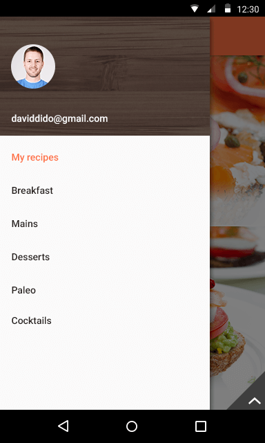

# RadSideDrawer Overview

**RadSideDrawer** is a component can show a hidden view that contains navigation UI or common settings. A popular application that uses the drawer UI is the Android Playstore app.
The hidden view can be displayed with a flick gesture and can be shown from any of the four edges of the screen. The view is also displayed with a transition which can be chosen from a set of pre-defined transitions.
A completely new and custom transition can also be easily created. In order to use RadSideDrawer developers must add dependencies to the **Common** and **Primitives** libraries.

