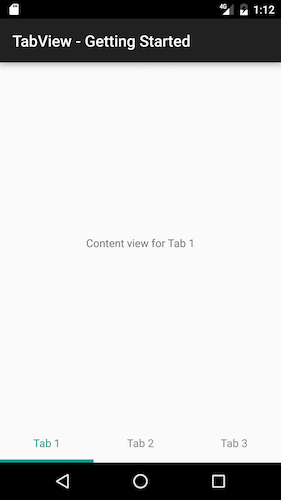

# Getting Started

To use **RadTabView** Beta  a reference to the Primitives library first must be added to your project. Then simply create an instance:

```Java
RadTabView tabView = new RadTabView(this.getContext());
```

Then add some tabs:

```Java
tabView.getTabs().add(new Tab("Tab 1"));
tabView.getTabs().add(new Tab("Tab 2"));
tabView.getTabs().add(new Tab("Tab 3"));
```

Add a **TabViewChangeListener**:

```Java
tabView.addChangeListener(this);
```

Finally, implement the change listener methods. One of those methods is called to create a content view for each tab:

```Java
@Override
public View getContentViewForTab(Tab tab) {
    TextView contentView = new TextView(this.getContext());
    contentView.setText(tab.getTitle() + " content view");
    contentView.setGravity(Gravity.CENTER);

    return contentView;
}
```

That's all there is to it. The result is a fully functioning tab view:



The full source code can be found <a href="https://github.com/telerik/Android-samples/blob/release/Samples-Java/Samples/src/main/java/fragments/tabview/TabViewGettingStartedFragment.java">here</a>.