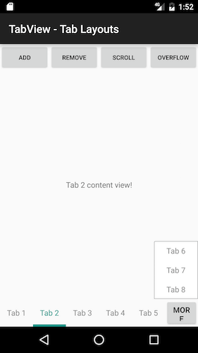
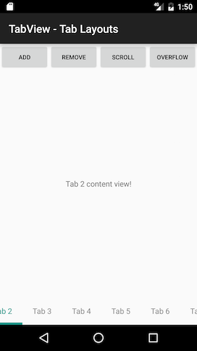

# RadTabView Beta Overview

The **RadTabView** class allows developers to create user interfaces similar to the android tab view (view pager and app bar combo) but is a lot easier to use. On top of that, the tabs of RadTabView
can be positioned on all four sides of the parent view (typically of the main view). 

Navigation between the different tabs can be done either by tapping on the individual tabs or swiping over the current tab content to display the tab adjacent to it.

## Layouts

RadTabView provides two tab layouts out of the box. These tab view layouts determine how many tabs can be shown in RadTabView and what happens to the tabs
layout if the tabs are more or less than the number specified for maximum tabs. The two layouts are called [TabStripOverflowLayout]( "Read more about the overflow layout") and [TabStripScrollLayout]( "Read more about the scroll layout").

**TabStripOverflowLayout** displays a "show more" button next to the last tab when the tabs exceed the maximum number of tabs. When the user taps on the
"show more" button the layout displays a small popup that contains the rest of the tabs.

**TabStripScrollLayout** displays the tabs inside a scroll view and allows scrolling when the tabs exceed the maximum number of tabs.

## Tabs alignment

For all layouts, developers can set the [tabs alignment]( "Read more about the tabs alignment and position") if the tabs are less than max tabs. The alignment can be left, right, center and stretch.
By default the tabs are stretched to fill the available tab view area.

## Change listeners

Finally developers can listen for tab view events by adding a [listener]( "Read more about the tab change listener"). The listener is notified before and after a tab is selected or deselected.
Before a tab is selected or deselected the callback allows the developer to cancel the selection/deselection. A tab can either be selected with a tap
gesture or through code by setting the selectedTab property.

The listener is also notified when the tab view needs the content view of a tab. This happens only if a tab without a content view is added initially.
This lazy loading of the content view helps when the tab view contains content that loads slowly because of network requests or some other
time-consuming operation.