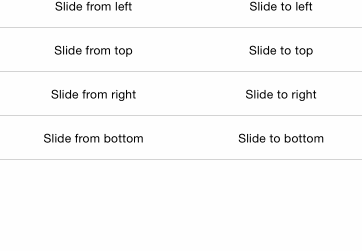
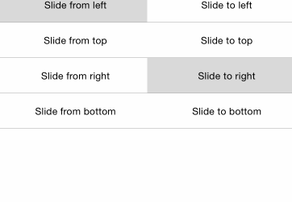

# Alert for Xamarin.iOS: Animations

TKAlert supports tree predefined show/dismiss animations: 

<table>

<tr>
<th>Animation Type</th>
<th>Figures</th>
</tr>

<tr>
<td>Fade</td>
<td></td>
</tr>

<tr>
<td>Scale</td>
<td></td>
</tr>

<tr>
<td>Slide</td>
<td></td>
</tr>

</table>

> In order to get a real understanding of how the animations look and feel, check the [Demo application that ships with the UI for Xamarin suite](##native-only-examples).

These animations can be applied when TKAlert is being shown or dismissed.


## Appear/hide animations

Those animations are applied when showing/dismissing the alert. You can add appear/hide animation by setting the <code>ShowAnimation</code> and <code>DismissAnimation</code>  property of <code>TKAlertStyle</code>:

```C#
alert.Style.ShowAnimation = TKAlertAnimation.Scale;
alert.Style.DismissAnimation = TKAlertAnimation.Scale;
```

## Gesture animations

TKAlert can recognize gestures. This allows end-users to dismiss the alert with a swipe or a tap gesture.
Enabling gesture recognition in TKAlert could be done as fallows:

```C#
alert.DismissMode = TKAlertDismissMode.Tap;
```

## Animations duration

Animations are controlled by setting properties of <code>TKAlert</code> class. The animation duration is controlled by setting the <code>AnimationDuration</code> property:

```C#
alert.AnimationDuration = 0.5f;
```

> Demos for Alert Animaions can be found in our [Native Xamarin.iOS examples](#native-only-examples).
