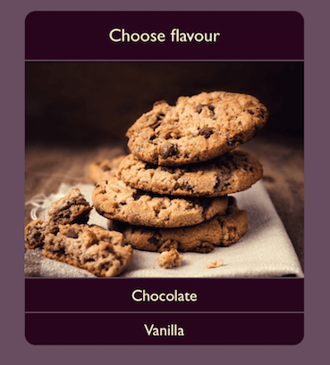
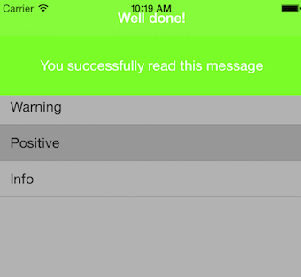
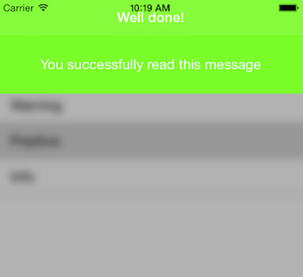
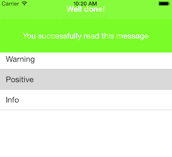
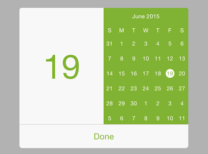

# Alert: Customizations



<code>TKAlert</code> allows customizing almost every aspect of its visual appearance. This article demonstrates some of the customization techniques that can be used with it.

<code>TKAlert</code> comes with two predefined actions layouts. You can choose between:
- <code>TKAlertActionsLayoutHorizontal</code> - actions horizontal alignment
- <code>TKAlertActionsLayoutVertical</code> - actions vertical alignment

You can switch between layouts by setting TKAlert's property <code>actionsLayout</code>:

<snippet id='alert-layout'/>

<snippet id='alert-layout-swift'/>

```C#
alert.ActionsLayout = TKAlertActionsLayout.Vertical;
```

<code>TKAlert</code> has a property <code>style</code> of type TKAlertStyle for styling it's appearance. The essential properties of <code> TKAlertStyle</code> class are:

<ul> 
  <li>appearAnimation</li>
  <li>hideAnimation</li>
  <li>backgroundStyle</li>
  <li>backgroundTintColor</li>
</ul>

You can switch between two customizable background styles - Blur and Dim. 
<table>

<tr>
<th>Background type</th>
<th>Figures</th>
</tr>

<tr>
<td>Dim</td>
<td></td>
</tr>

<tr>
<td>Blur</td>
<td></td>
</tr>

<tr>
<td>None</td>
<td></td>
</tr>

</table>

Setting TKAlert's back behind could be done as follows:
<snippet id='alert-bg'/>

<snippet id='alert-bg-swift'/>

```C#
alert.Style.BackgroundStyle = TKAlertBackgroundStyle.None;
```

You can control background's opacity and color by setting TKAlert's style as follows:

<snippet id='alert-tint-dim'/>

<snippet id='alert-tint-dim-swift'/>

```C#
alert.Style.BackgroundDimAlpha = 0.5f;
alert.Style.BackgroundTintColor = UIColor.LightGray;
```

TKAlert's parallax effect could be turned on/off with single line of code:

<snippet id='alert-parallax'/>

<snippet id='alert-parallax-swift'/>

```C#
alert.AllowParallaxEffect = true;
```

Custom Content
---

In some scenarios you may need to use custom views for TKAlert header or content view. <code>TKAlert</code> allows this by using its <code>headerView</code> and <code>contentView </code> properties:

<snippet id='alert-custom-content'/>

<snippet id='alert-custom-content-swift'/>

```C#
TKAlert alert = new TKAlert ();
alert.Style.HeaderHeight = 0;
alert.TintColor = new UIColor (0.5f, 0.7f, 0.2f, 1f);
alert.CustomFrame  = new CGRect ((this.View.Frame.Size.Width - 300) / 2, 100, 300, 250);
AlertCustomContentView view = new AlertCustomContentView (new CGRect(0, 0, 300, 210));
alert.ContentView.AddSubview (view);
```


