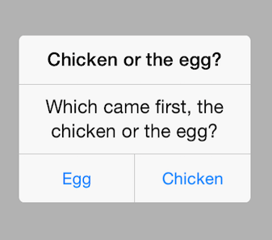

# Alert: Getting Started

This quick start tutorial demonstrates how to create a simple iOS application with <code>TKAlert</code>.


## Setting up TKAlert

Now that our project is created and the TelerikUI.framework is added, we can start referencing and using the TelerikUI types:

Open your <code>UIViewController</code> file and add a reference to Telerik UI header file:

```C#
using TelerikUI;
```

Note that starting with Xcode 6 Apple doesn't generate the precompiled headers file automatically. That is why you should add import the UIKit framework before importing TelerikUI:

```C#
using UIKit;
```

If you are writing Swift, add the same line in your bridging header.

In the <code>ViewDidLoad</code> method create a new instance of <code>TKAlert</code> and set its title and message properties:

<snippet id='getting-started-alert'/>

<snippet id='getting-started-alert-swift'/>

```C#
TKAlert alert = new TKAlert ();
alert.Title = "Chicken or the egg";
alert.Message = "Which came first, the chicken or the egg?";
```

The next step is to add a few actions to TKAlert:

<snippet id='getting-started-alert-action'/>

<snippet id='getting-started-alert-action-swift'/>

```C#
alert.AddActionWithTitle("Egg",  (TKAlert al, TKAlertAction action) => {
    TextLabel.Text = "It was the egg!";
    return true;
});
                
alert.AddActionWithTitle("Chicken",  (TKAlert al, TKAlertAction action) => {
    TextLabel.Text = "It was the chicken!";
    return true;
});
```

Now let's show TKAlert on the screen:

<snippet id='getting-started-alert-show'/>

<snippet id='getting-started-alert-show-swift'/>

```C#
alert.Show (true);
```

And here is what it looks like:



