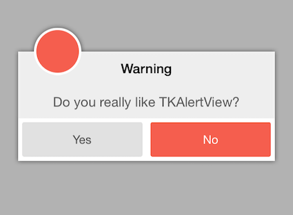
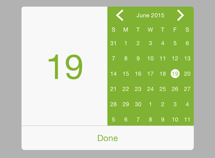

# Alert for Xamarin.iOS: Overview

**TKAlert** is a highly customizable alert view component that offers different predefined animations, easy to use Block API, many customization options. 

 

<code>TKAlert</code> features include:

## Key Features:

<ul>
<li>Device orientation change support </li>
<li>Custom view support</li>
<li>CustomView</li>
<li>Easy to use block API</li>
<li>Fully customizable</li>
<li>Predefined appear/dismiss animations</li>
<li>Blurred or dimmed background style </li>
<li>Parallax effect</li>
<li>Custom frame support</li>
<li>Auto dismiss after a specified time interval</li>
<li>Swipe or pan dismiss options</li>
<li>Horizontal/vertical buttons layout</li>
</ul>

> Demos for Alert control can be found in our [Native Xamarin.iOS examples](#native-only-examples).
