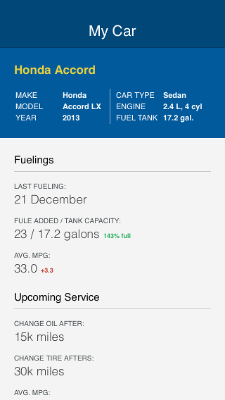
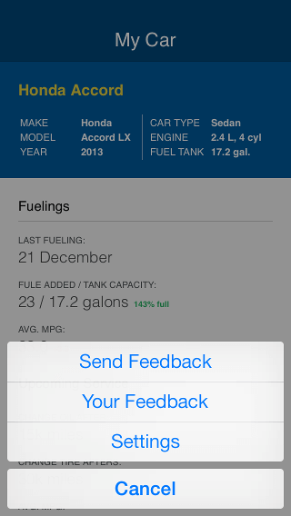
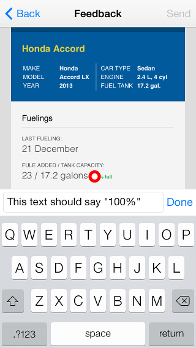
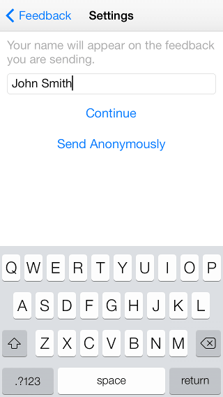
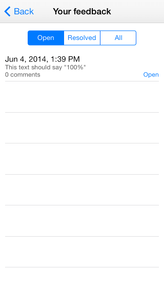
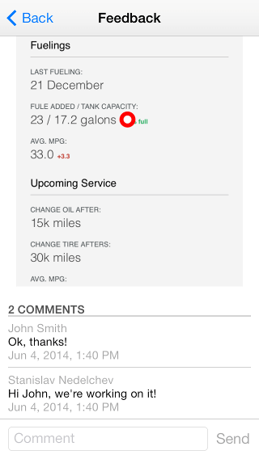
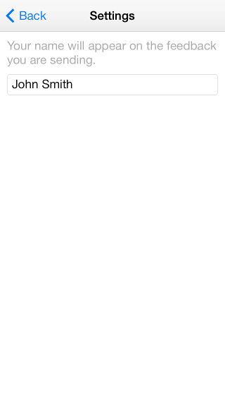

# AppFeedback: Workflow

The feedback functionality is triggered on the device shake gesture. This gesture provides an easy and unobtrusive way to incorporate feedback into your application. After you shake the device, a popup with actionable items is shown on the screen.

The sample application consists of a single screen, displayed below.

Selection Popup
===

This screen is shown on device shake.

It contains items for the specific actions you can perform:

- Submit feedback
- View feedback
- Settings

Submit Feedback
===

Tapping on this item opens a view where the user can submit feedback about the application. This view contains a screenshot of the application, taken at the time of shaking the device, as well as a prompting text.

The user can tap multiple times anywhere on the screenshot and leave a comment, describing what is the problem within that part of the screenshot.

After the user has left his comments, tapping the "Send" button will send all the comments to the backend.

**Note that every comment is sent as a new feedback thread to the backend.**

If a user sends feedback for the first time, a screen prompting for his name is displayed.

The user can also choose to send feedback anonymously.

View Feedback
===
All feedback left from that device is displayed in the Your Feedback view. It is split into three parts:

*Open feedback threads, which need to be resolved from within Telerik Platform. *Resolved threads *All threds, both open and resolved.

Each item in the list has its creation date, description and its status in the lower right corner. Tapping an item leads to a details page, described below.

View Feedback Details
===
This screen is opened by tapping an item from the **Your Feedback** view and allows the user to examine further details about a specific feedback thread. Such details include a screenshot and a list of comments left from users within Telerik Platform, replying to that thread. The user can also add another comment to the feedback thread.

Settings
===
In case the user wants to change or view his name, he can do so by visiting the Settings screen.

