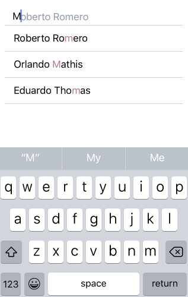

# AutoCompleteTextView (Beta): Completion Modes

<code>TKAutoCompleteTextView</code> provides two completion modes:

- <code>TKAutoCompleteCompletionModeStartsWith</code> - returns suggestions that start with what the end-user has typed.


- <code>TKAutoCompleteCompletionModeContains</code> - returns suggestions that contain what the end-user has typed.




They are accessible through the <code>TKDataSource</code>. The default completion mode is <code>TKAutoCompleteCompletionModeStartsWith</code>.

<snippet id='autocmp-completion'/>

<snippet id='autocmp-completion-swift'/>

```C#
this.dataSource.Settings.AutoComplete.CompletionMode = TKAutoCompleteCompletionMode.StartsWith;
```
