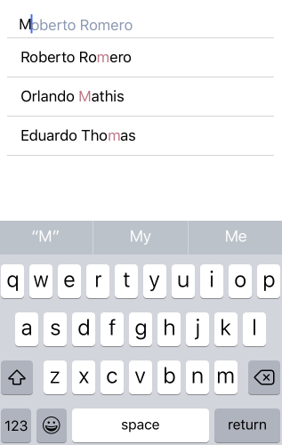

# AutoCompleteTextView for Xamarin.iOS: Completion Modes

<code>TKAutoCompleteTextView</code> provides two completion modes:

- <code>TKAutoCompleteCompletionModeStartsWith</code> - returns suggestions that start with what the end-user has typed.


- <code>TKAutoCompleteCompletionModeContains</code> - returns suggestions that contain what the end-user has typed.




They are accessible through the <code>TLKDataSource</code>. The default completion mode is <code>TKAutoCompleteCompletionModeStartsWith</code>.

```C#
this.Autocomplete = new TKAutoCompleteTextView(new CGRect(10, this.View.Bounds.Y + 10, this.View.Bounds.Size.Width - 20, 30));
this.AutomaticallyAdjustsScrollViewInsets = false;
this.Datasource = new TLKDataSource ();
this.Datasource.Settings.AutoComplete.CompletionMode = TKAutoCompleteCompletionMode.Contains;
//this.dataSource.Settings.AutoComplete.CompletionMode = TKAutoCompleteCompletionMode.StartsWith;
```
