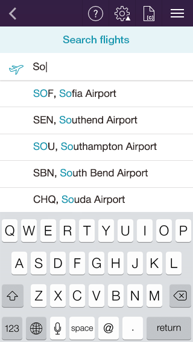

# AutoCompleteTextView for Xamarin.iOS: Overview

<code>TKAutoCompleteTextView</code> can automatically complete user input string by comparing the text being entered to all strings in the associated data source. The control provides means for easy customization and data management. To make working with data easier for developers, <code>TKAutoCompleteTextView</code> works seamlessly with the Telerik DataSource control which serves as a mediator between the raw suggestions data and the UI component which serves as a suggestion view.

## Key Features

- Customizable Tokens
- Token Layout Modes
- Suggest Modes
- Suggestion Match Highlighting
- Completion Modes
- Display Modes

> Demos for AutoCompleteTextView control can be fond in our [Native Xamarin.iOS examples](##native-only-examples).
