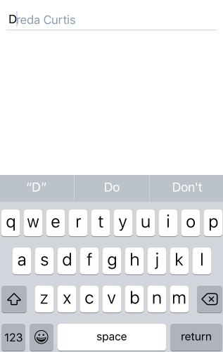
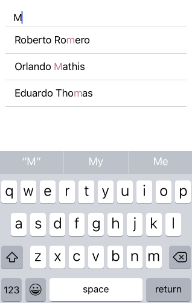

# AutoCompleteTextView for Xamarin.iOS: Suggest Modes

There are three suggesting modes in which <code>TKAutoCompleteTextView</code> operates: 

- <code>TKAutoCompleteSuggestModeAppend</code> - suggestions are shown in list view.



- <code>TKAutoCompleteSuggestModeSuggest</code> - only one suggestion is shown as an instant completion to the typed text.



- <code>TKAutoCompleteSuggestModeSuggestAppend</code> - combines the first two modes.


The default suggesting mode is <code>TKAutoCompleteSuggestMode.Suggest</code>. It can be changed through the <code>SuggestMode</code> property of the <code>TKAutoCompleteTextView</code>:

```C#
this.Autocomplete.SuggestMode = TKAutoCompleteSuggestMode.Suggest;
```

