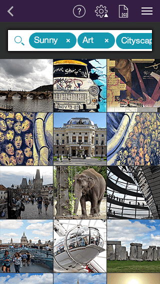

# AutoCompleteTextView (Beta): Tokens



 In order to provide better user expirience and complete set of functionalities <code>TKAutoCompleteTextView</code> supports text tokenizing which can be enabled through the <code>displayMode</code> property of the <code>TKAutoCompleteTextView</code>.
 
 <snippet id='autocmp-display-mode'/>
 
 <snippet id='autocmp-display-mode-swift'/>
 
 ```C#
this.Autocomplete.DisplayMode = TKAutoCompleteDisplayMode.Tokens;
```

The layout flow of the tokens can be horizontal or vertically wrapped.
This feature can be accessed through the <code>layoutMode</code> property of the <code>TKAutoCompleteTextView</code>. By default vertical wrapping is used.

 <snippet id='autocmp-layout-mode'/>
 
 <snippet id='autocmp-layout-mode-swift'/>
 
 ```C#
this.Autocomplete.LayoutMode = TKAutoCompleteLayoutMode.Wrap;
```

Tokens appereance can be customized by conforming to the <code>TKAutoCompleteDelegate</code> protocol and implementing the <code>autocomplete:viewForToken:</code> method. You can change variaty of properties to get custom look or you can provide a custom token object.

 <snippet id='autocmp-token-custom'/>
 
 <snippet id='autocmp-token-custom-swift'/>
 
 ```C#
class AutoCompleteTokensDelegate : TKAutoCompleteDelegate
{
    public override TKAutoCompleteTokenView ViewForToken(TKAutoCompleteTextView autocomplete, TKAutoCompleteToken token)
    {
        TKAutoCompleteTokenView tokenView = new TKAutoCompleteTokenView(token);
        tokenView.BackgroundColor = UIColor.LightGray;
        tokenView.Layer.CornerRadius = 10;
        tokenView.ImageView.Layer.CornerRadius = 3;
        return tokenView;
    }
}
```
