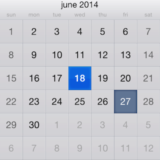
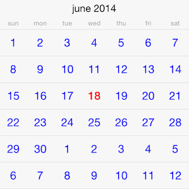

# Calendar: Customizations



<code>TKCalendar</code> allows customizing almost evety aspect of its visual appearance. This article demonstrates some of the customization techniques that can be used with it.

<code>TKCalendar</code> comes with two predefined themes:
- <code>TKCalendarDefaultTheme</code> - a default theme
- <code>TKCalendarIPadTheme</code> - a theme designed for iPad

You can switch between themes by usig the <code>theme</code> property:

<snippet id='customization-theme'/>

<snippet id='customization-theme-swift'/>

```C#
TKCalendar calendar = new TKCalendar (this.View.Bounds);
calendar.Theme = new TKCalendarIPadTheme ();
calendar.AutoresizingMask = UIViewAutoresizing.FlexibleWidth | UIViewAutoresizing.FlexibleHeight;
this.View.AddSubview (calendar);
```

<code>TKCalendar</code> uses presenter classes to render different view modes. They all inherit from <code>UIView</code> and contain subviews with settings that can be changed. Most useful settings are grouped in a style property in the presenter class:

<snippet id='customization-presenter'/>

<snippet id='customization-presenter-swift'/>

```C#
TKCalendarMonthPresenter presenter = (TKCalendarMonthPresenter)calendar.Presenter;
presenter.Style.TitleCellHeight = 40;
presenter.Style.BackgroundColor = UIColor.Yellow;
presenter.HeaderIsSticky = true;
presenter.Style.MonthNameTextEffect = TKCalendarTextEffect.Lowercase;
presenter.Update (false);
```

There are cases when specific cells must have custom design based on the cell state (e.g. today, weekend, selected). This can be dobe by adopging the <code>TKCalendarDelegate</code> protocol and implementing its <code>UpateVisualsForCell</code> method:

<snippet id='customization-updatevisualcell'/>

```C#
public override void UpdateVisualsForCell (TKCalendar calendar, TKCalendarCell cell)
{
    if (cell is TKCalendarDayCell) {
        TKCalendarDayCell dayCell = (TKCalendarDayCell)cell;
        if ((dayCell.State & TKCalendarDayState.Today) != 0) {
            cell.Style.TextColor = UIColor.Red;
        }
        else {
            cell.Style.TextColor = UIColor.Purple;
        }
    }
}
```

The cell can be replaced with a custom one for more complex scenarios. This can be done by implementing the <code>ViewForCellOfKind</code> method of <code>TKCalendarDelegate</code> protocol:

<snippet id='customization-viewforcell'/>

```C#
public override TKCalendarCell ViewForCellOfKind (TKCalendar calendar, TKCalendarCellType cellType)
{
    if (cellType == TKCalendarCellType.Day) {
        DocsCustomCell cell = new DocsCustomCell ();
        return cell;
    }
    return null;
}
```

The following is the implementation of the <code>CustomCell</code> class:

<snippet id='customization-customcell'/>

```C#
public class DocsCustomCell : TKCalendarDayCell
{
    public DocsCustomCell ()
    {
    }

    public override void UpdateVisuals ()
    {
        base.UpdateVisuals ();

        if ((this.State & TKCalendarDayState.Today) != 0) {
            this.Label.TextColor = UIColor.Green;
        } else {
            this.Label.TextColor = UIColor.Blue;
        }
    }
}
```

The result is presented below:


