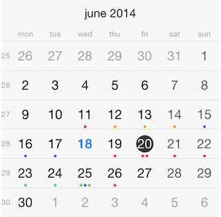

# Calendar: Getting Started

This quick start tutorial demonstrates how to create a simple iOS application with <code>TKCalendar</code>.



## Setting up TKCalendar

Since iOS 10, Apple requires explicit description when NSCalendar is being used, more precisely when one is trying to access the phone's calendar events. This description is prompted to the user, only when there is an attempt for accessing events, and requires user's confirmation.

If you are using Telerik UI for Xamarin.iOS but never accessing device's calendar your users won't get prompted with this message.

In order to submit your application to the AppStore make sure to include a <code>NSCalendarsUsageDescription</code> variable to your info.plist and provide some description, for example "This application need to acces your calendar events."

Now that our project is created and the TelerikUI.framework is added, we can start referencing and using the TelerikUI types:

Open your <code>UIViewController</code> file and add a reference to Telerik UI header file:

```C#
using TelerikUI;
```

Note that starting with Xcode 6 Apple doesn't generate the precompiled headers file automatically. That is why you should add import the UIKit framework before importing TelerikUI:

```C#
using UIKit;
```
   
Type the following code in <code>ViewDidLoad</code> method:

<snippet id='getting-started-calendar'/>

```C#
TKCalendar calendarView = new TKCalendar (this.View.Bounds);
calendarView.AutoresizingMask = UIViewAutoresizing.FlexibleWidth | UIViewAutoresizing.FlexibleHeight;
this.View.AddSubview (calendarView);
```

This code creates a new instance of <code>TKCalendar</code> and adds it as a subview of the ViewController's main view. The <code>AutoresizingMask</code> property is set in order to allow correct resizing of the calendar when the device is rotated in landscape mode.

The next step is to create some random data that will be consumed by the calendar. You can use the following code:

<snippet id='getting-started-event'/>

```C#
events = new List<TKCalendarEvent> ();
NSCalendar calendar = new NSCalendar (NSCalendarType.Gregorian);
NSDate date = NSDate.Now;

Random r = new Random ();
for (int i = 0; i < 3; i++) {
    TKCalendarEvent ev = new TKCalendarEvent ();
    ev.Title = "Sample event";
    NSDateComponents components = calendar.Components (NSCalendarUnit.Day | NSCalendarUnit.Month | NSCalendarUnit.Year, date);
    components.Day = r.Next () % 20;
    ev.StartDate = calendar.DateFromComponents (components);
    ev.EndDate = calendar.DateFromComponents (components);
    ev.EventColor = UIColor.Red;
    events.Add (ev);
}
```


This code will add 10 events with random dates to an array named <code>events</code>. The <code>arc4random</code> method is being used to create the random dates. The code also assigns a title and a color to the events.

Now let's add this random data to the calendar and present it. In order to do this, we should first adopt the <code>TKCalendarDataSource</code> protocol:

<snippet id='getting-started-datasource'/>

<snippet id='getting-started-datasource-swift'/>

```C#
class CalendarDataSource : TKCalendarDataSource
```

And we should implement its <code>calendar:eventsForDate:</code> method:

<snippet id='getting-started-eventsfordate'/>

<snippet id='getting-started-eventsfordate-swift'/>

```C#
public TKCalendarEventProtocol[] EventsForDate (TKCalendar calendar, NSDate date)
{
    NSDateComponents components = calendar.Calendar.Components (NSCalendarUnit.Day | NSCalendarUnit.Month | NSCalendarUnit.Year, date);
    components.Hour = 23;
    components.Minute = 59;
    components.Second = 59;
    NSDate endDate = calendar.Calendar.DateFromComponents (components);
    List<TKCalendarEventProtocol> filteredEvents = new List<TKCalendarEventProtocol> ();
        for (int i = 0; i < this.events.Count; i++) {
            TKCalendarEventProtocol ev = this.events[i];
            if (ev.StartDate.SecondsSinceReferenceDate <= endDate.SecondsSinceReferenceDate && 
                ev.EndDate.SecondsSinceReferenceDate >= date.SecondsSinceReferenceDate) {
                filteredEvents.Add (ev);
            }
    }
    return filteredEvents.ToArray ();
}
```

Here, the predicate is used to filter the events array by date. Do not forget to assign the <code>dataSource</code> property of <code>TKCalendar</code>:

<snippet id='getting-started-assigndatasource'/>

```C#
calendarView.DataSource = new CalendarDataSource (this);
```

For information about populating <code>TKCalendar</code> with EventKit events, please refer to the following article: [Populating with data](populating-with-data)

As a next step you may want to tune up the calendar more precisely by specifying minimum and maximum allowed dates. This can be done by setting the <code>minDate</code> and <code>maxDate</code> properties:

<snippet id='getting-started-minmaxdate'/>

<snippet id='getting-started-minmaxdate-swift'/>

```C#
calendarView.MinDate = TKCalendar.DateWithYear (2010, 1, 1, calendar);
calendarView.MaxDate = TKCalendar.DateWithYear (2016, 12, 31, calendar);
```

By default, <code>TKCalendar</code> displays the current date, use the <code>navigateToDate:animated</code> method to display a different date:

<snippet id='getting-started-navigatetodate'/>


```C#
NSDateComponents newComponents = new NSDateComponents();
newComponents.Year = 2015;
newComponents.Month = 5;
newComponents.Day = 1;
NSDate newDate = calendarView.Calendar.DateFromComponents (newComponents);
calendarView.NavigateToDate (newDate, true);
```

<code>TKCalendar</code> sends different notifications. For example, in order to be notified when a date was selected, override the <code>calendar:didSelectDate:</code> method of <code>TKCalendarDelegate</code> protocol:

<snippet id='getting-started-didselectdate'/>

<snippet id='getting-started-didselectdate-swift'/>

```C#
class CalendarDelegate : TKCalendarDelegate
{
    public override void DidSelectDate (TKCalendar calendar, NSDate date)
    {
        Console.WriteLine ("{0}", date);
    }
}
```

Note that <code>TKCalendar</code> supports single, multiple and range date selection. Selection modes are described in detail in the article about [Selection](selection).

Along with selection notifications <code>TKCalendar</code> supports navigation and customization notifications by adopting the <code>TKCalendarDelegate</code> protocol. These notifications are described in the articles about: [Navigation](navigation) and [Customizations](customizations).

Here is the full code of this example:

<snippet id='getting-started-example'/>

<snippet id='getting-started-example-swift'/>

```C#
    public class CalendarDocsWithSimpleEvent : XamarinExampleViewController
    {
        CalendarDelegate calendarDelegate;
        List<TKCalendarEvent> events;

        public TKCalendar CalendarView {
            get;
            set;
        }

        public TKCalendarEventProtocol[] EventsForDate {
            get;
            set;
        }

        public override void ViewDidLoad ()
        {
            base.ViewDidLoad ();
            TKCalendar calendarView = new TKCalendar (this.View.Bounds);
            calendarView.AutoresizingMask = UIViewAutoresizing.FlexibleWidth | UIViewAutoresizing.FlexibleHeight;
            this.View.AddSubview (calendarView);

            calendarDelegate = new CalendarDelegate ();

            calendarView.DataSource = new CalendarDataSource (this);

            events = new List<TKCalendarEvent> ();
            NSCalendar calendar = new NSCalendar (NSCalendarType.Gregorian);
            NSDate date = NSDate.Now;

            Random r = new Random ();
            for (int i = 0; i < 3; i++) {
                TKCalendarEvent ev = new TKCalendarEvent ();
                ev.Title = "Sample event";
                NSDateComponents components = calendar.Components (NSCalendarUnit.Day | NSCalendarUnit.Month | NSCalendarUnit.Year, date);
                components.Day = r.Next () % 20;
                ev.StartDate = calendar.DateFromComponents (components);
                ev.EndDate = calendar.DateFromComponents (components);
                ev.EventColor = UIColor.Red;
                events.Add (ev);
            }

            calendarView.MinDate = TKCalendar.DateWithYear (2010, 1, 1, calendar);
            calendarView.MaxDate = TKCalendar.DateWithYear (2016, 12, 31, calendar);

//            calendarDelegate.events = this.events;
            calendarView.Delegate = calendarDelegate;
    
            NSDateComponents newComponents = new NSDateComponents();
            newComponents.Year = 2015;
            newComponents.Month = 5;
            newComponents.Day = 1;
            NSDate newDate = calendarView.Calendar.DateFromComponents (newComponents);
            calendarView.NavigateToDate (newDate, true);

            calendarView.ReloadData();
        }

        class CalendarDataSource : TKCalendarDataSource
        {
            CalendarDocsWithSimpleEvent main;
            public List<TKCalendarEvent> events;
            public CalendarDataSource(CalendarDocsWithSimpleEvent main)
            {
                this.main = main;
            }

            public TKCalendarEventProtocol[] EventsForDate (TKCalendar calendar, NSDate date)
            {
                NSDateComponents components = calendar.Calendar.Components (NSCalendarUnit.Day | NSCalendarUnit.Month | NSCalendarUnit.Year, date);
                components.Hour = 23;
                components.Minute = 59;
                components.Second = 59;
                NSDate endDate = calendar.Calendar.DateFromComponents (components);
                List<TKCalendarEventProtocol> filteredEvents = new List<TKCalendarEventProtocol> ();
                    for (int i = 0; i < this.events.Count; i++) {
                        TKCalendarEventProtocol ev = this.events[i];
                        if (ev.StartDate.SecondsSinceReferenceDate <= endDate.SecondsSinceReferenceDate && 
                            ev.EndDate.SecondsSinceReferenceDate >= date.SecondsSinceReferenceDate) {
                            filteredEvents.Add (ev);
                        }
                }
                return filteredEvents.ToArray ();
            }
        }

        class CalendarDelegate : TKCalendarDelegate
        {
            public override void DidSelectDate (TKCalendar calendar, NSDate date)
            {
                Console.WriteLine ("{0}", date);
            }
        }
            
    
}
```

You can easily change the way data is presented in chart by changing the view mode property:

<snippet id='getting-started-viewmodeyear'/>

```C#
this.CalendarView.ViewMode = TKCalendarViewMode.Year;
```

All view modes are described in the following article:
[View modes](view-modes)

