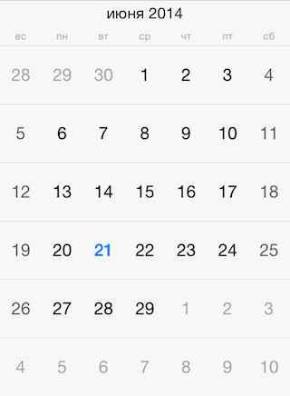
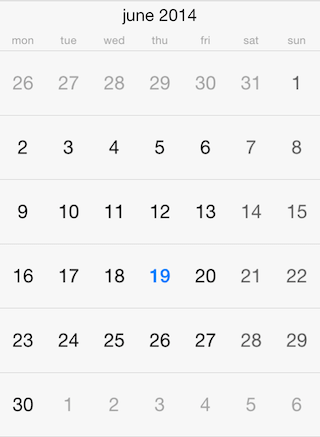
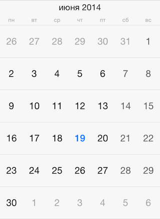

# Calendar: Localization



By defualt, <code>TKCalendar</code> uses the current system locale and calendar settings. However, it allows for specifying those settings explicitly, overriding the system settings. This article describes how to do this.

The <code>calendar</code> property of <code>TKCalendar</code> specifies the <code>NSCalendar</code> to be used. You can use this property to change the first day in week to Monday for example:

<snippet id='localization-firstweekday'/>

<snippet id='localization-firstweekday-swift'/>

```C#
NSCalendar calendar = new NSCalendar (NSCalendarType.Gregorian);
calendar.FirstWeekDay = 2;
```



Or, you can change the calendar with one specific for your users:

<snippet id='localization-chinesecalendar'/>

<snippet id='localization-chinesecalendar-swift'/>

```C#
this.CalendarView.Calendar = new NSCalendar (NSCalendarType.Chinese);
```

Month names and week day names are provided by the <code>locale</code> property. Use the following code to customize the current locale:

<snippet id='localization-localeproperty'/>

<snippet id='localization-localeproperty-swift'/>

```C#
this.CalendarView.Locale = new NSLocale ("ru_RU");
```

After modifying the locale you should call the <code>update:</code> method for the presenter:

<snippet id='localization-update'/>

<snippet id='localization-update-swift'/>

```C#
((TKCalendarMonthPresenter)this.CalendarView.Presenter).Update (false);
```




