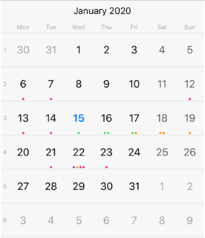

# Calendar Overview

<code>TKCalendar</code> is a highly customizable calendar component that offers different view modes, animations, great performance and customization options. Its EventKit data source helper allows for easy importing of events from the device.

<code>TKCalendar</code> main features include:

- Different view modes: week, month, year, month names, year numbers, flow.
- Easy way to import device events by using the EventKit framework.
- Transition effects when switching between calendar pages.
- Different selection modes: single, multiple, and range selection.
- Overriding the default calendar appearance with themes and custom cells.
- Localization.

