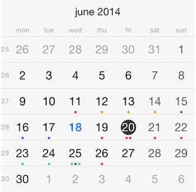

# Calendar: Populating with Data

Following the Model-View-Controller design pattern, the data source mediates between the application's data model (that is, its model objects) and the calendar view. The data source provides the calendar view object with the information it needs to display events.

 

Following this approach, the <code>TKCalendarDataSource</code> protocol should be implemnted in order to bind <code>TKCalendar</code> with data. This is easy because this protocol contains a single method <code>calendar:eventsForDate:</code>. The adopter should provide the events specific for the provided date. Here is a sample implementation of this method:

<snippet id='populating-with-data-event'/>

<snippet id='populating-with-data-event-swift'/>

```C#
public override TKCalendarEventProtocol[] EventsForDate(TKCalendar calendar, NSDate date)
{
    NSDateComponents components = calendar.Calendar.Components(NSCalendarUnit.Year | NSCalendarUnit.Month | NSCalendarUnit.Day, date);
    components.Hour = 23;
    components.Minute = 59;
    components.Second = 59;
    NSDate endDate = calendar.Calendar.DateFromComponents(components);
    List<TKCalendarEventProtocol> filteredEvents = new List<TKCalendarEventProtocol>();
    for (int i = 0; i < this.main.Events.Length; i++)
    {
        TKCalendarEvent ev = (TKCalendarEvent)this.main.Events[i];
        if (ev.StartDate.SecondsSinceReferenceDate <= endDate.SecondsSinceReferenceDate &&
            ev.EndDate.SecondsSinceReferenceDate >= date.SecondsSinceReferenceDate)
        {
            filteredEvents.Add(ev);
        }
    }

    return filteredEvents.ToArray();
}
```

In most cases <code>TKCalendar</code> accesses events stored on the device where the application executes. In this scenario the *EventKit* framework should be used. <code>TKCalendar</code> provides a helper data source class which loads the events from device by using the *EventKit API*.

As a prerequisite, the *EventKit* and *EventKitUI* frameworks should be added to the application. Now, you are ready to use the *EventKit* data source helper class for <code>TKCalendar</code>.

The simplest scenario is to create a new instance of <code>TKCalendarEventKitDataSource</code> class and set it as a data source for <code>TKCalendar</code>:

<snippet id='populating-with-data-kitdatasource'/>

<snippet id='populating-with-data-kitdatasource-swift'/>

```C#
this.CalendarView = new TKCalendar (this.View.Bounds);
this.CalendarView.AutoresizingMask = UIViewAutoresizing.FlexibleWidth | UIViewAutoresizing.FlexibleHeight;
this.CalendarView.DataSource = this.DataSource;
this.View.AddSubview (this.CalendarView);
```

However, <code>TKCalendarEventKitDataSource</code> supports event filtering. Adopt its <code>TKCalendarEventKitDataSourceDelegate</code> protocol to enable this feature.


In the cases when you want to filter only specific events, use the <code>shouldImportEvent:</code> method.
