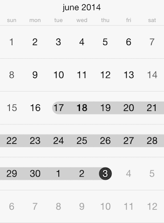

# Calendar for Xamarin.iOS: Selection

This article describes the different selection modes available in <code>TKCalendar</code>

The selection mode in <code>TKCalendar</code> can be altered by using the <code>SelectionMode</code> property. The available options are:

- <code>TKCalendarSelectionMode.Node</code> - No selection is allowed.
- <code>TKCalendarSelectionMode.Single</code> - A single date can be selected.
- <code>TKCalendarSelectionMode.Multiple</code> - Different dates can be selected by tapping on them. A second tap will deselect the date.
- <code>TKCalendarSelectionMode.Range</code> - A range between two dates on the same page can be selected.



Here is an example how to set the SelectionMode:

```C#
this.CalendarView.SelectionMode = TKCalendarSelectionMode.Range;
```

Use the <code>SelectedDate</code> property to get or set the currently selected date in <code>TKCalendar</code> when the single selection mode is used.

Use the <code>SelectedDates</code> property to get or set the selected dates when multiple selection mode is selected.

The <code>SelectedDatesRange</code> property is used to store the date range when this selection option is used.

You can determine whether a selection is changed by adopting <code>TKCalendarDelegate</code> protocol:

<snippet id='selection-didselectdate'/>


```C#
public override void DidSelectDate (TKCalendar calendar, NSDate date)
{
    Console.WriteLine (String.Format ("{0}", date));
}
```

You can prevent <code>TKCalendar</code> from selecting specific date by handling the <code>ShouldSelectDate</code> method:

<snippet id='selection-shouldselectdate'/>

```C#
public override bool ShouldSelectDate (TKCalendar calendar, NSDate date)
{
    Console.WriteLine (String.Format ("Trying to select the unselectable {0}", date));

    return !TKCalendar.IsDate (main.UnselectableDate, date, NSCalendarUnit.Year | NSCalendarUnit.Month | NSCalendarUnit.Day, main.CalendarView.Calendar);
}
```

Furthermore, the <code>DidDeselectDate</code> is called when using multiple selection to notify for unselected dates:

<snippet id='selection-didselecteddate'/>

```C#
public override void DidDeselectedDate (TKCalendar calendar, NSDate date)
{
    Console.WriteLine (String.Format ("{0}", date));
}
```