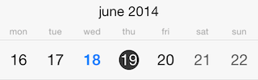
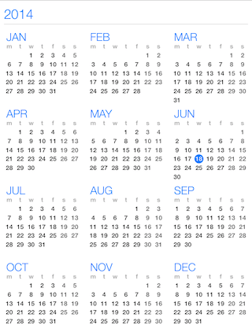
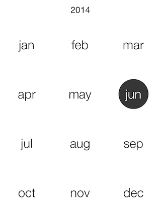
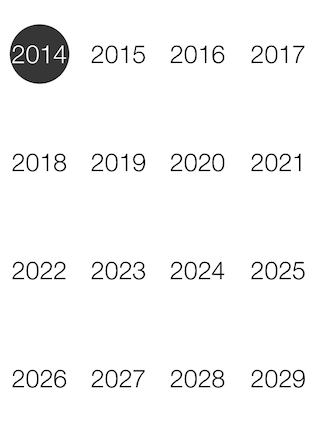
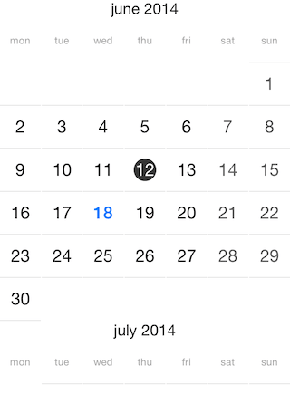

# Calendar: View Modes

TKCalendar is able to present its contents in different ways. Those include:

- A single month.
- A single week.
- A list with years, containing months and month days.
- A list with month names.
- A list with year numbers.
- A flow layout with months and month days.
- A separate view controller to allow iOS 7 calendar style like experience.

This article describes those view modes in detail.

The <code>presenter</code> property of <code>TKCalendar</code> allows customizing settings specific for the current view mode. Every view mode has its dedicated presenter class:

<snippet id='view-modes-presenter'/>

<snippet id='view-modes-presenter-swift'/>

```C#
TKCalendarYearPresenter presenter = (TKCalendarYearPresenter)this.CalendarView.Presenter;
presenter.Columns = 3;
```

You can determine whether a view change occurred by implementing <code>TKCalendarDelegate</code> protocol:

<snippet id='view-modes-changeviewmode'/>

<snippet id='view-modes-changeviewmode-swift'/>

```C#
public override void DidChangedViewModeFrom(TKCalendar calendar, TKCalendarViewMode previousViewMode, TKCalendarViewMode viewMode)
{
    if (viewMode == TKCalendarViewMode.Week || previousViewMode == TKCalendarViewMode.Week)
    {
        this.main.View.SetNeedsLayout();
    }
}
```

## Single month view mode ##


Use the <code>TKCalendarViewModeMonth</code> to enable the single month view:

<snippet id='view-modes-month'/>

<snippet id='view-modes-month-swift'/>

```C#
this.CalendarView.ViewMode = TKCalendarViewMode.Month;
```

In this mode <code>TKCalendar</code> renders a single month and allows switching to a different month with a swipe gesture. This transition can be customized with different transition effects. More about this is available in this help article: [Transition effects](view-transitions)

In addition to selecting a different month with swipe, users can change the view mode to month names when the <code>allowPinchZoom</code> property is set to <code>YES</code>:

<snippet id='view-modes-pinchzoom'/>

<snippet id='view-modes-pinchzoom-swift'/>

```C#
this.CalendarView.AllowPinchZoom = false;
```

Dates can be selected according to the <code>selectionMode</code> property. Details about selection are available in the dedicated help article about selection: [Selection](selection)

Dates in this view mode are represented by the <code>TKCalendarCell</code> class which inherits from <code>UIView</code>. The visual appearance can be customized by creating custom cells and handling the <code>calendar:viewForCellOfKind:</code> method of <code>TKCalendarDelegate</code> protocol. This technique is described in [Calendar customizations](customizations) article.

The presenter class responsible for month view is the <code>TKCalendarMonthPresenter</code> class. It contains a style property where different UI settings can be tuned. For example:

<snippet id='view-modes-monthpresenter'/>

<snippet id='view-modes-monthpresenter-swift'/>

<snippet id='view-modes-monthpresenter-cs'/>

## Single week view mode ##



Set the <code>viewMode</code> property to <code>TKCalendarViewModeWeek</code> to enable this view:

<snippet id='view-modes-week'/>

<snippet id='view-modes-week-swift'/>

```C#
this.CalendarView.ViewMode = TKCalendarViewMode.Week;
```

This view mode is similar to the previous one, but it displays only one week. The presenter class for this view mode is <code>TKCalendarWeekPresenter</code>, it inherits from <code>TKCalendarMonthPresenter</code> and allows the same customization and behavior features.

## List with years view mode ##



Set the <code>viewMode</code> property to <code>TKCalendarViewModeYear</code> to enable this view:

<snippet id='getting-started-viewmodeyear'/>

<snippet id='getting-started-viewmodeyear-swift'/>

```C#
this.CalendarView.ViewMode = TKCalendarViewMode.Year;
```

This view mode displays a list of years with their months and dates. The user can select months by tapping on them.

The presenter class for this view mode is <code>TKCalendarYearPresenter</code>.

## List with month names ##



Set the <code>viewMode</code> property to <code>TKCalendarViewModeMonthNames</code> to enable this view.

<snippet id='view-modes-monthnames'/>

<snippet id='view-modes-monthnames-swift'/>

```C#
this.CalendarView.ViewMode = TKCalendarViewMode.MonthNames;
```

The month names view is used together with the month view mode when the <code>allowPinchZoom</code> option is turned on. It allows for selecting a different month faster. Use pinch-in/out gesture to switch between single month/year numbers view mode.

The presenter class for this view mode is <code>TKCalendarMonthNamesPresenter</code>, it inherits from <code>TKCalendarMonthPresenter</code> and allows the same customization and behavior features.

## List with year numbers ##



Set the <code>viewMode</code> property to <code>TKCalendarViewModeYearNumbers</code> to enable this view.

<snippet id='view-modes-yearnumber'/>

<snippet id='view-modes-yearnumber-swift'/>

```C#
this.CalendarView.ViewMode = TKCalendarViewMode.YearNumbers;
```

The year numbers view is used together with the month view mode when the <code>allowPinchZoom</code> option is turned on. It allows for selecting a different year faster.

The presenter class for this view mode is <code>TKCalendarYearNumbersPresenter</code>, it inherits from <code>TKCalendarMonthPresenter</code> and allows the same customization and behavior features.

## Flow layout with months and month days ##



Set the <code>viewMode</code> property to <code>TKCalendarViewModeFlow</code> to enable this view.

<snippet id='view-modes-flow'/>

<snippet id='view-modes-flow-swift'/>

```C#
this.CalendarView.ViewMode = TKCalendarViewMode.Flow;
```

The flow view displays months with single dates. Single cells are represented by the <code>TKCalendarCell</code> class and allow customization by handling the <code>calendar:viewForCellOfKind</code> method.

Only the single selection mode is available when selecting cells in flow view.

The presenter class for this view mode is <code>TKCalendarFlowPresenter</code>.

## iOS 7 calendar style experience ##

The <code>TKCalendarYearViewController</code> class can be used to create an experience similar to the one in the built-in calendar in iOS 7. Follow these steps to add the TKCalendarYearViewController to your application:

1. Add a navigation controller
2. Use this code to show the year view controller in your application:

<snippet id='view-modes-viewcontroller'/>

<snippet id='view-modes-viewcontroller-swift'/>

```C#
TKCalendarYearViewController controller = new TKCalendarYearViewController ();
controller.ContentView.MinDate = TKCalendar.DateWithYear (2012, 1, 1, calendar);
controller.ContentView.MaxDate = TKCalendar.DateWithYear (2018, 12, 31, calendar);
controller.ContentView.NavigateToDate (NSDate.Now, false);
this.NavigationController.PushViewController (controller, true);
```

The <code>contentView</code> property of <code>TKCalendarYearViewController</code> contains the presented <code>TKCalendar</code> object instance. Use its properties and methods to customize the calendar. 

