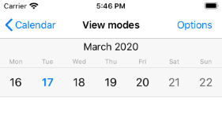

# Calendar for Xamarin.iOS: View Modes

TKCalendar is able to present its contents in different ways. Those include:

- **Month View**
- **Week View**
- **Year View**
- **Day View**
- **MultiDay View**
- **Agenda View**
- **List with years, containing months and month days**
- **List with year numbers**
- **List with month names**
- **Flow layout with months and month days**

This article describes those view modes in detail.

The <code>Presenter</code> property of <code>TKCalendar</code> allows customizing settings specific for the current view mode. Every view mode has its dedicated presenter class:

```C#
TKCalendarYearPresenter presenter = (TKCalendarYearPresenter)this.CalendarView.Presenter;
presenter.Columns = 3;
```

You can determine whether a view change occurred by implementing <code>TKCalendarDelegate</code> protocol:

<snippet id='view-modes-changeviewmode'/>

```C#
public override void DidChangedViewModeFrom(TKCalendar calendar, TKCalendarViewMode previousViewMode, TKCalendarViewMode viewMode)
{
    if (viewMode == TKCalendarViewMode.Week || previousViewMode == TKCalendarViewMode.Week)
    {
        this.main.View.SetNeedsLayout();
    }
}
```

## Month View


Use the <code>TKCalendarViewModeMonth</code> to enable the single month view:

```C#
this.CalendarView.ViewMode = TKCalendarViewMode.Month;
```

In this mode <code>TKCalendar</code> renders a single month and allows switching to a different month with a swipe gesture. This transition can be customized with different transition effects. More about this is available in this help article: [Transition effects](view-transitions)

In addition to selecting a different month with swipe, users can change the view mode to month names when the <code>AllowPinchZoom</code> property is set to <code>true</code>:

<snippet id='view-modes-pinchzoom'/>

```C#
this.CalendarView.AllowPinchZoom = false;
```

Dates can be selected according to the <code>SelectionMode</code> property. Details about selection are available in the dedicated help article about selection: [Selection](selection)

Dates in this view mode are represented by the <code>TKCalendarCell</code> class which inherits from <code>UIView</code>. The visual appearance can be customized by creating custom cells and handling the <code>calendar:viewForCellOfKind:</code> method of <code>TKCalendarDelegate</code> protocol. This technique is described in [Calendar customizations](customizations) article.

The presenter class responsible for month view is the <code>TKCalendarMonthPresenter</code> class. It contains a style property where different UI settings can be tuned.

## Week View



Set the <code>ViewMode</code> property to <code>TKCalendarViewModeWeek</code> to enable this view:

```C#
this.CalendarView.ViewMode = TKCalendarViewMode.Week;
```

This view mode is similar to the previous one, but it displays only one week. The presenter class for this view mode is <code>TKCalendarWeekPresenter</code>, it inherits from <code>TKCalendarMonthPresenter</code> and allows the same customization and behavior features.

## Year Mode


Set the <code>viewMode</code> property to <code>TKCalendarViewModeYear</code> to enable this view:

```C#
this.CalendarView.ViewMode = TKCalendarViewMode.Year;
```

This view mode displays a list of years with their months and dates. The user can select months by tapping on them.

The presenter class for this view mode is <code>TKCalendarYearPresenter</code>.

## Day View


Set the <code>viewMode</code> property to <code>TKCalendarViewMode.Day</code> to enable this view:

```C#
this.CalendarView.ViewMode = TKCalendarViewMode.Day;
```

## MultiDay View


Set the <code>viewMode</code> property to <code>TKCalendarViewMode.MultiDay</code> to enable this view:

```C#
this.CalendarView.ViewMode = TKCalendarViewMode.MultiDay;
```

## Agenda View


Set the <code>viewMode</code> property to <code>TKCalendarViewMode.Agenda</code> to enable this view:

```C#
this.CalendarView.ViewMode = TKCalendarViewMode.Agenda;
```

## List with year numbers


Set the <code>ViewMode</code> property to <code>TKCalendarViewMode.YearNumbers</code> to enable this view.

```C#
this.CalendarView.ViewMode = TKCalendarViewMode.YearNumbers;
```

The year numbers view is used together with the month view mode when the <code>allowPinchZoom</code> option is turned on. It allows for selecting a different year faster.

The presenter class for this view mode is <code>TKCalendarYearNumbersPresenter</code>, it inherits from <code>TKCalendarMonthPresenter</code> and allows the same customization and behavior features.

## List with month names


Set the <code>viewMode</code> property to <code>TKCalendarViewMode.MonthNames</code> to enable this view.

```C#
this.CalendarView.ViewMode = TKCalendarViewMode.MonthNames;
```

The month names view is used together with the month view mode when the <code>allowPinchZoom</code> option is turned on. It allows for selecting a different month faster. Use pinch-in/out gesture to switch between single month/year numbers view mode.

The presenter class for this view mode is <code>TKCalendarMonthNamesPresenter</code>, it inherits from <code>TKCalendarMonthPresenter</code> and allows the same customization and behavior features.

## Flow layout with months and month days ##


Set the <code>viewMode</code> property to <code>TKCalendarViewMode.Flow</code> to enable this view.

```C#
this.CalendarView.ViewMode = TKCalendarViewMode.Flow;
```

The flow view displays months with single dates. Single cells are represented by the <code>TKCalendarCell</code> class and allow customization by handling the <code>calendar:viewForCellOfKind</code> method.

Only the single selection mode is available when selecting cells in flow view.

The presenter class for this view mode is <code>TKCalendarFlowPresenter</code>.

## Examples

>tip Sample View Modes example with different TKClanedar ViewModes can be found in our native [Xamarin.iOS Examples/Calendar folder](#native-only-examples).

# See Also

- [Customizations]()
- [Transitions]()
- [Selection]()