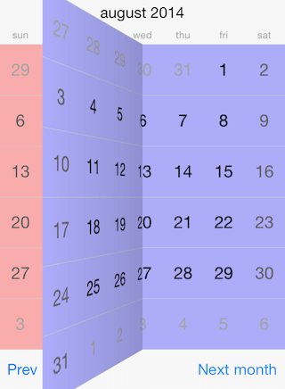

# Calendar for Xamarin.iOS: View Transitions

View transitions allow for switching to the next/previous month with different animation effects. Those effects are available in all view mode presenters that inherit from <code>TKCalendarPresenterBase</code>. These include: month, month names, year numbers. Detailed information about view modes is available in this help article: [View modes]()



The available animations are: *card, flip, flow, fold, rotate, and scroll*. The default transition is *scroll*. You should access the <code>TransitionMode</code> property of the presenter class in order to customize the transition effect:

```C#
TKCalendarMonthPresenter presenter = (TKCalendarMonthPresenter)this.CalendarView.Presenter;
presenter.TransitionMode = TKCalendarTransitionMode.Flip;
```

The following options can be applied on transitions:

The <code>TransitionIsVertical</code> changes the horizontal/vertical orientation of the transition, this changes also the activation gesture:

```C#
presenter.TransitionIsVertical = true;
```

The <code>TransitionIsReverse</code> changes the forward/backward direction of the transition, thus changing its effect.

Finally the transition duration can be customized by setting the <code>TransitionDuration</code> property:

```C#
presenter.TransitionDuration = 2;
```
