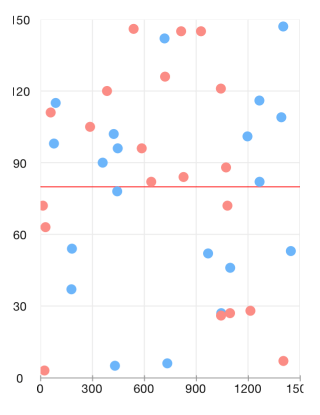
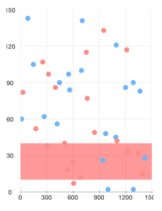
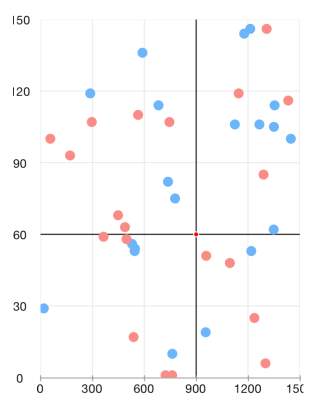
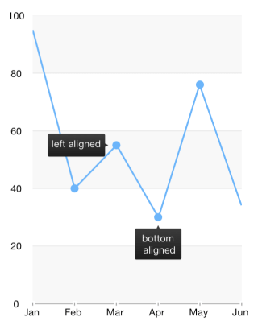
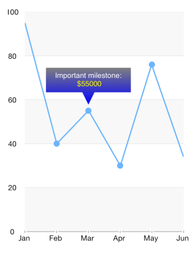
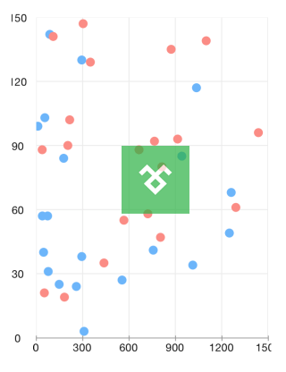

# Chart: Annotations

Annotations are visual elements that can be used to highlight certain areas on the plot area and denote statistical significance.

TKChart provides the following types of annotations:

- <code>TKChartGridLineAnnotation</code>
- <code>TKChartBandAnnotation</code>
- <code>TKChartCrossLineAnnotation</code>
- <code>TKChartBalloonAnnotation</code>
- <code>TKChartLayerAnnotation</code>
- <code>TKChartViewAnnotation</code>

## Adding annotations to the chart##

<code>TKChart</code> contains an <code>annotations</code> collection and annotations can be added to the chart by calling the <code>addAnnotation</code> method. The following code adds a horizontal grid line annotation in TKChart. The annotation requires an axis and a value in order to be initialized correctly.

<snippet id='chart-add-annotation'/>

<snippet id='chart-add-annotation-swift'/>

```C#
chart.AddAnnotation (new TKChartGridLineAnnotation(new NSNumber(600), chart.XAxis));
```

The annotation visibility can be controlled by setting its <code>hidden</code> property.
The annotation visual appearance can be changed by using its <code>style</code> property.

## Annotation types##

Conceptually, there are three types of annotations - grid line, band and point annotations. Below is a comparison for each one depending on the scenario.

### Grid line###

The grid line annotation represents a vertical or horizontal line which crosses the entire plot area. It is specified by using the <code>TKChartGridLineAnnotation</code>.

The line color can be customized by using the annotation initializer:

<snippet id='chart-line-annotation'/>

<snippet id='chart-line-annotation-swift'/>

```C#
chart.AddAnnotation (new TKChartGridLineAnnotation(new NSNumber(80), chart.YAxis, new TKStroke(UIColor.Red)));
```



### Plot band###

The <code>TKChartBandAnnotation</code> is either horizontal or vertical strip, crossing its corresponding axis, specified by its <code>range</code> property.

<snippet id='chart-plot-annotation'/>

<snippet id='chart-plot-annotation-swift'/>

```C#
chart.AddAnnotation (new TKChartBandAnnotation(new TKRange(new NSNumber(10), new NSNumber(40)), chart.YAxis, new TKSolidFill(new UIColor (1, 0, 0, 0.4f)), null)); 
```



### Point annotations###

Point annotations render their content starting at specific position. Besides the position, a pixel based offset could be added to the point annotation by specifying the <code>offset</code> property.

### Cross line annotation###

The TKChartCrossLineAnnotation is a point annotation which represents two crossing lines with a point at the crossing position.

<snippet id='chart-cross-annotation'/>

<snippet id='chart-cross-annotation-swift'/>

```C#
chart.AddAnnotation (new TKChartCrossLineAnnotation(new NSNumber(900), new NSNumber(60), chart.Series[0]));
```



### Balloon annotation###

The <code>TKChartBalloonAnnotation</code> displays a balloon-like shape next to the position specified by its arguments. The <code>verticalAlign</code> and <code>horizontalAlign</code> properties allow to position the annotation precisely. The balloon will correct its position automatically if there is not enough space at the specified coordinates.

<snippet id='chart-balloon-annotation'/>

<snippet id='chart-balloon-annotation-swift'/>

```C#
NSMutableParagraphStyle paragraphStyle = (NSMutableParagraphStyle)new NSParagraphStyle ().MutableCopy();
paragraphStyle.Alignment = UITextAlignment.Center;
NSMutableDictionary attributes = new NSMutableDictionary ();
attributes.Add (UIStringAttributeKey.ForegroundColor, UIColor.White);
attributes.Add (UIStringAttributeKey.ParagraphStyle, paragraphStyle);
NSMutableAttributedString attributedText = new NSMutableAttributedString ("Important milestone:\n $55000", attributes);

attributedText.AddAttribute (UIStringAttributeKey.ForegroundColor, UIColor.Yellow, new NSRange (22, 6));

TKChartBalloonAnnotation balloon = new TKChartBalloonAnnotation (new NSString("Mar"), new NSNumber(55), series);
balloon.AttributedText = attributedText;
balloon.Style.DistanceFromPoint = 20;
balloon.Style.ArrowSize = new Size (10, 10);
chart.AddAnnotation (balloon);
```



The <code>attributedText</code> property can be used to present formatted text with NSAttributedString.



### Layer and view annotations###

The <code>TKChartLayerAnnotation</code> and <code>TKChartViewAnnotations</code> are also point annotations. Those allow positioning a layer or a view inside the chart. The following code will position an image named *img* at the center of the chart:

<snippet id='chart-layer-annotation'/>

<snippet id='chart-layer-annotation-swift'/>

```C#
UIImageView imageView = new UIImageView ();
imageView.Image = UIImage.FromBundle ("logo.png");
imageView.Bounds = new CGRect (0, 0, imageView.Image.Size.Width, imageView.Image.Size.Height);
imageView.Alpha = 0.7f;
chart.AddAnnotation (new TKChartViewAnnotation(imageView, new NSNumber(550), new NSNumber(90), chart.Series[0]));
```



