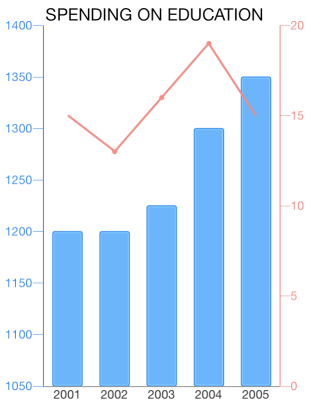
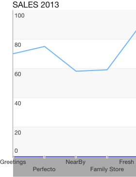
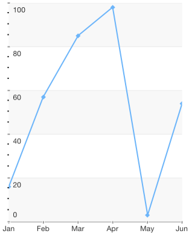
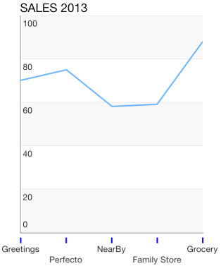
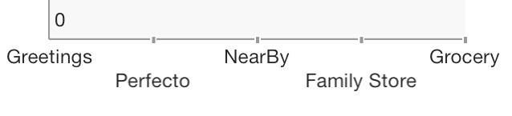
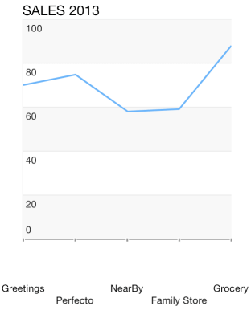
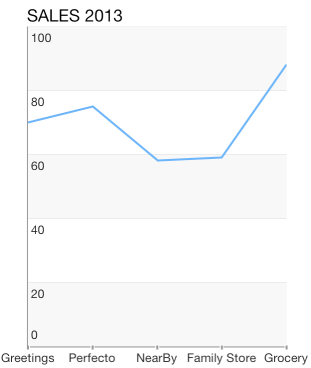
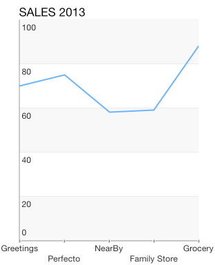
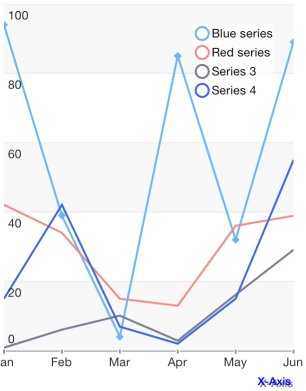

## Chart for Xamarin.iOS:  Axes Overview

<code>TKChart</code> renders its points in a coordinate system defined by its axes. To do this, axes specify the minimum and maximum values that can be presented on the plot area. There are a few different types of axes that can be used with <code>TKChart</code>. They include: numeric, date/time and categoric. You can assign each axis to different series and you can show multiple axes in chart. Axes contain various properties to control their position, style and behavior. All chart axes subclass from TKChartAxis.

- Use <code>TKChartNumericAxis</code> to present numeric values.
- Use <code>TKChartLogarithmicAxis</code> to represent numeric values by using logarithmic scale.
- Use <code>TKChartDateTimeAxis</code> to present date/time values.
- Use <code>TKChartDateTimeCategoryAxis</code> to present discontinuous date/time values.
- Use <code>TKChartCategoryAxis</code> to present categoric values.

This article discusses the common characteristics of the abstract class <code>TKChartAxis</code>, which is the class all <code>TKChart</code> axes derive from. The axes automatically calculate its maximum and minimum properties, based on the incoming data.

## Adding axes in TKChart##

By default TKChart creates its axes automatically based on the provided data. The axes can be accessed by using the <code>XAxis</code> and <code>YAxis</code> properties of TKChartSeries. Use those properties to customize your axes appearance.

```C#
chart.XAxis.Style.LabelStyle.Font = UIFont.SystemFontOfSize (18);
```

TKChart creates the following axes based on your data:

- TKChartNumericAxis is created by default for both axes when using TKChartScatterSeries
- TKChartCategoryAxis is created by default for the x axis when using TKChartColumnSeries
- TKChartCategoryAxis is created by default for the y axis when using TKChartBarSeries
- TKChartNumericAxis is created when your points contain NSNumber values.
- TKChartDateTimeAxis is created when your points contain NSDate values.
- TKChartCategoryAxis is created in all other cases.
- TKChartPieSeries ignore the xAxis and yAxis properties.

Sometimes, it is necessary to set the axes explicitly. For example, you might want to change the axis type or to set a custom range. In this scenario you can set the <code>XAxis</code> and <code>YAxis</code> properties directly when creating your series:

```C#
TKChartCategoryAxis xAxis = new TKChartCategoryAxis ();
xAxis.Position = TKChartAxisPosition.Bottom;
xAxis.PlotMode = TKChartAxisPlotMode.BetweenTicks;
series.XAxis = xAxis;
```

The <code>Axes</code> property in TKChart can be used to iterate through all axes in chart.

## Axes Common Properties##

There are several important properties which allow customization of the behavior and appearance of each axis:

- <code>Style</code> - contains a set of properties which define the visual style of an axis and its labels.
- <code>Position</code> - defines where the axis is positioned in relation to the plot area.
- <code>PlotMode</code> - defines how the associated series is rendered in relation to the axis.
- <code>AllowZoom</code> - allows zooming by this axis.
- <code>Zoom</code> - determines the zoom level for this axis.
- <code>AllowPan</code> - allows panning by this axis.
- <code>Pan</code> - determines the pan level for this axis.
- <code>Title</code> - defines the axis title. Note that it sets internally the <code>attributedTitle</code> property.
- <code>AttributedTitle</code> - defines the axis attributedTitle, which allows text formatting.
- <code>LabelFormat</code> - defines a format string for axis labels.
- <code>LabelFormatter</code> - defines a label formatter for axis labels.
- <code>TickCount</code> - returns the count of axis labels.

## Configure Axes Position##

You can change the axis position by setting its position property to one of the following values:
<code>TKChartAxisPositionLeft</code>, <code>TKChartAxisPositionRight</code>, <code>TKChartAxisPositionTop</code> and <code>TKChartAxisPositionBottom</code>.

The following lines of code demonstrate how you can create multiple axes at different positions:

```C#
TKChartDateTimeAxis periodXAxis = new TKChartDateTimeAxis ();
periodXAxis.MajorTickIntervalUnit = TKChartDateTimeAxisIntervalUnit.Years;
periodXAxis.MinorTickIntervalUnit = TKChartDateTimeAxisIntervalUnit.Years;
periodXAxis.MajorTickInterval = 1;
periodXAxis.Position = TKChartAxisPosition.Bottom;
periodXAxis.PlotMode = TKChartAxisPlotMode.BetweenTicks;
chart.AddAxis (periodXAxis);

TKChartNumericAxis gdpInvestmentYAxis = new TKChartNumericAxis (new NSNumber(0), new NSNumber(20));
gdpInvestmentYAxis.MajorTickInterval = 5;
gdpInvestmentYAxis.Position = TKChartAxisPosition.Right;
gdpInvestmentYAxis.Style.LabelStyle.TextAlignment = TKChartAxisLabelAlignment.Left;
gdpInvestmentYAxis.Style.MajorTickStyle.TicksHidden = false;
gdpInvestmentYAxis.Style.LineHidden = false;
chart.AddAxis (gdpInvestmentYAxis);
```



## Configure Axes Appearance##

You can customize any feature of the axis appearance. If you want to hide its line or change its line stroke or background, you can use the following peace of code:

```C#
chart.XAxis.Style.LineStroke = new TKStroke (UIColor.Black);
```



## Configure Axes Ticks Appearance##

In numeric/date-time axes you can specify the interval between axis ticks by setting the <code>MajorTickInterval</code> and <code>MinorTickInterval</code> properties:

```C#
xAxis.MajorTickInterval = 1;
xAxis.MinorTickInterval = 1;
```



You can customize the major and minor ticks of axis by manipulating the <code>MajorTickStyle</code> and <code>MinorTickStyle</code> properties.

```C#
xAxis.Style.MajorTickStyle.TicksOffset = -3;
xAxis.Style.MajorTickStyle.TicksHidden = false;
xAxis.Style.MajorTickStyle.TicksWidth = 1.5f;
xAxis.Style.MajorTickStyle.TicksFill = new TKSolidFill (new UIColor (203 / 255.0f, 203 / 255.0f, 203 / 255.0f, 1f));
xAxis.Style.MajorTickStyle.MaxTickClippingMode = TKChartAxisClippingMode.Visible;
```



In addition to the common tick style customizations, you can specify the first and last ticks visibility by setting <code>MinTickClippingMode</code> and <code>MaxTickClippingMode</code> properties:

```C#
series.YAxis.Style.MajorTickStyle.MaxTickClippingMode = TKChartAxisClippingMode.Visible;
series.YAxis.Style.MajorTickStyle.MinTickClippingMode = TKChartAxisClippingMode.Visible;
```



## Configure Axes Label Appearance##

You can configure the axis label appearance by manipulating the <code>LabelStyle</code> property of the axis style object. If you want to change the font, text color, shadow color and offset, you should modify the corresponding properties:

```C#
chart.YAxis.Style.LabelStyle.Font = UIFont.SystemFontOfSize (18);
chart.YAxis.Style.LabelStyle.TextColor = UIColor.Black;
```

You can define the label offset and alignment by setting the <code>TextOffset</code> and <code>TextAlignment</code> properties:

```C#
yAxis.Style.LabelStyle.TextAlignment = TKChartAxisLabelAlignment.Right | TKChartAxisLabelAlignment.Bottom;
yAxis.Style.LabelStyle.FirstLabelTextAlignment = TKChartAxisLabelAlignment.Right | TKChartAxisLabelAlignment.Top;
yAxis.Style.LabelStyle.TextOffset = new UIOffset (0, 0);
yAxis.Style.LabelStyle.FirstLabelTextOffset = new UIOffset (0, 0);
```



You can change the label fitting mode in the following manner:

```C#
yAxis.Style.LabelStyle.FitMode = TKChartAxisLabelFitMode.Rotate;
```





## Configure Axes Title Appearance

In order to change the change the axis title font, text color, shadow color, alignment and offset, you should modify the corresponding properties:

```C#
xAxis.Title = "Vendors";
xAxis.Style.TitleStyle.TextColor = UIColor.Gray;
xAxis.Style.TitleStyle.Font = UIFont.BoldSystemFontOfSize (11);
xAxis.Style.TitleStyle.Alignment = TKChartAxisTitleAlignment.RightOrBottom;
chart.ReloadData ();
```



## Axes Types

Any Cartesian series supports the following axes:

- [TKChartNumericAxis](numeric)
- [TKChartCategoryAxis](categoric)
- [TKChartDateTimeAxis](datetime)
- [TKChartLogarithmicAxis](logarithmic)

>warning Note that Pie series does not support axes.
