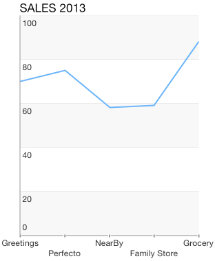
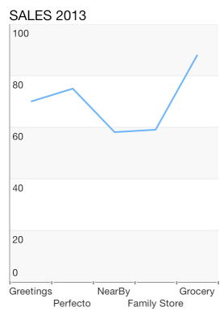

# Chart Axes: Categoric

<code>TKChart</code> uses Categoric axes to plot data that contains categoric values. The axis is valid only in the context of Cartesian series. It also introduces several important properties:

- <code>majorTickInterval</code> - defines an interval among major axis ticks.

- <code>minorTickInterval</code> - defines an interval among minor axis ticks.

- <code>baseline</code> - contains a value, which defines how the series data should be aligned. For example, The <code>TKChartBarSeries</code> might render its bars up and down depending on whether its value is greater or less than the baseline value.

- <code>offset</code> - determines an axis value where the axis is crossed with another axis.

## Configure a TKChartCategoryAxis##

You can configure a category axis by settings its categories property. You should use the following code snippet as a sample:

<snippet id='chart-category-axis'/>
<snippet id='chart-category-axis-swift'/>
```C#
List<TKChartDataPoint> list = new List<TKChartDataPoint> ();
string[] categories = new []{"Apple", "Google", "Microsoft", "Samsung"};
for (int i = 0; i < categories.Length; i++) {
    list.Add(new TKChartDataPoint(new NSString(categories[i]), new NSNumber(r.Next() % 100))); 
}

TKChartColumnSeries series = new TKChartColumnSeries (list.ToArray());
series.Selection = TKChartSeriesSelection.Series;

TKChartCategoryAxis xAxis = new TKChartCategoryAxis ();
xAxis.Position = TKChartAxisPosition.Bottom;
xAxis.PlotMode = TKChartAxisPlotMode.BetweenTicks;
series.XAxis = xAxis;
```

You can specify the axis range by setting the minimum and maximum indexes of categories.

## Setting the plot mode of axis##

 The <code>TKChartAxisPlotMode</code> is used by the axis to plot the data. Possible values are <code>TKChartAxisPlotModeBetweenTicks</code> and <code>TKChartAxisPlotModeOnTicks</code>. <code>TKChartAxisPlotModeBetweenTicks</code> plots points in the middle of the range, defined by two ticks. <code>OnTicks</code> plots the points over each tick.

 You should use the following lines of code to alter this behavior:

<snippet id='chart-category-plot'/>
<snippet id='chart-category-plot-swift'/>
```C#
xAxis.PlotMode = TKChartAxisPlotMode.BetweenTicks;
```



<snippet id='chart-category-plot-onticks'/>
<snippet id='chart-category-plot-onticks-swift'/>
```C#
xAxis.PlotMode = TKChartAxisPlotMode.OnTicks;
```


