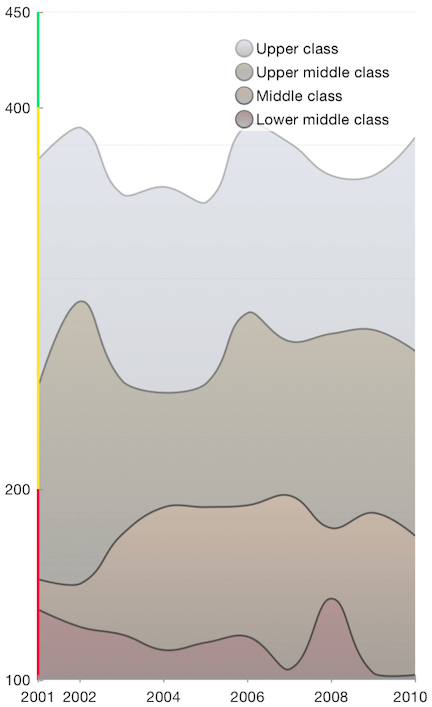

## Chart for Xamarin.iOS: Axis Customization

The <code>TKChartAxis</code> is responsible for <code>TKChart</code>'s axes. You can set custom ticks and color the axis partially by using its property <code>CustomLabels</code>.

```C#
this.chart.YAxis.CustomLabels = new NSDictionary(new NSNumber(100), UIColor.Blue, 
    new NSNumber(200), UIColor.Yellow, 
    new NSNumber(400), UIColor.Red);
```



TKChartAxis can have a custom render that you would use for drawing an axis completely by your taste. For the purpose a new custom Axis should be created that derives from TKChartAxisRender and its method <code>RenderForChart</code> should be overridden:


```C#
class MyAxis : TKChartNumericAxis
{
    public MyAxis (NSNumber minimum, NSNumber maximum)
        : base(minimum, maximum)
    {
    }

    public override TKChartAxisRender Render (TKChart chart)
    {                return new AxisRender (this, chart);
    }
}
```

Once this is done you are ready to start drawing in the DrawInContext method of your new axis render:

```C#
public class AxisRender: TKChartAxisRender
{
    public AxisRender (TKChartAxis axis, TKChart chart)
        : base(axis, chart)
    {
    }

    public override void DrawInContext (CoreGraphics.CGContext ctx)
    {
        CGRect rect = this.BoundsRect();
        CGColorSpace colorSpace = CGColorSpace.CreateDeviceRGB ();
        nfloat [] colors = new nfloat[] {
            0.42f, 0.66f, 0.31f, 1.0f,
            0.95f, 0.76f, 0.20f, 1.0f,
            0.80f, 0.25f, 0.15f, 1.0f
        };

        CGGradient gradient = new CGGradient (colorSpace, colors, null);

        nuint tickSpaces = this.Axis.MajorTickCount - 1;
        nuint pointsCount = 5;
        if (this.Chart.Frame.Size.Height < this.Chart.Frame.Size.Width) {
            pointsCount = 3;
        }

        nfloat diameter = 8;
        nfloat spaceHeight = rect.Size.Height / tickSpaces;
        nfloat spacing = (spaceHeight - (pointsCount * diameter)) / (pointsCount + 1);
        nuint allPointsCount = pointsCount * tickSpaces;
        CGPath multipleCirclePath = new CGPath ();
        double y = rect.GetMinY() +  diameter / 2.0f  + spacing;

        for (uint i = 1; i <= allPointsCount; i++) {
            CGPoint center = new CGPoint (rect.GetMidX (), y);
            CGPath path = new CGPath ();
            path.AddArc (center.X, center.Y, (nfloat)diameter/2.0f, 0, (nfloat)Math.PI * 2, true);
            multipleCirclePath.AddPath (path);
            y += spacing + diameter;
            if (i % pointsCount == 0) {
                y += spacing;
            }
        }

        ctx.SaveState ();
        ctx.AddPath (multipleCirclePath);
        ctx.Clip ();
        CGPoint startPoint = new CGPoint (rect.GetMidX (), rect.GetMinY ());
        CGPoint endPoint = new CGPoint (rect.GetMidX (), rect.GetMaxY());
        ctx.DrawLinearGradient (gradient, startPoint, endPoint, 0);
        ctx.RestoreState ();

        base.DrawInContext (ctx);
    }

}
```

