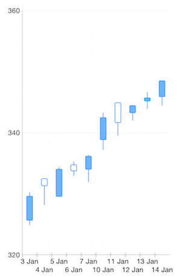

## Chart for Xamarin.iOS: DateTimeCategory Axis

<code>TKChartDateTimeCategoryAxis</code> is a special axis that is similar to <code>TKChartCategoryAxis</code> and adds notation for <code>NSCalendarUnit</code> enumeration. This axis uses the selected calendar units to extract a key from dates. The key is used to build categories. Once build, categories are sorted in chronological order.

The most important property of <code>TKChartDateTimeCategoryAxis</code> is the <code>DateComponent</code>. It is used to specify which parts of the date are important. Its default value is <code>TKCalendarUnitDate</code> which is a shortcut for <code>NSCalendarUnitDay|NSCalendarUnitMonth|NSCalendarUnitYear</code>.



## Configure a TKChartDateTimeCategoryAxis##

You can configure a date time category axis by setting the <code>DateComponent</code> property. Optionally you can set properties like <code>PlotMode</code> and <code>LabelFormatter</code> to control the appearance of the axis:
 
```C#
var xAxis = new TKChartDateTimeCategoryAxis ();
var formatter = new NSDateFormatter ();
formatter.DateFormat = "d MMM";
xAxis.LabelFormatter = formatter;
```
