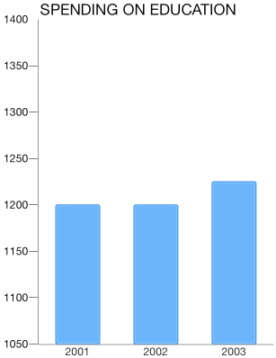
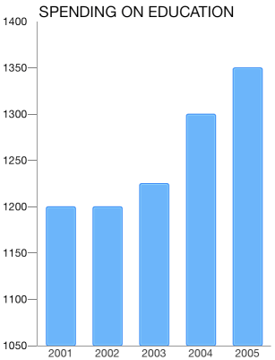

# Chart Axes: Datetime

The <code>TKChartDateTimeAxis</code> Categoric axis is an axis with NSDate values sorted chronologically. It also allows definitions of categories based on specific date time components – year, month, day etc. For example, if data values fall in the range of one year, the points can be plotted in categories for each month. If data values fall in the range of one month, the values can be categorized by days. It also introduces several important properties:

- <code>majorTickInterval</code> - defines an interval between major axis ticks.

- <code>baseline</code> - defines how the series data should be aligned. For example: The <code>TKChartBarSeries</code> might render its bars up and down depending on whether its value is greater or less than the baseline value.

- <code>offset</code> - determines an axis value where the axis is crossed with another axis.

## Configure a TKChartDateTimeAxis##

You can configure a date-time axis by initializing it and setting it as the main x-axis or y-axis of the chart:

<snippet id='chart-axis-datetime'/>
<snippet id='chart-axis-datetime-swift'/>
```C#
TKChartDateTimeAxis xAxis = new TKChartDateTimeAxis (minDate, maxDate);
xAxis.MajorTickIntervalUnit = TKChartDateTimeAxisIntervalUnit.Months;
xAxis.MajorTickInterval = 1;
```

You can define the axis categories by changing the interval unit property to one of the following values:
*TKChartDateTimeAxisIntervalUnitSeconds* - The majorTickInterval is measured in seconds.
*TKChartDateTimeAxisIntervalUnitMinutes* - The majorTickInterval is measured in minutes.
*TKChartDateTimeAxisIntervalUnitHours* - The majorTickInterval is measured in hours.
*TKChartDateTimeAxisIntervalUnitDays* - The majorTickInterval is measured in days.
*TKChartDateTimeAxisIntervalUnitWeeks* - The majorTickInterval is measured in weeks.
*TKChartDateTimeAxisIntervalUnitMonths*  - The majorTickInterval is measured in months.
*TKChartDateTimeAxisIntervalUnitYears* - The majorTickInterval is measured in years.
*TKChartDateTimeAxisIntervalUnitCustom* - The majorTickInterval is measured in ticks.



## Setting a plotting mode of axis##

 The <code>TKChartAxisPlotMode</code> is used by the axis to plot the data. Possible values are <code>TKChartAxisPlotModeBetweenTicks</code> and <code>TKChartAxisPlotModeOnTicks</code>. <code>TKChartAxisPlotModeBetweenTicks</code> plots points in the middle of the range, defined by two ticks. <code>OnTicks</code> plots the points over each tick.

You should use the following lines of code to alter this behavior:

<snippet id='chart-category-plot'/>
<snippet id='chart-category-plot-swift'/>
```C#
xAxis.PlotMode = TKChartAxisPlotMode.BetweenTicks;
```


