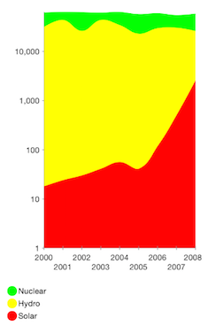

## Chart for Xamarin.iOS: Logarithmic Axis

<code>TKChartLogarithmicAxis</code> is used to display values that cover several orders of magnitude in a more manageable way. This is a special numeric axis that transforms the actual values of the data points using logarithm function with a specific base. For example if the base of the logarithm is 10, then the axis will be scaled to show equally spaced powers of 10. The Richter scale and the Decibel scale are examples of logarithmic scale. TKChartLogarithmicAxis is a subclass of TKChartNumericAxis and introduces two important properties.

- <code>LogarithmBase</code> - the base of the logarithmic function used to calculate. the value.

- <code>ExponentStep</code> - specifies the exponent step between the axis ticks. 



## Configure a TKChartLogarithmicAxis##

You can configure a logarithmic axis by setting its base property. The default base value is 10.

```C#
TKChartLogarithmicAxis yAxis = new TKChartLogarithmicAxis();
yAxis.LogarithmBase = 2;
chart.YAxis = yAxis;
```

## Logarithmic axis customization ##

You can also specify the exponent step between the axis ticks with the  <code>ExponentStep</code> property. The default value of the exponent step is 1 which means that the axis itself will calculate an exponent step that will visualize the points in the best possible way. The ExponentStep should be a number bigger than 0.


