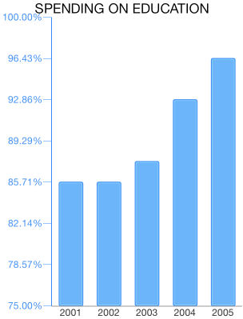

## Chart for Xamarin.iOS: Numeric Axis

<code>TKChart</code> uses Linear axes to plot data containing numerical values. It is valid only in the context of Cartesian Area, this axis is created by default when you add Bar, Line, Area and Scatter series. It also introduces several important properties:

- <code>MajorTickInterval</code> - defines the interval between major axis ticks.
- <code>MinorTickInterval</code> - defines the interval between minor axis ticks.
- <code>Baseline</code> - defines how the series data should be aligned. For example, The TKChartBarSeries might render its bars up and down side depending on whether its value is greater or less than the baseline value.
- <code>Offset</code> - Determines an axis value where the axis is crossed with another axis.
- <code>IsLogarithmic</code> - Determines whether the axis is linear or logarithmic.

## Configure a TKChartNumericAxis##

You can configure a numeric axis by initializing it and setting it as the main x-axis or y-axis of the chart:

```C#
TKChartNumericAxis yAxis = new TKChartNumericAxis ();
yAxis.Range = new TKRange (new NSNumber (0), new NSNumber (2000));
yAxis.Position = TKChartAxisPosition.Left;
yAxis.MajorTickInterval = 400;
yAxis.LabelDisplayMode = TKChartNumericAxisLabelDisplayMode.Percentage;
chart.YAxis = yAxis;
```

Numeric axes can also be modified to display percentage or values depending on your needs. This modification is available with the <code>LabelDisplayMode</code> property - it accepts *TKChartNumericAxisLabelDisplayMode.Value* (the default one) and *TKChartNumericAxisLabelDisplayMode.Percentage* options.



