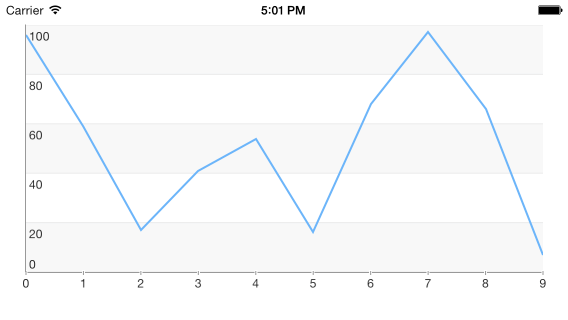

## Chart for Xamarin.iOS: Getting Started

=======
This quick start tutorial demonstrates how to create a simple iOS application with TKChart.



## Setting up TKChart

Now that our project is created and the Telerik.Xamarin.iOS assembly is added, we can start referencing and using the TelerikUI types:

Open your **UIViewController** file and add a reference to the chart header file:

```C#
using TelerikUI;
```

Type the following code in <code>ViewDidLoad</code> method:

```C#
TKChart chart = new TKChart (this.View.Bounds);
chart.AutoresizingMask = UIViewAutoresizing.FlexibleWidth | UIViewAutoresizing.FlexibleHeight;
this.View.AddSubview (chart);
```

This code creates a new instance of TKChart and adds it as a subview of the ViewController's main view. The <code>AutoresizingMask</code> property is set in order to allow correct resizing of the chart when the device is rotated in landscape mode.

The next step is to create some random data that will be consumed by the chart. You can use the following code:

```C#
Random r = new Random ();
List<TKChartDataPoint> list = new List<TKChartDataPoint> ();
for (int i = 0; i < 12; i++) {
    list.Add (new TKChartDataPoint (new NSNumber (i), new NSNumber (r.Next () % 2000)));
}
```

In this case we use the *i* variable as an x value, and we generate a random number in the range between 0 and 100 as an y value.

Now let's add this random data to the chart and present it. This is done by the following code:

```C#
TKChartLineSeries series = new TKChartLineSeries (list.ToArray());

series.Selection = TKChartSeriesSelection.Series;
chart.AddSeries (series);
```

For more information about populating TKChart with data, please refer to the [Populating with Data](populating-with-data) article.

The TKChartLineSeries tells the chart to present its data as a line chart and initializes it with the already created points.

Let's add a title and a legend to our chart. We can do so by setting the corresponding Hidden properties to *false*. We can easily employ the built-in animations support to create some fancy animations. To do so, we should set the <code>AllowAnimations</code> property to *true*:

```C#
chart.Title.Hidden = false;
chart.Title.Text = "This is a chart demo";
chart.Legend.Hidden = false;
chart.AllowAnimations = true;
```

For more information about customizing animations, please refer to the following articles:

- [Custom Animations](animations/custom)
- [Custom UIKit Dynamics Animations](animations/custom-uikit-dynamics)

For more information about series types, please refer to the following articles: [Chart Structure](structure).