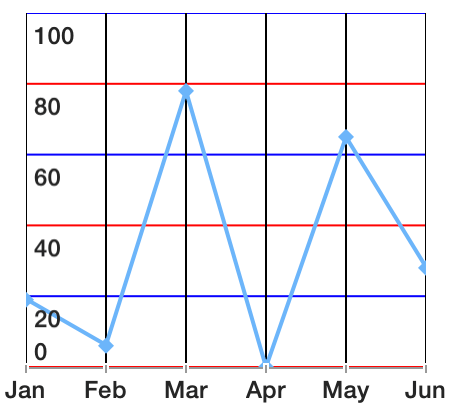
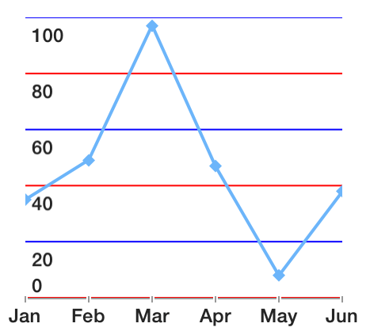
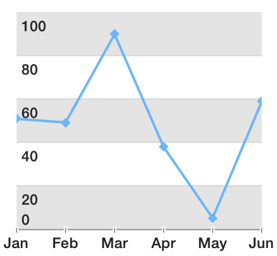
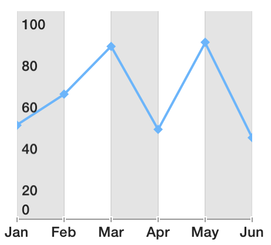
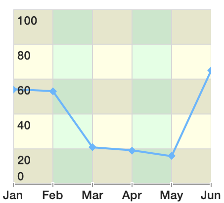
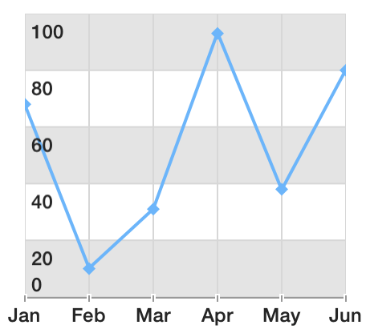
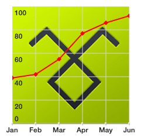
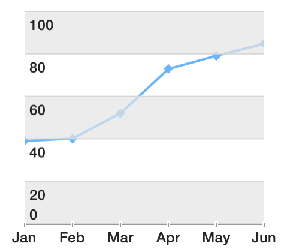

## Chart for Xamarin.iOS: Grid Customization

TKChart series, which support axes, can render a grid that facilitates the process of determining the values of points afar from the axes. Since Pie area does not use axes, the grid is valid only in the context of Cartesian series. Grid consists of horizontal and vertical lines matching axes major ticks and fills between them. You can alternate fills to create zebra like effect both horizontally and vertically.

The essential properties of <code>TKChartGridStyle</code> are the following:

- <code>VerticalLineStroke</code> - defines the vertical line stroke.
- <code>VerticalLineAlternateStroke</code> - defines the vertical alternate line stroke.
- <code>VerticalLinesHidden</code> - determines whether the vertical line is hidden.
- <code>VerticalFill</code> - defines the background pattern of fill among vertical lines.
- <code>VerticalAlternateFill</code> - defines the background pattern of alternate fill among vertical lines.
- <code>HorizontalLineStroke</code> - defines the horizontal line stroke.
- <code>HorizontalLineAlternateStroke</code> - defines the horizontal alternate line stroke
- <code>HorizontalLinesHidden</code> - determines whether the hidden line is hidden.
- <code>HorizontalFill</code> - defines the background pattern of fill among horizontal lines
- <code>HorizontalAlternateFill</code> - defines the background pattern of alternate fill among horizontal lines
- <code>BackgroundFill</code> - sets the background fill color. By default, it is nil (no background color is drawn).
- <code>DrawOrder</code> - sets the draw order. By default, it is TKGridDrawModeHorizontalFirst.
- <code>ZPosition</code> - defines the grid position according to the series.

## Customizing grid appearance

Working with grid style properties is easy. Here is a way to make colorful grid lines:

```C#
var gridStyle = chart.GridStyle;
gridStyle.VerticalLineStroke = new TKStroke (UIColor.Black);
gridStyle.VerticalLineAlternateStroke = new TKStroke (UIColor.Black);
gridStyle.VerticalLinesHidden = false;
gridStyle.VerticalFill = null;
gridStyle.VerticalAlternateFill = null; 

gridStyle.HorizontalLineStroke = new TKStroke (UIColor.Red);
gridStyle.HorizontalLineAlternateStroke =new  TKStroke (UIColor.Blue);
gridStyle.HorizontalFill = null;
gridStyle.HorizontalAlternateFill = null;
gridStyle.HorizontalLinesHidden = false;
```



You can remove vertical lines altogether:

```C#
var gridStyle = chart.GridStyle;

gridStyle.VerticalLinesHidden = true;
gridStyle.VerticalFill = null;
gridStyle.VerticalAlternateFill = null;  

gridStyle.HorizontalLineStroke = new TKStroke (UIColor.Red);
gridStyle.HorizontalLineAlternateStroke = new TKStroke (UIColor.Blue);
gridStyle.HorizontalFill = null;
gridStyle.HorizontalAlternateFill = null;
gridStyle.HorizontalLinesHidden = false;
```



Now add some style using alternative fills:

```C#
var gridStyle = chart.GridStyle;

gridStyle.HorizontalLineStroke = new TKStroke (UIColor.FromWhiteAlpha(215.0f / 255.0f, 1.0f));
gridStyle.HorizontalLineAlternateStroke = new TKStroke (UIColor.FromWhiteAlpha (215.0f / 255.0f, 1.0f));
gridStyle.HorizontalLinesHidden = false;
gridStyle.HorizontalFill = new TKSolidFill (UIColor.FromWhiteAlpha (228.0f / 255.0f, 1.0f));
gridStyle.HorizontalAlternateFill = new TKSolidFill (UIColor.White);

gridStyle.VerticalFill = null;
gridStyle.VerticalAlternateFill = null;
gridStyle.VerticalLinesHidden = true;
```



Here is how to switching to alternative vertical fills:

```C#
var gridStyle = chart.GridStyle;

gridStyle.VerticalLineStroke = new TKStroke (UIColor.FromWhiteAlpha (215.0f / 255.0f, 1.0f));
gridStyle.VerticalLineAlternateStroke = new TKStroke (UIColor.FromWhiteAlpha (215.0f / 255.0f, 1.0f));
gridStyle.VerticalLinesHidden = false;
gridStyle.VerticalFill = new TKSolidFill (UIColor.FromWhiteAlpha (228.0f / 255.0f, 1.0f));
gridStyle.VerticalAlternateFill = new TKSolidFill (UIColor.White);

gridStyle.HorizontalFill = null;
gridStyle.HorizontalAlternateFill = null;
gridStyle.HorizontalLinesHidden = true;
```



## Combining it together

```C#
var gridStyle = chart.GridStyle;

gridStyle.HorizontalLineStroke = new TKStroke (UIColor.FromWhiteAlpha (215.0f / 255.0f, 1.0f));
gridStyle.HorizontalLineAlternateStroke = new TKStroke (UIColor.FromWhiteAlpha (215.0f / 255.0f, 1.0f));
gridStyle.HorizontalFill = new TKSolidFill(UIColor.FromWhiteAlpha (228.0f / 255.0f, 1.0f));
gridStyle.HorizontalAlternateFill = new TKSolidFill (UIColor.White);
gridStyle.HorizontalLinesHidden = false;

gridStyle.VerticalLineStroke = new TKStroke (UIColor.FromWhiteAlpha (215.0f / 255.0f, 1.0f));
gridStyle.VerticalLineAlternateStroke = new TKStroke (UIColor.FromWhiteAlpha (215.0f / 255.0f, 1.0f));
gridStyle.VerticalLinesHidden = false;
gridStyle.VerticalFill = new TKSolidFill (new UIColor (1.0f, 1.0f, 0.0f, 0.1f));
gridStyle.VerticalAlternateFill = new TKSolidFill (new UIColor (0.0f, 1.0f, 0.0f, 0.1f));
```



Note how vertical fills are transparent. This is because in default mode horizontal fills are drawn first. However you can change the drawing order. Adding a single line of code to the snippet above will produce the effect below:

```C#
gridStyle.DrawOrder = TKChartGridDrawMode.VerticalFirst;
```



As you can see vertical fills are missing. The reason is that in TKGridDrawModeVerticalFirst mode they are drawn first and then the non-transparent horizontal fills got drawn above. On order to address this, the fills which are drawn last always need to have some transparency. You can also draw all the fills with transparency, but in this case you might need to set:

```C#
gridStyle.BackgroundFill = new TKSolidFill(UIColor.White);
```

This will create a predictable background for the grid and plot area.

You can also use grid's background to set an image:

```C#
gridStyle.BackgroundFill = new TKSolidFill(UIColor.FromPatternImage(new UIImage("telerk_logo.png")));
```



## Using ZPosition

ZPosition property specifies the Z order of the grid. Grid is drawn below series by default. However you can change it so grid is above series:

```C#
var gridStyle = chart.GridStyle;

gridStyle.HorizontalLineStroke = new TKStroke (UIColor.FromWhiteAlpha (215.0f / 255.0f, 1.0f));
gridStyle.HorizontalLineAlternateStroke = new TKStroke (UIColor.FromWhiteAlpha (215.0f / 255.0f, 1.0f));
gridStyle.HorizontalLinesHidden = false;
gridStyle.HorizontalFill = new TKSolidFill (UIColor.FromWhiteAlpha (228.0f / 255.0f, 1.0f));
gridStyle.HorizontalAlternateFill = new TKSolidFill (UIColor.Clear);

gridStyle.VerticalFill = null;
gridStyle.VerticalAlternateFill = null;
gridStyle.VerticalLinesHidden = true;

gridStyle.ZPosition = TKChartGridZPosition.AboveSeries;
```


