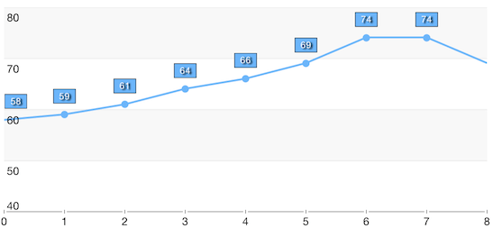
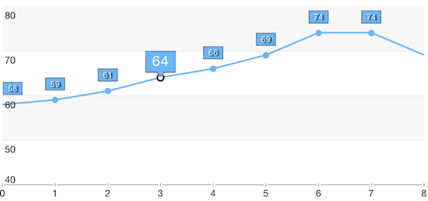

# Point Labels: Customization

<code>TKChart</code> lets you customize point labels using <code>TKChartPointLabelStyle</code>'s properties. However, sometimes you may need to draw specific shapes for the labels. In such cases you should sublcass <code>TKChartPointLabel</code> to create your own label and implement <code>TKChartDelegate</code> to use it.

## Customization using TKChartPointLabelStyle properies

Here is an example how to customize point labels changing <code>TKChartPointLabelStyle</code> settings.

<snippet id='chart-pointlabels'/>
```C#
TKChartLineSeries lineSeries = new TKChartLineSeries (dataPoints.ToArray ());
lineSeries.Selection = TKChartSeriesSelection.DataPoint;
lineSeries.Style.PointShape = new TKPredefinedShape (TKShapeType.Circle, new SizeF (8, 8));
lineSeries.Style.PointLabelStyle.TextHidden = false;
lineSeries.Style.PointLabelStyle.LabelOffset = new UIOffset (0, -24);
lineSeries.Style.PointLabelStyle.Insets = new UIEdgeInsets (-1, -5, -1, -5);
lineSeries.Style.PointLabelStyle.LayoutMode = TKChartPointLabelLayoutMode.Manual;
lineSeries.Style.PointLabelStyle.Font = UIFont.SystemFontOfSize (10);
lineSeries.Style.PointLabelStyle.TextAlignment = UITextAlignment.Center;
lineSeries.Style.PointLabelStyle.TextColor = UIColor.White;
lineSeries.Style.PointLabelStyle.Fill = new TKSolidFill (new UIColor ((float)(108 / 255.0), (float)(181 / 255.0), (float)(250 / 255.0), (float)1.0));
lineSeries.Style.PointLabelStyle.ClipMode = TKChartPointLabelClipMode.Hidden;
```



## Custom point labels

Subclassing <code>TKChartPointLabel</code> lets you perform custom drawing and calculate the size of the point label. Once you create your own label you should implement <code>TKChartDelegate</code> to use it.

<snippet id='chart-custom-label'/>
<snippet id='chart-custom-label-swift'/>
```C#
public override TKChartPointLabel LabelForDataPoint (TKChart chart, TKChartData dataPoint, string propertyName, TKChartSeries series, nuint dataIndex)
{
    TKChartDataPoint point = (TKChartDataPoint)dataPoint;
    if (series.Index == (nuint)this.selectedSeriesIndex && dataIndex == (nuint)this.selectedDataPointIndex) {
        return new MyPointLabel (point, series, String.Format ("{0}", point.DataYValue));
    }

                
    return new TKChartPointLabel (point, series, String.Format ("{0}", point.DataYValue));
}
```



