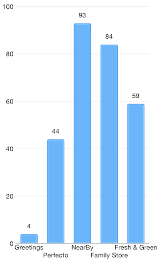

# Point Labels: Overview


<code>TKChart</code> supports point labels. Point labels are visual elements that are placed on the plot at the location of series data points showing the data point's value or other string by your choice. By default point labels are hidden. If you would like to show them, you should set <code>TKChartPointLabelStyle</code>'s <code>textHidden</code> property to *NO*. You can also alter offset origin of the labels using the <code>labelOffset</code> property.

<snippet id='chart-labels-overview'/>
<snippet id='chart-labels-overview-swift'/>
```C#
barSeries.Style.PointLabelStyle.TextHidden = false;
barSeries.Style.PointLabelStyle.LabelOffset = new UIOffset (15, 0);
```




